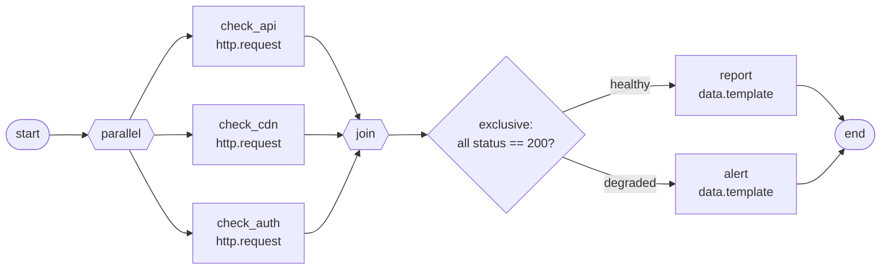
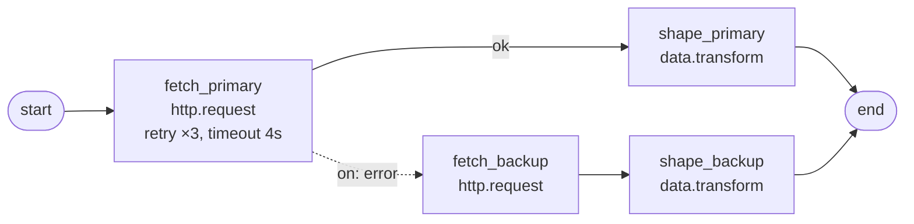
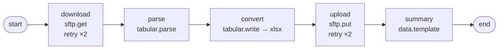
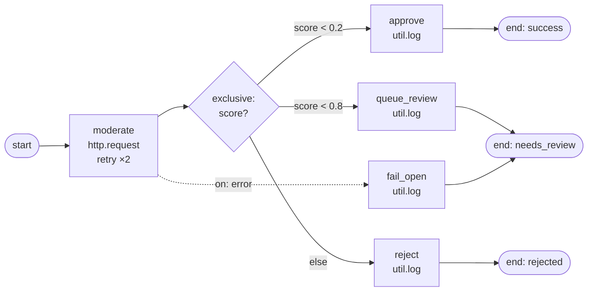
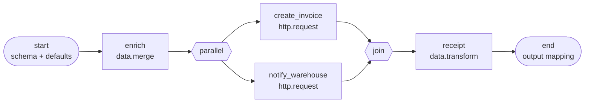
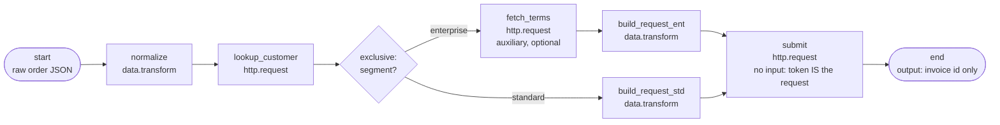
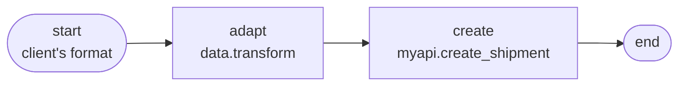
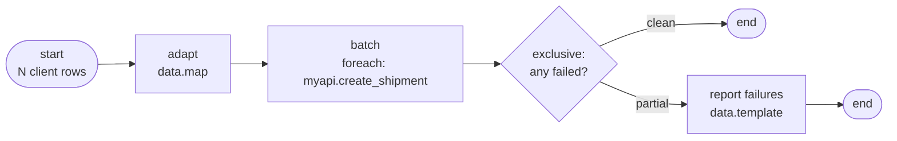

# workflow-forge — Examples

What can you build **today** with the existing code? Every example below runs
against the current engine and official extensions — no vaporware. Copy the
JSON, register the default extensions, and run it.

```rust
use workflow_forge::prelude::*;

let workflow: WorkflowDefinition = serde_json::from_str(WORKFLOW_JSON)?;
let executor = WorkflowExecutor::new(workflow, workflow_forge::default_registry())
    .map_err(|errors| format!("{errors:?}"))?;
let result = executor.run(WorkflowData(trigger_json)).await?;
```

**Capabilities used across these examples**

| Capability | Where it shows up |
|------------|-------------------|
| JSONPath data wiring (`$.trigger`, `$.nodes.<id>.output`) | all examples |
| Exclusive gateway + condition DSL | #2, #4 |
| Parallel fan-out + join | #1, #5 |
| Retry with backoff + timeout | #2, #3, #6 |
| Error routes (`on: "error"`) + `$.nodes.<id>.error` | #2, #4 |
| Optional branches that converge ("request built as data") | #6 |
| Schema-validated trigger + defaults | #5 |
| Blobs (`$blob`) for files | #3 |
| Task profiles (preconfigured instances) + `$secret` | #8 |
| `foreach` batches (concurrency, throttle, collect) | #9 |
| Execution observability (`InMemoryHistory` report) | #9 |
| Three routable exits per node (`on: "error"` / `on: "panic"`) | #10 |
| Full HTTP bodies (multipart, form, raw, blob) + binary downloads | #11 |
| Per-field conversions (`data.cast`: dates, numbers, defaults) | #12 |
| Sub-workflows (shared registry + inline section) | #13 |
| HTTP, SFTP, tabular, data, util tasks | everywhere |

---

## 1. Multi-service health monitor

Probe three services **in parallel**, join the results, decide if the platform
is healthy, and produce a human-readable report. HTTP errors are *data* here
(default behavior), so a 500 doesn't kill the run — it routes it.



```json
{
  "spec": "1.0",
  "name": "health-monitor",
  "version": "1.0.0",
  "nodes": [
    { "id": "start", "kind": "start" },
    { "id": "fan", "kind": "gateway", "gateway": "parallel" },
    { "id": "check_api", "kind": "task", "task": "http.request",
      "input": { "url": "$.trigger.api_url" }, "timeout_ms": 5000 },
    { "id": "check_cdn", "kind": "task", "task": "http.request",
      "input": { "url": "$.trigger.cdn_url" }, "timeout_ms": 5000 },
    { "id": "check_auth", "kind": "task", "task": "http.request",
      "input": { "url": "$.trigger.auth_url" }, "timeout_ms": 5000 },
    { "id": "join", "kind": "gateway", "gateway": "join" },
    { "id": "verdict", "kind": "gateway", "gateway": "exclusive", "branches": [
      { "when": { "and": [
          { "path": "$.nodes.check_api.output.status",  "eq": 200 },
          { "path": "$.nodes.check_cdn.output.status",  "eq": 200 },
          { "path": "$.nodes.check_auth.output.status", "eq": 200 }
      ]}, "edge": "healthy" },
      { "else": true, "edge": "degraded" }
    ]},
    { "id": "report", "kind": "task", "task": "data.template",
      "input": {
        "template": "All systems operational (api={api}, cdn={cdn}, auth={auth})",
        "values": {
          "api":  "$.nodes.check_api.output.status",
          "cdn":  "$.nodes.check_cdn.output.status",
          "auth": "$.nodes.check_auth.output.status"
        }
      } },
    { "id": "alert", "kind": "task", "task": "data.template",
      "input": {
        "template": "DEGRADED: api={api}, cdn={cdn}, auth={auth}",
        "values": {
          "api":  "$.nodes.check_api.output.status",
          "cdn":  "$.nodes.check_cdn.output.status",
          "auth": "$.nodes.check_auth.output.status"
        }
      } },
    { "id": "end", "kind": "end" }
  ],
  "edges": [
    { "from": "start", "to": "fan" },
    { "from": "fan", "to": "check_api" },
    { "from": "fan", "to": "check_cdn" },
    { "from": "fan", "to": "check_auth" },
    { "from": "check_api", "to": "join" },
    { "from": "check_cdn", "to": "join" },
    { "from": "check_auth", "to": "join" },
    { "from": "join", "to": "verdict" },
    { "from": "verdict", "label": "healthy", "to": "report" },
    { "from": "verdict", "label": "degraded", "to": "alert" },
    { "from": "report", "to": "end" },
    { "from": "alert", "to": "end" }
  ]
}
```

**Trigger**: `{ "api_url": "https://...", "cdn_url": "https://...", "auth_url": "https://..." }`
**Result**: a string like `"All systems operational (api=200, cdn=200, auth=200)"`.

> The three probes run **concurrently**; the join waits for all of them
> (`wait_all`). If one probe *task* failed hard (e.g. timeout) without an
> error route, the sibling branches would be cancelled — fail-fast.

---

## 2. Resilient fetch with automatic fallback provider

Call a primary API with **3 retries (exponential backoff)** and a timeout.
If it still fails, the **error route** kicks in and a backup provider is
called instead. Each path shapes its own response so the consumer gets one
uniform document either way.



```json
{
  "spec": "1.0",
  "name": "quotes-with-fallback",
  "version": "1.0.0",
  "nodes": [
    { "id": "start", "kind": "start" },
    { "id": "fetch_primary", "kind": "task", "task": "http.request",
      "input": {
        "url": "$.trigger.primary_url",
        "auth": { "type": "bearer", "token": "$.trigger.primary_token" },
        "fail_on_error_status": true
      },
      "retry": { "max": 3, "backoff": "exponential", "initial_ms": 250 },
      "timeout_ms": 4000 },
    { "id": "shape_primary", "kind": "task", "task": "data.transform",
      "input": {
        "source": "$.nodes.fetch_primary.output.body",
        "shape": { "price": "@.data.quote", "currency": "@.data.ccy", "provider": "primary" }
      } },
    { "id": "fetch_backup", "kind": "task", "task": "http.request",
      "input": { "url": "$.trigger.backup_url", "fail_on_error_status": true } },
    { "id": "shape_backup", "kind": "task", "task": "data.transform",
      "input": {
        "source": "$.nodes.fetch_backup.output.body",
        "shape": { "price": "@.quote", "currency": "@.currency", "provider": "backup" }
      } },
    { "id": "end", "kind": "end" }
  ],
  "edges": [
    { "from": "start", "to": "fetch_primary" },
    { "from": "fetch_primary", "to": "shape_primary" },
    { "from": "fetch_primary", "on": "error", "to": "fetch_backup" },
    { "from": "fetch_backup", "to": "shape_backup" },
    { "from": "shape_primary", "to": "end" },
    { "from": "shape_backup", "to": "end" }
  ]
}
```

**Result** (either path): `{ "price": 103.5, "currency": "USD", "provider": "primary" }`.

> Key detail: `fail_on_error_status: true` turns HTTP 5xx into a *task
> failure*, which is what makes `retry` and the `on: "error"` route work.
> The original failure stays inspectable at `$.nodes.fetch_primary.error`.
> Note how each provider gets its own `data.transform` with `@.` paths
> *relative to its own response shape* — that's the adapter pattern, in JSON.

---

## 3. Partner file exchange: SFTP → CSV → XLSX → SFTP

A classic B2B integration. Download a CSV from a partner's SFTP, parse it
(typed rows), convert it to XLSX, upload the result back, and produce an
audit summary. Files move as **blob references** — a 500 MB file never
touches the JSON context.



```json
{
  "spec": "1.0",
  "name": "partner-file-exchange",
  "version": "1.0.0",
  "nodes": [
    { "id": "start", "kind": "start" },
    { "id": "download", "kind": "task", "task": "sftp.get",
      "input": {
        "connection": "$.trigger.partner_sftp",
        "path": "$.trigger.remote_csv"
      },
      "retry": { "max": 2, "backoff": "linear", "initial_ms": 2000 } },
    { "id": "parse", "kind": "task", "task": "tabular.parse",
      "input": { "file": "$.nodes.download.output.file" } },
    { "id": "convert", "kind": "task", "task": "tabular.write",
      "input": {
        "rows": "$.nodes.parse.output.rows",
        "format": "xlsx",
        "name": "orders.xlsx"
      } },
    { "id": "upload", "kind": "task", "task": "sftp.put",
      "input": {
        "connection": "$.trigger.partner_sftp",
        "file": "$.nodes.convert.output.file",
        "path": "/outbox/orders.xlsx"
      },
      "retry": { "max": 2, "backoff": "linear", "initial_ms": 2000 } },
    { "id": "summary", "kind": "task", "task": "data.template",
      "input": {
        "template": "Processed {rows} rows; uploaded {bytes} bytes to /outbox/orders.xlsx",
        "values": {
          "rows": "$.nodes.parse.output.count",
          "bytes": "$.nodes.upload.output.size"
        }
      } },
    { "id": "end", "kind": "end" }
  ],
  "edges": [
    { "from": "start", "to": "download" },
    { "from": "download", "to": "parse" },
    { "from": "parse", "to": "convert" },
    { "from": "convert", "to": "upload" },
    { "from": "upload", "to": "summary" },
    { "from": "summary", "to": "end" }
  ]
}
```

**Trigger**:

```json
{
  "partner_sftp": {
    "host": "sftp.partner.com",
    "username": "acme",
    "auth": { "type": "key", "private_key": "/etc/keys/partner_ed25519" },
    "known_hosts": "/etc/ssh/known_hosts"
  },
  "remote_csv": "/inbox/orders.csv"
}
```

> Notice the whole `connection` object travels from the trigger via a single
> JSONPath. Blobs are streamed to a per-execution temp store and cleaned up
> automatically when the run ends — success *or* failure.

### Variation: restructure the rows while converting

Need the output file (or JSON) to have a *different structure* than the
input? Insert a `data.map` step: it applies a `shape` to **every element**
of an array — rename columns, pick nested fields, add constants.


```json
{
  "spec": "1.0",
  "name": "csv-restructure",
  "version": "1.0.0",
  "nodes": [
    { "id": "start", "kind": "start" },
    { "id": "parse", "kind": "task", "task": "tabular.parse",
      "input": { "file": "$.trigger.file" } },
    { "id": "remap", "kind": "task", "task": "data.map",
      "input": {
        "items": "$.nodes.parse.output.rows",
        "shape": {
          "full_name": "@.nombre",
          "city": "@.direccion_ciudad",
          "active": "@.estatus_activo",
          "source": "legacy-csv"
        }
      } },
    { "id": "write", "kind": "task", "task": "tabular.write",
      "input": { "rows": "$.nodes.remap.output", "format": "csv", "name": "clean.csv" } },
    { "id": "end", "kind": "end",
      "output": { "file": "$.nodes.write.output.file", "rows": "$.nodes.parse.output.count" } }
  ],
  "edges": [
    { "from": "start", "to": "parse" },
    { "from": "parse", "to": "remap" },
    { "from": "remap", "to": "write" },
    { "from": "write", "to": "end" }
  ]
}
```

Input CSV columns `nombre, direccion_ciudad, estatus_activo` come out as
`full_name, city, active, source` — and dropping `"write"` (ending at
`remap`) gives you the restructured **JSON array** instead of a file.

---

## 4. Content moderation triage (3-way routing)

Score a piece of content through a moderation API, then route three ways:
auto-approve, human review, or auto-reject. Each terminal `end` reports a
distinct status so the embedding application can react. If the moderation
API itself dies, an error route produces a "fail open to review" decision.



```json
{
  "spec": "1.0",
  "name": "moderation-triage",
  "version": "1.0.0",
  "nodes": [
    { "id": "start", "kind": "start" },
    { "id": "moderate", "kind": "task", "task": "http.request",
      "input": {
        "url": "$.trigger.moderation_url",
        "method": "POST",
        "body": { "text": "$.trigger.text" },
        "fail_on_error_status": true
      },
      "retry": { "max": 2, "backoff": "exponential", "initial_ms": 300 },
      "timeout_ms": 3000 },
    { "id": "triage", "kind": "gateway", "gateway": "exclusive", "branches": [
      { "when": { "path": "$.nodes.moderate.output.body.score", "lt": 0.2 }, "edge": "approve" },
      { "when": { "path": "$.nodes.moderate.output.body.score", "lt": 0.8 }, "edge": "review" },
      { "else": true, "edge": "reject" }
    ]},
    { "id": "approve", "kind": "task", "task": "util.log",
      "input": { "message": "auto-approved", "value": "$.nodes.moderate.output.body" } },
    { "id": "queue_review", "kind": "task", "task": "util.log",
      "input": { "level": "warn", "message": "needs human review",
                 "value": "$.nodes.moderate.output.body" } },
    { "id": "reject", "kind": "task", "task": "util.log",
      "input": { "level": "warn", "message": "auto-rejected",
                 "value": "$.nodes.moderate.output.body" } },
    { "id": "fail_open", "kind": "task", "task": "util.log",
      "input": { "level": "error", "message": "$.nodes.moderate.error",
                 "value": { "score": null, "reason": "moderation api unavailable" } } },
    { "id": "end_ok", "kind": "end", "status": "success" },
    { "id": "end_review", "kind": "end", "status": { "custom": "needs_review" } },
    { "id": "end_rejected", "kind": "end", "status": { "custom": "rejected" } }
  ],
  "edges": [
    { "from": "start", "to": "moderate" },
    { "from": "moderate", "to": "triage" },
    { "from": "moderate", "on": "error", "to": "fail_open" },
    { "from": "triage", "label": "approve", "to": "approve" },
    { "from": "triage", "label": "review", "to": "queue_review" },
    { "from": "triage", "label": "reject", "to": "reject" },
    { "from": "approve", "to": "end_ok" },
    { "from": "queue_review", "to": "end_review" },
    { "from": "fail_open", "to": "end_review" },
    { "from": "reject", "to": "end_rejected" }
  ]
}
```

> Branches are evaluated **in order** — the first `when` that matches wins,
> so `lt: 0.2` / `lt: 0.8` / `else` forms clean score bands. The "fail open"
> route reads the structured failure from `$.nodes.moderate.error`
> (code, message, source task) and converges into the *review* outcome.

---

## 5. Order intake with validated trigger, enrichment and parallel side-effects

The `start` node **rejects malformed triggers** before anything runs (JSON
Schema) and injects defaults. Then the order is enriched, and two side
effects run in parallel: creating an invoice and notifying the warehouse.
The join output (`{node_id: output}`) is merged into a final receipt.



```json
{
  "spec": "1.0",
  "name": "order-intake",
  "version": "1.0.0",
  "nodes": [
    { "id": "start", "kind": "start",
      "schema": {
        "type": "object",
        "required": ["order_id", "items"],
        "properties": {
          "order_id": { "type": "string" },
          "items": { "type": "array", "minItems": 1 }
        }
      },
      "defaults": { "currency": "MXN", "warehouse": "MX-CENTRAL" } },
    { "id": "enrich", "kind": "task", "task": "data.merge",
      "input": { "objects": [
        { "received_by": "workflow-forge", "execution": "$.workflow.execution_id" },
        "$.nodes.start.output"
      ] } },
    { "id": "fan", "kind": "gateway", "gateway": "parallel" },
    { "id": "create_invoice", "kind": "task", "task": "http.request",
      "input": {
        "url": "https://billing.internal/invoices",
        "method": "POST",
        "body": "$.nodes.enrich.output",
        "fail_on_error_status": true
      },
      "retry": { "max": 2, "backoff": "exponential", "initial_ms": 500 } },
    { "id": "notify_warehouse", "kind": "task", "task": "http.request",
      "input": {
        "url": "https://wms.internal/picks",
        "method": "POST",
        "body": { "order_id": "$.trigger.order_id", "site": "$.nodes.start.output.warehouse" },
        "fail_on_error_status": true
      } },
    { "id": "join", "kind": "gateway", "gateway": "join" },
    { "id": "receipt", "kind": "task", "task": "data.transform",
      "input": {
        "source": "$.nodes.join.output",
        "shape": {
          "invoice_id": "@.create_invoice.body.id",
          "pick_id": "@.notify_warehouse.body.pick_id"
        }
      } },
    { "id": "end", "kind": "end",
      "output": {
        "order_id": "$.trigger.order_id",
        "invoice_id": "$.nodes.receipt.output.invoice_id",
        "pick_id": "$.nodes.receipt.output.pick_id",
        "currency": "$.nodes.start.output.currency"
      } }
  ],
  "edges": [
    { "from": "start", "to": "enrich" },
    { "from": "enrich", "to": "fan" },
    { "from": "fan", "to": "create_invoice" },
    { "from": "fan", "to": "notify_warehouse" },
    { "from": "create_invoice", "to": "join" },
    { "from": "notify_warehouse", "to": "join" },
    { "from": "join", "to": "receipt" },
    { "from": "receipt", "to": "end" }
  ]
}
```

**Things this example shows**

- A trigger missing `order_id` fails *before* any node runs, with
  `SCHEMA_VALIDATION_FAILED`.
- `defaults` are merged into the start node's **output**
  (`$.nodes.start.output.currency`), the raw trigger stays untouched.
- The join output is a deterministic object keyed by origin node:
  `{ "create_invoice": {...}, "notify_warehouse": {...} }` — and
  `data.transform` reshapes it with `@.` paths.
- The `end.output` mapping assembles the final result from *four different
  places* in the context.
- If invoicing fails after retries, the warehouse branch is **cancelled**
  (fail-fast `wait_all`) and the workflow fails — no half-processed order
  going unnoticed.

---

## 6. Quote-to-invoice: conditional enrichment, then a final call *built as data*

The full journey the engine is made for: a raw JSON comes in, gets
**normalized**, an HTTP lookup **evaluates** the customer, an *optional*
auxiliary request runs **only for one branch**, each branch **reformats**
everything into a new JSON, and a final HTTP call submits it — the workflow
returns just the `id` from that last response.

The trick worth learning here: branches that converge can't reference
"whichever node ran" in a mapping (a missing path is an error by design).
So each branch assembles the **complete HTTP request as a JSON document**
(`{url, method, body}`), and the single `submit` node has **no `input`** —
it receives the built request as its incoming token. One submit node, one
stable path to the response id.



```json
{
  "spec": "1.0",
  "name": "quote-to-invoice",
  "version": "1.0.0",
  "nodes": [
    { "id": "start", "kind": "start" },
    { "id": "normalize", "kind": "task", "task": "data.transform",
      "input": {
        "source": "$.trigger",
        "shape": {
          "customer_email": "@.cliente.correo",
          "items": "@.lineas",
          "currency": "@.moneda",
          "total": "@.importe_total"
        }
      } },
    { "id": "lookup_customer", "kind": "task", "task": "http.request",
      "input": {
        "url": "$.trigger.crm_url",
        "query": { "email": "$.nodes.normalize.output.customer_email" },
        "fail_on_error_status": true
      },
      "retry": { "max": 2, "backoff": "exponential", "initial_ms": 300 },
      "timeout_ms": 5000 },
    { "id": "segment", "kind": "gateway", "gateway": "exclusive", "branches": [
      { "when": { "and": [
          { "path": "$.nodes.lookup_customer.output.body.segment", "eq": "enterprise" },
          { "path": "$.nodes.normalize.output.total", "gt": 1000 }
      ]}, "edge": "enterprise" },
      { "else": true, "edge": "standard" }
    ]},
    { "id": "fetch_terms", "kind": "task", "task": "http.request",
      "input": {
        "url": "$.trigger.terms_url",
        "query": { "customer_id": "$.nodes.lookup_customer.output.body.id" },
        "fail_on_error_status": true
      },
      "timeout_ms": 5000 },
    { "id": "build_request_ent", "kind": "task", "task": "data.transform",
      "input": {
        "source": {
          "endpoint": "$.trigger.billing_url",
          "customer": "$.nodes.lookup_customer.output.body",
          "order": "$.nodes.normalize.output",
          "terms": "$.nodes.fetch_terms.output.body"
        },
        "shape": {
          "url": "@.endpoint",
          "method": "POST",
          "fail_on_error_status": true,
          "body": {
            "customer_id": "@.customer.id",
            "items": "@.order.items",
            "currency": "@.order.currency",
            "payment_terms_days": "@.terms.net_days",
            "discount_pct": "@.terms.enterprise_discount"
          }
        }
      } },
    { "id": "build_request_std", "kind": "task", "task": "data.transform",
      "input": {
        "source": {
          "endpoint": "$.trigger.billing_url",
          "customer": "$.nodes.lookup_customer.output.body",
          "order": "$.nodes.normalize.output"
        },
        "shape": {
          "url": "@.endpoint",
          "method": "POST",
          "fail_on_error_status": true,
          "body": {
            "customer_id": "@.customer.id",
            "items": "@.order.items",
            "currency": "@.order.currency",
            "payment_terms_days": 30,
            "discount_pct": 0
          }
        }
      } },
    { "id": "submit", "kind": "task", "task": "http.request",
      "retry": { "max": 3, "backoff": "exponential", "initial_ms": 500 },
      "timeout_ms": 8000 },
    { "id": "end", "kind": "end",
      "output": { "invoice_id": "$.nodes.submit.output.body.id" } }
  ],
  "edges": [
    { "from": "start", "to": "normalize" },
    { "from": "normalize", "to": "lookup_customer" },
    { "from": "lookup_customer", "to": "segment" },
    { "from": "segment", "label": "enterprise", "to": "fetch_terms" },
    { "from": "fetch_terms", "to": "build_request_ent" },
    { "from": "segment", "label": "standard", "to": "build_request_std" },
    { "from": "build_request_ent", "to": "submit" },
    { "from": "build_request_std", "to": "submit" },
    { "from": "submit", "to": "end" }
  ]
}
```

**Trigger** (the "ugly" upstream JSON):

```json
{
  "cliente": { "correo": "ada@example.com" },
  "lineas": [ { "sku": "A-1", "qty": 2 } ],
  "moneda": "MXN",
  "importe_total": 18500,
  "crm_url": "https://crm.internal/customers",
  "terms_url": "https://crm.internal/terms",
  "billing_url": "https://billing.internal/invoices"
}
```

**Result**: `{ "invoice_id": "inv_8841" }` — exactly the one field promised,
extracted from the final response by the `end` output mapping.

**Step-by-step, mapped to what you asked for**

| Stage | Node | What happens |
|-------|------|--------------|
| JSON in | `start` | the raw upstream document arrives as `$.trigger` |
| Transform | `normalize` | Spanish legacy keys → clean internal shape |
| Request | `lookup_customer` | GET to the CRM, with retry + timeout |
| Evaluation | `segment` | composed condition: segment **and** amount |
| Optional auxiliary request | `fetch_terms` | runs **only** on the enterprise branch |
| Reformat | `build_request_*` | each branch assembles the final `{url, method, body}` |
| Final invocation | `submit` | no `input` — executes the request it received as a token |
| Specific id back | `end.output` | `$.nodes.submit.output.body.id`, nothing else |

> Why not let `submit` have an `input` mapping? Because it would need to
> reference `fetch_terms`, which **doesn't exist** on the standard path —
> and a missing mapping path is a hard error by design. Building the request
> as data per branch keeps every path total, and as a bonus the exact request
> that was sent is visible in the context (`$.nodes.build_request_*.output`)
> for debugging.

---

## 7. Embedding it: custom tasks next to official ones

The engine is a library. Your domain logic becomes a task like any other,
participating in the same JSON, validation, retries and catalog.

```rust
use async_trait::async_trait;
use workflow_forge::prelude::*;

struct ScoreRisk {
    manifest: TaskManifest,
}

impl Default for ScoreRisk {
    fn default() -> Self {
        let mut manifest = TaskManifest::new("acme.score_risk");
        manifest.description = Some("Scores an order 0..1 using ACME's rules".into());
        manifest.input_schema = Some(serde_json::from_value(serde_json::json!({
            "type": "object",
            "required": ["amount"],
            "properties": { "amount": { "type": "number", "minimum": 0 } }
        })).unwrap());
        Self { manifest }
    }
}

#[async_trait]
impl Task for ScoreRisk {
    fn manifest(&self) -> &TaskManifest { &self.manifest }

    async fn execute(&self, _ctx: &WorkflowContext, input: WorkflowData) -> WorkflowResult {
        let amount = input.get("amount").and_then(|v| v.as_f64()).unwrap_or(0.0);
        let score = (amount / 10_000.0).min(1.0);
        Ok(WorkflowData(serde_json::json!({ "score": score })))
    }
}

let registry = workflow_forge::default_registry(); // util + data + http
registry.register(ScoreRisk::default());           // + your domain

// The catalog now includes your task, schemas included — ready for tooling:
let catalog_json = serde_json::to_string_pretty(&registry.catalog())?;
```

Now `"task": "acme.score_risk"` is available in any workflow JSON, its input
is schema-validated on every run, and a malformed `amount` fails with
`TASK_INPUT_INVALID` *before* your code executes.

---

## 8. Client integration via a preconfigured task profile

The integration-platform pattern: a **task profile** turns one concrete
endpoint into a named, reusable task with its own input/output contract.
URL, method and auth are baked in (`bind`), credentials come from a
`SecretProvider` (`{"$secret": ...}`), and the client's incompatible JSON is
remapped field by field with `data.transform` before invoking it.



```json
{
  "spec": "1.0",
  "name": "shipment-intake",
  "version": "1.0.0",
  "tasks": [{
    "id": "myapi.create_shipment",
    "extends": "http.request",
    "description": "Creates a shipment in my logistics API",
    "input_schema": {
      "type": "object",
      "required": ["sku", "qty", "customer_id"],
      "properties": {
        "sku": { "type": "string" },
        "qty": { "type": "integer", "minimum": 1 },
        "customer_id": { "type": "string" }
      }
    },
    "output_schema": { "type": "object", "required": ["tracking_id"] },
    "bind": {
      "url": "https://api.internal.example/shipments",
      "method": "POST",
      "auth": { "type": "bearer", "token": { "$secret": "MYAPI_TOKEN" } },
      "fail_on_error_status": true,
      "body": "@"
    },
    "output": "@.body"
  }],
  "nodes": [
    { "id": "start", "kind": "start" },
    { "id": "adapt", "kind": "task", "task": "data.transform",
      "input": {
        "source": "$.trigger",
        "shape": {
          "sku": "@.producto.codigo",
          "qty": "@.producto.unidades",
          "customer_id": "@.cliente_ref"
        }
      }},
    { "id": "create", "kind": "task", "task": "myapi.create_shipment",
      "retry": { "max": 2, "initial_ms": 500 } },
    { "id": "end", "kind": "end" }
  ],
  "edges": [
    { "from": "start", "to": "adapt" },
    { "from": "adapt", "to": "create" },
    { "from": "create", "to": "end" }
  ]
}
```

Trigger — the client's own format, untouched:

```json
{ "cliente_ref": "c-77", "producto": { "codigo": "ABC-1", "unidades": 3 } }
```

What you get:

- `adapt` reshapes the client payload to the profile's contract; the engine
  then validates it against `input_schema` (`TASK_INPUT_INVALID` on mismatch).
- `bind` builds the real HTTP request: `@` is the profile's whole input, so
  it becomes the JSON body; url/method/auth never leak into the workflow.
- `output: "@.body"` strips the HTTP envelope; the result is checked against
  `output_schema`, so downstream nodes can rely on `tracking_id` existing.
- Profiles in the `tasks` section are local to this workflow. For reuse
  across workflows, register them once on the shared registry:

```rust
let registry = workflow_forge::default_registry();
let profile: TaskProfile = serde_json::from_str(PROFILE_JSON)?;
registry.register_profile(profile, &EnvSecrets)?;   // {"$secret": "MYAPI_TOKEN"} ← env
```

Onboarding the next client = one new `data.transform` shape. The profile —
contract included — is already there.

---

## 9. Batch integration: `foreach` over a profile, with a report

The missing piece for real batches: the client sends N rows, each row becomes
one API call. `foreach` iterates a profile with bounded `concurrency`, a
`throttle_ms` rate limit toward the target API, and `on_item_error: "collect"`
so one broken row doesn't abort the other 999.



```json
{
  "spec": "1.0",
  "name": "shipment-batch",
  "version": "1.0.0",
  "tasks": [{
    "id": "myapi.create_shipment",
    "extends": "http.request",
    "input_schema": {
      "type": "object",
      "required": ["sku", "qty"],
      "properties": {
        "sku": { "type": "string" },
        "qty": { "type": "integer", "minimum": 1 }
      }
    },
    "bind": {
      "url": "https://api.internal.example/shipments",
      "method": "POST",
      "auth": { "type": "bearer", "token": { "$secret": "MYAPI_TOKEN" } },
      "fail_on_error_status": true,
      "body": "@"
    },
    "output": "@.body"
  }],
  "nodes": [
    { "id": "start", "kind": "start" },
    { "id": "adapt", "kind": "task", "task": "data.map",
      "input": {
        "items": "$.trigger.filas",
        "shape": { "sku": "@.codigo", "qty": "@.unidades" }
      }},
    { "id": "batch", "kind": "foreach",
      "task": "myapi.create_shipment",
      "items": "$.nodes.adapt.output",
      "concurrency": 4,
      "throttle_ms": 100,
      "on_item_error": "collect",
      "retry": { "max": 2, "initial_ms": 500 } },
    { "id": "verdict", "kind": "gateway", "gateway": "exclusive", "branches": [
      { "when": { "path": "$.nodes.batch.output.failed[0]", "exists": true },
        "edge": "partial" },
      { "else": true, "edge": "clean" }
    ]},
    { "id": "report", "kind": "task", "task": "data.transform",
      "input": {
        "source": "$.nodes.batch.output",
        "shape": { "rejected_rows": "@.failed" }
      }},
    { "id": "end", "kind": "end" },
    { "id": "end-partial", "kind": "end", "status": { "custom": "partial" } }
  ],
  "edges": [
    { "from": "start", "to": "adapt" },
    { "from": "adapt", "to": "batch" },
    { "from": "batch", "to": "verdict" },
    { "from": "verdict", "label": "clean", "to": "end" },
    { "from": "verdict", "label": "partial", "to": "report" },
    { "from": "report", "to": "end-partial" }
  ]
}
```

Key semantics:

- Each element of `items` is the task's input **as-is** — reshaping happens
  in `adapt` (`data.map`), keeping transformations in one place.
- `concurrency: 4` bounds in-flight calls; `throttle_ms: 100` guarantees at
  least 100ms between call *starts* even with free slots — your rate limit.
- `retry`/`timeout_ms` apply **per element**.
- With `"collect"` the node never fails: `{ "ok": [...], "failed":
  [{ "index", "item", "error" }] }`. With the default `"fail"`, the first
  error cancels in-flight elements and the node fails (error edges apply).

And to answer "what happened to batch X?" — attach an observer:

```rust
use workflow_forge::prelude::*;
use std::sync::Arc;

let history = Arc::new(InMemoryHistory::new());
let executor = WorkflowExecutor::new(workflow, workflow_forge::default_registry())?
    .with_observer(Arc::clone(&history) as Arc<dyn ExecutionObserver>);
let result = executor.run(WorkflowData(trigger)).await?;

let report = history.report();        // status, per-node attempts/durations,
                                      // foreach ok/failed counts, payloads
println!("{}", serde_json::to_string_pretty(&report)?);
// Or stream raw events (workflow_started, node_completed, foreach_item_failed, …)
// to your own sink: implement ExecutionObserver and ship them to a DB/OTLP.
```

---

## 10. Three routable exits: success, error and panic

Every task-running node (`task`, `foreach`) has up to three labeled outcomes,
each with its own edge:

- **success** — the default edge.
- **`on: "error"`** — the task failed *operationally* after exhausting its
  retries. The structured error is the token (`$.nodes.<id>.error`).
- **`on: "panic"`** — the task's *code* panicked (a bug in an extension).
  The runtime survives (`catch_unwind`), but the semantics are stricter:
  a panic **never retries** (bugs aren't transient) and **never falls back
  to the error route** (it may have left side effects half-done). No panic
  edge → the whole run fails.

```json
{
  "spec": "1.0",
  "name": "charge-with-cleanup",
  "version": "1.0.0",
  "nodes": [
    { "id": "start", "kind": "start" },
    { "id": "charge", "kind": "task", "task": "http.request",
      "input": {
        "url": "https://payments.internal/charge",
        "method": "POST",
        "body": { "order_id": "$.trigger.order_id" },
        "fail_on_error_status": true
      },
      "retry": { "max": 3, "backoff": "exponential", "initial_ms": 500 } },

    { "id": "notify_fail", "kind": "task", "task": "http.request",
      "input": {
        "url": "https://ops.internal/alerts",
        "method": "POST",
        "body": { "kind": "charge_failed", "error": "$.nodes.charge.error" }
      } },

    { "id": "page_oncall", "kind": "task", "task": "http.request",
      "input": {
        "url": "https://ops.internal/pages",
        "method": "POST",
        "body": { "kind": "extension_bug", "error": "$.nodes.charge.error" }
      } },

    { "id": "done", "kind": "end" },
    { "id": "failed", "kind": "end" },
    { "id": "bug", "kind": "end" }
  ],
  "edges": [
    { "from": "start", "to": "charge" },
    { "from": "charge", "to": "done" },
    { "from": "charge", "on": "error", "to": "notify_fail" },
    { "from": "charge", "on": "panic", "to": "page_oncall" },
    { "from": "notify_fail", "to": "failed" },
    { "from": "page_oncall", "to": "bug" }
  ]
}
```

What happens per outcome:

| Outcome | Retries? | Route taken | Error code |
|---------|----------|-------------|------------|
| 2xx response | — | `charge → done` | — |
| 5xx after 3 retries | yes (3) | `on: "error" → notify_fail` | `HTTP_STATUS_ERROR` |
| Panic inside the task | **no** | `on: "panic" → page_oncall` | `TASK_PANIC` |
| Panic, no panic edge | no | none — the run fails | `TASK_PANIC` |

In a `foreach`, a panicking element always aborts the whole node — even with
`on_item_error: "collect"` — and routes through the foreach's `on: "panic"`
edge. A collected list of "rows that hit a bug" would look like data; it's not.

---

## 11. Files end-to-end: download a binary report, upload it as multipart

`http.request` covers every body type — JSON (`body`), urlencoded (`form`),
raw (`text`), binary (`body_blob`) and `multipart` — and can store binary
*responses* in the per-run blob store with `response_body: "blob"`. Blobs are
streamed on both legs; file bytes never enter the JSON context.

```json
{
  "spec": "1.0",
  "name": "sync-daily-report",
  "version": "1.0.0",
  "nodes": [
    { "id": "start", "kind": "start" },

    { "id": "download", "kind": "task", "task": "http.request",
      "input": {
        "url": "https://api.client.com/reports/daily",
        "auth": { "type": "bearer", "token": "$.trigger.client_token" },
        "response_body": "blob",
        "fail_on_error_status": true
      },
      "retry": { "max": 2, "initial_ms": 1000 } },

    { "id": "upload", "kind": "task", "task": "http.request",
      "input": {
        "url": "https://ingest.internal/files",
        "method": "POST",
        "multipart": {
          "source": "client-acme",
          "meta": { "json": { "kind": "daily_sales" } },
          "file": {
            "blob": "$.nodes.download.output.body",
            "content_type": "text/csv"
          }
        },
        "fail_on_error_status": true
      } },

    { "id": "end", "kind": "end",
      "output": { "ingest_id": "$.nodes.upload.output.body.ingest_id" } }
  ],
  "edges": [
    { "from": "start", "to": "download" },
    { "from": "download", "to": "upload" },
    { "from": "upload", "to": "end" }
  ]
}
```

Notes:

- With `response_body: "blob"` the output `body` is the blob reference
  (`{"$blob": "...", "name": "ventas-diarias.csv", "size": 51234}`); `name`
  comes from the server's `content-disposition` when present, and is reused
  as the multipart `filename` unless you override it.
- Multipart parts: a bare string is a text part; `{ "json": ... }` serializes
  with `application/json`; `{ "blob": ..., "filename"?, "content_type"? }`
  streams a file part with its length.
- Request bodies are mutually exclusive — sending `body` *and* `text`
  fails with `HTTP_INPUT_INVALID` before any network call.
- The downloaded blob lives in the run's `BlobStore` (temp dir) and is
  cleaned up when the run ends.

---

## 12. Normalizing a messy client batch with `data.cast`

Real client files never arrive clean: dates as `dd/mm/yyyy`, prices with
decimal commas, padded SKUs, optional columns. `data.cast` converts fields
*in place*, declaratively, before the batch hits your API. With
`on_invalid: "collect"` bad rows are separated instead of failing the run —
the mirror of `foreach`'s collect mode.

```json
{
  "spec": "1.0",
  "name": "normalize-client-batch",
  "version": "1.0.0",
  "nodes": [
    { "id": "start", "kind": "start" },

    { "id": "normalize", "kind": "task", "task": "data.cast",
      "input": {
        "source": "$.trigger.rows",
        "fields": {
          "order_date": [{ "op": "date", "from": "%d/%m/%Y" }],
          "total": [{ "op": "number", "decimal": ",", "thousands": "." }],
          "qty": [{ "op": "int" }],
          "sku": [{ "op": "trim" }, { "op": "upper" }],
          "express": [{ "op": "default", "value": "no" }, { "op": "bool" }],
          "notes": [{ "op": "default", "value": "" }]
        },
        "on_invalid": "collect"
      } },

    { "id": "check", "kind": "gateway", "gateway": "exclusive",
      "branches": [
        { "when": { "path": "$.nodes.normalize.output.failed[0]", "exists": true }, "edge": "dirty" },
        { "else": true, "edge": "clean" }
      ] },

    { "id": "report_bad_rows", "kind": "task", "task": "http.request",
      "input": {
        "url": "https://ops.internal/data-quality",
        "method": "POST",
        "body": { "failed": "$.nodes.normalize.output.failed" }
      } },

    { "id": "end", "kind": "end",
      "output": { "rows": "$.nodes.normalize.output.ok" } },
    { "id": "end_dirty", "kind": "end",
      "output": {
        "rows": "$.nodes.normalize.output.ok",
        "rejected": "$.nodes.normalize.output.failed"
      } }
  ],
  "edges": [
    { "from": "start", "to": "normalize" },
    { "from": "normalize", "to": "check" },
    { "from": "check", "label": "clean", "to": "end" },
    { "from": "check", "label": "dirty", "to": "report_bad_rows" },
    { "from": "report_bad_rows", "to": "end_dirty" }
  ]
}
```

The operations, per field (chained left to right):

| Op | What it does |
|----|--------------|
| `date` | parses with `from` (strftime), reformats with `to` (default `%Y-%m-%d`) |
| `number` | `"1.234,56"` → `1234.56` (configurable `decimal` / `thousands`) |
| `int`, `bool`, `string` | strict scalar casts (`"Sí"`/`"yes"`/`"1"` → `true`) |
| `trim`, `upper`, `lower`, `replace` | string cleanup |
| `default` | substitutes **null/missing** values only |

Null or missing fields pass through untouched (only `default` replaces
them) — an optional column never fails a conversion. `on_invalid` decides
what an *unconvertible* value does: `"fail"` (default) stops the task with
`CAST_FIELD_INVALID` naming the row and field, `"null"` nulls it out, and
`"collect"` returns `{ "ok": [...], "failed": [{ "index", "item", "errors" }] }`.

---

## 13. Sub-workflows: define "normalize and send" once, reuse it per client

A `kind: "subworkflow"` node runs another workflow as if it were a task: the
node's `input` becomes the child's **trigger**, and the child's final output
becomes the node's output. It's the reuse block above task profiles — define
the pipeline once, let every client integration call it with its own mapping.

Register shared sub-workflows once in a `WorkflowRegistry`:

```rust
use workflow_forge::prelude::*;
use std::sync::Arc;

let workflows = Arc::new(WorkflowRegistry::new());
workflows.register(serde_json::from_str(NORMALIZE_AND_SEND_JSON)?)?;

let executor = WorkflowExecutor::builder(client_workflow, workflow_forge::default_registry())
    .workflows(workflows)
    .build()
    .map_err(|errors| format!("{errors:?}"))?;
```

Each client's workflow stays tiny — adapt the format, delegate:

```json
{
  "spec": "1.0",
  "name": "client-acme",
  "version": "0.1.0",
  "nodes": [
    { "id": "start", "kind": "start" },

    { "id": "process", "kind": "subworkflow", "workflow": "normalize-and-send",
      "input": {
        "order_date": "$.trigger.fecha_pedido",
        "total": "$.trigger.importe",
        "sku": "$.trigger.articulo"
      } },

    { "id": "end", "kind": "end" },
    { "id": "end_failed", "kind": "end" }
  ],
  "edges": [
    { "from": "start", "to": "process" },
    { "from": "process", "to": "end" },
    { "from": "process", "on": "error", "to": "end_failed" }
  ]
}
```

For self-contained documents, embed children in a `workflows` section
(it takes precedence over the shared registry):

```json
{
  "spec": "1.0",
  "name": "standalone-parent",
  "version": "0.1.0",
  "workflows": [
    {
      "name": "double-check",
      "version": "0.1.0",
      "nodes": [
        { "id": "start", "kind": "start" },
        { "id": "verify", "kind": "task", "task": "util.noop" },
        { "id": "end", "kind": "end" }
      ],
      "edges": [
        { "from": "start", "to": "verify" },
        { "from": "verify", "to": "end" }
      ]
    }
  ],
  "nodes": [
    { "id": "start", "kind": "start" },
    { "id": "check", "kind": "subworkflow", "workflow": "double-check" },
    { "id": "end", "kind": "end" }
  ],
  "edges": [
    { "from": "start", "to": "check" },
    { "from": "check", "to": "end" }
  ]
}
```

Semantics worth knowing:

- **All three exits apply**: a child failure routes through the node's
  `on: "error"`; a panic *inside* the child routes through `on: "panic"`
  (same rules as #10 — no retry, no fallback).
- **Resolved at build time, never at runtime**: unknown names
  (`SUBWORKFLOW_NOT_FOUND`), cycles (`SUBWORKFLOW_CYCLE`), nesting beyond 8
  levels (`SUBWORKFLOW_DEPTH_EXCEEDED`) and invalid children all fail when
  the executor is constructed.
- **Blobs cross the boundary**: the child shares the root run's blob store,
  so a file produced inside a sub-workflow is readable by the parent.
- **Observability**: child events carry `parent_execution_id`;
  `InMemoryHistory::report()` summarizes the root run (the subworkflow node
  shows up as one node), `report_for(id)` gives per-child detail.

---

## Patterns & gotchas worth knowing

- **Implicit token vs explicit mapping**: a task *without* `input` receives
  its predecessor's output. With `input`, you assemble exactly what you need
  from anywhere in the context.
- **Missing paths**: in node `input` mappings a missing path is an **error**
  (`MAPPING_PATH_NOT_FOUND`) — almost always a typo. In *conditions* a
  missing path is just `false`. This asymmetry is deliberate.
- **Literal `$.`**: write `"$$.not.a.path"` to produce the literal string
  `"$.not.a.path"`.
- **Branch order matters**: exclusive branches evaluate top-down; put the
  `else` last by convention.
- **Joins want all their branches**: don't route an exclusive gateway into a
  join — a starved join fails the run with a `JOIN_INCOMPLETE` diagnostic
  telling you which branches never arrived.
- **Failure payloads are data**: after an error route fires, the structured
  error (code, message, source task) lives at `$.nodes.<id>.error`.

## Not there yet (so you don't design around it)

- **No loops/pagination**: the graph is acyclic; "fetch pages until `next`
  is null" can't be expressed yet.
- **Ephemeral execution**: run-to-completion, in memory. No resume after a
  crash, no waiting for external events — durability is on the roadmap.
- **No scheduler/triggers**: the embedding application decides *when* to run
  a workflow (cron, HTTP handler, queue consumer — your call).
