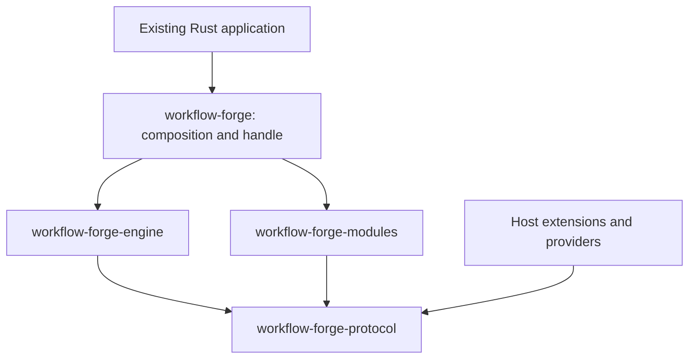
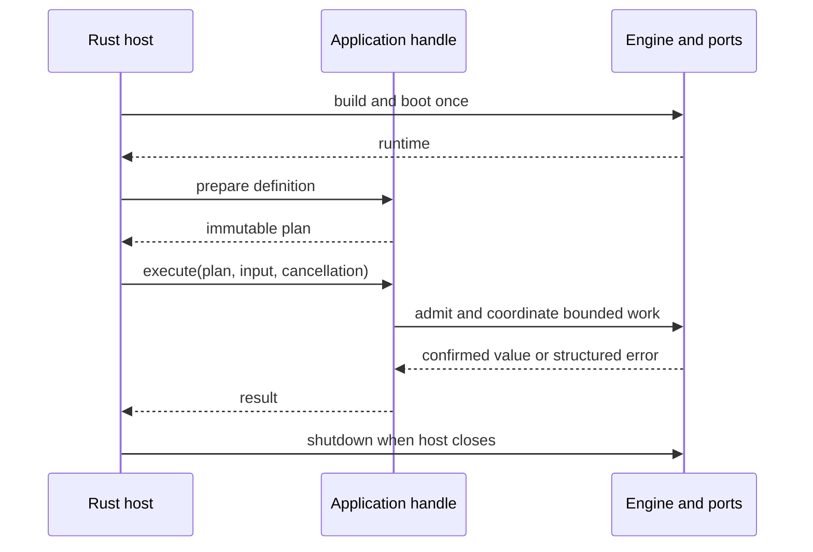

# Architecture

Workflow Forge is an embedded integration library. The host composes resources and calls the
application handle; the engine coordinates contracts without knowing application business rules.

## Boundaries

| Crate | Owns | Does not own |
|---|---|---|
| protocol | Traits, revisions, schemas, values, commands and persisted contracts | Execution or provider implementations |
| engine | Preparation, coordination, state transitions, limits and recovery | HTTP clients, SQL adapters or domain rules |
| modules | Official operations, memory providers and optional SQLite/connectors | Choosing workflow successors |
| forge | Standard composition and public facade | A separate runtime implementation |
| conformance | Reusable behavioral checks for providers | Certification of all concurrency/durability guarantees |

`examples/reference-module` demonstrates protocol-only extensions. `examples/authoring-client`
uses public catalog/schema APIs. `examples/host` contains repository-only integration tests and
proofs of concept; it is not published with the library. The practical manual has an independent
example workspace.

## Runtime ownership

`WorkflowBuilder` collects implementations; `build` validates them and creates an inactive
`EngineAssembly`. `EngineRuntime::boot` claims the store, prepares mandatory definitions and
starts supervision. Default boot rejects unfinished work; recovery requires explicit opt-in.
The host retains the runtime and shares cloned `WorkflowApplication` handles. Preparing a
workflow resolves exact revisions and validates its structure without executing operations.

A prepared plan is immutable and belongs to its composition. A run holds separate input,
identity, deadlines and progress. A retry is another attempt of the same logical invocation,
not another independently identified effect. An application handle does not acquire independent
runtime ownership. Cleanup must still occur after an error or a dropped execution future.

## Coordination and data

Definitions describe control edges and data bindings separately. Every body has an explicit
chain; decision, try, parallel, foreach, loop and subworkflow introduce structured nested scopes.
The compiler rejects inaccessible node references and pins all dependencies before execution.

The coordinator persists intent before dispatch, classifies the attempt result and confirms
progress before enabling a successor. Operations receive only the invocation and authorized
context. They return a value/error; they cannot write checkpoints or select the next node.
Observer callbacks report state without controlling execution. The store enforces ownership,
revision checks, identity and immutable confirmations across commits.

## Effects, waits and recovery

Pure control decisions and confirmed outputs are recoverable state; futures are not persisted.
The recovery package freezes workflow definitions, registered schemas, operation revisions and
requirements. Resume reconstructs unfinished scopes and skips confirmed work. It classifies
unfinished writes before dispatching again. Missing dependencies fail explicitly rather than
silently selecting the current catalog's implementation.

A signal wait reserves its identity before an optional operation starts external work. Delivery
and consumption are separate atomic transitions. Suspended scopes release active capacity;
durable state and wake-up projections retain their readiness. Timers and waits preserve their
original deadlines through restart. The host supplies any incoming transport and authentication.

SQLite provides local durability and exclusive ownership, not distributed execution. Install the
same SQLite provider behind execution and artifact ports when a durable run uses artifacts.
Memory is an explicit ephemeral option. Provider conformance checks supplement, rather than
replace, failure/race/process-crash tests.

## Extension rules

Register a compiled `OperationBundle` before build. Inject clients and pools through its factory;
keep per-invocation input local. Declare exact revisions, schemas, resources, effect certainty and
repetition guarantees. Add a provider by implementing an existing protocol port. A new control
instruction changes the engine language and needs compiler/runtime/contract tests; it is not an
operation plugin. See [patterns](PATTERNS.md), [contracts](CONTRACTS.md) and
[embedding](EMBEDDING.md) for concrete rules.

There is no dynamic plugin loader, code sandbox, standalone listener or cross-language execution
service. Trusted Rust code must cooperate with cancellation. Budgets bound logical work and
retention but do not establish a universal requests-per-second or process-memory guarantee.
