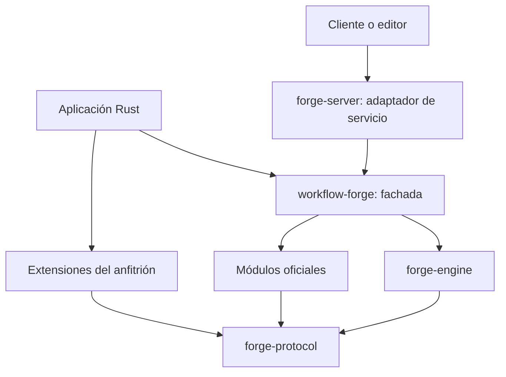
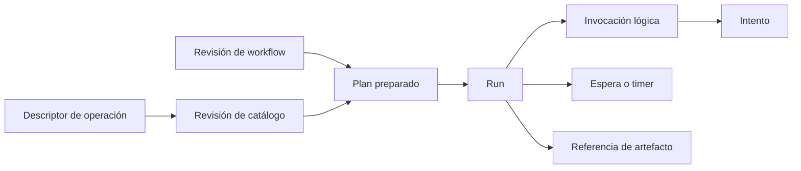
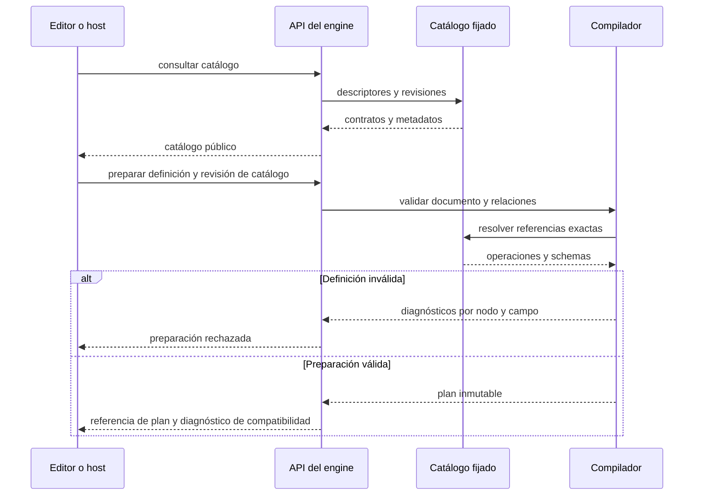
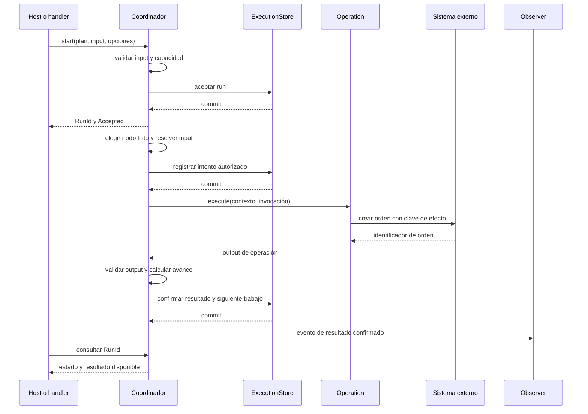
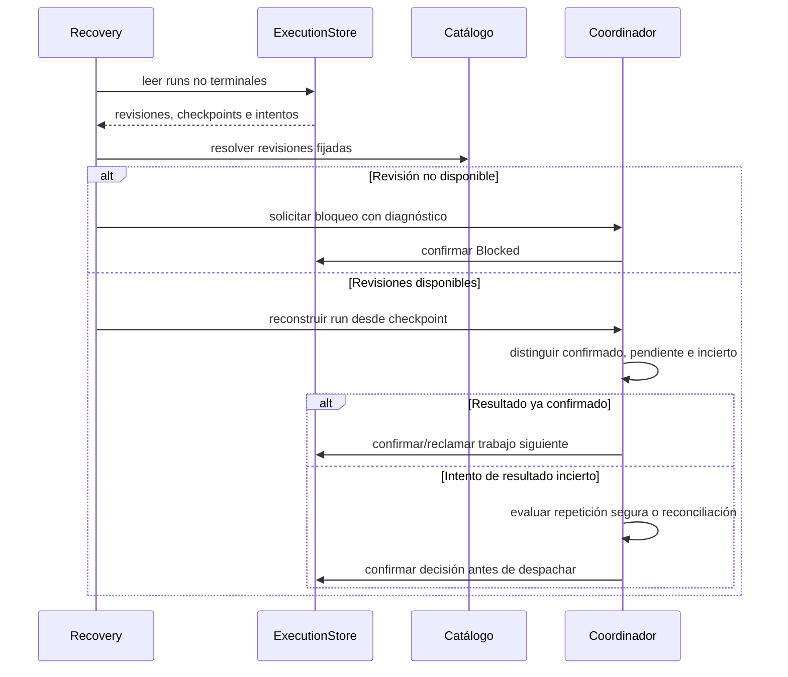
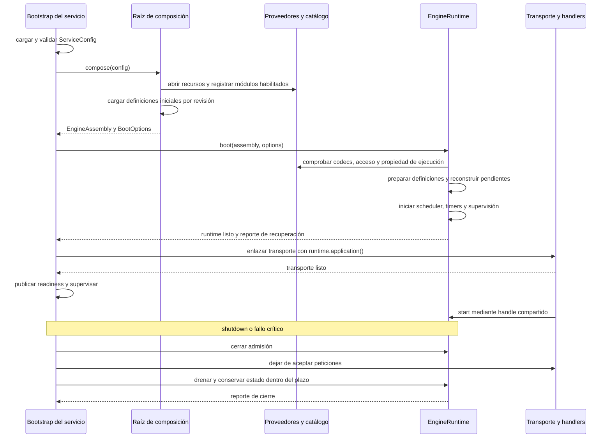

# Workflow Forge — arquitectura objetivo

Fecha: 2026-09-26. Arquitectura de la refactorización, no fotografía del código actual. [PRD](PRD.md) define el producto; [TDD](TDD.md) sus mecanismos; [PROJECT](PROJECT.md) conserva evidencia del prototipo.

## Cómo usar este documento

Leer primero las capas y su [matriz de comunicación](#comunicacion); después los [recorridos completos](#recorridos) y las [recetas de extensión](#recetas). Para implementar una parte, seguir sus referencias TDD-* y verificaciones V-*; las reglas de negocio y garantías prevalecen sobre la brevedad de los ejemplos.

Los fragmentos Rust son **ilustrativos y parciales**: comunican responsabilidad, datos y dirección de las llamadas. Omiten imports, constructores y tipos auxiliares; no son una API publicada ni código listo para copiar y compilar. [CONTRACTS](CONTRACTS.md) fija las decisiones y formas de F-1; [ACCEPTANCE](ACCEPTANCE.md) las recorre con datos concretos. Los diagramas de secuencia muestran escenarios concretos; las variantes de fallo se explican junto a ellos.

Se toma de `memory-forge` la presentación mediante límites de módulos, recetas de extensión, secuencias completas y contratos pequeños. Su dominio, stack y decisiones de infraestructura no se trasladan automáticamente.

## 1. Decisiones y principios

**Confirmado:** Rust, librería y servicio, protocolos públicos, módulos predeterminados y extensiones, composición integrada sustituible y mecanismos que permitan recuperación. Se permite romper compatibilidad.

**Diseño propuesto:** arquitectura de puertos y adaptadores, compilación de definiciones a planes con referencias fijadas, coordinador con estado serializable y proveedores de infraestructura con pruebas de conformidad. Los nombres de crates son propuestos; este documento no ordena crear un crate por cada trait.

| ID | Invariante arquitectónica | Requisito |
|---|---|---|
| ARC-01 | El núcleo depende de contratos y no de conectores, base de datos, transporte ni UI. | PRD-EXT-001 |
| ARC-02 | Módulos oficiales y externos implementan la misma frontera pública. | PRD-EXT-001, PRD-COMP-001 |
| ARC-03 | Librería y servicio componen el mismo coordinador y validador. | PRD-API-001 |
| ARC-04 | La revisión preparada fija semántica, catálogo y dependencias del run. | PRD-EVOL-001 |
| ARC-05 | Transiciones autoritativas y observación tienen responsabilidades distintas. | PRD-DUR-001, PRD-OBS-001 |
| ARC-06 | El núcleo define garantías; el proveedor demuestra cómo las satisface. | PRD-DUR-001, PRD-RES-001 |
| ARC-07 | La presentación gráfica no participa en decisiones de ejecución. | PRD-VIS-001 |

### 1.1 Decisiones para mantener el diseño pequeño

La primera entrega permite transformar/consultar JSON en una secuencia y ampliarla con operaciones. El motor completo añade coordinación, efectos, recuperación y servicio por fases. La simplicidad se conserva colocando cada cambio en su frontera:

| Decisión adoptada | Alternativa considerada | Motivo y consecuencia |
|---|---|---|
| Operaciones abiertas; instrucciones de control conocidas. | Hacer cada regla del scheduler un plugin. | Nuevos negocios no cambian el coordinador; nuevo control exige revisar estados y recuperación. ARC-01/06, P-09. |
| Crates confiables y composición explícita. | Loader dinámico desde la primera entrega. | Comprueba extensibilidad sin añadir ABI, aislamiento y descarga de código antes de necesitarlos. P-03/P-08. |
| JSON Schema 2020-12 y bindings estructurados pequeños. | DSL implícito y lenguaje de scripting dentro del mapping. | El autor distingue datos y expresiones; transformaciones complejas usan operaciones. Rompe el formato anterior deliberadamente. P-06. |
| `Operation` con future boxed en la frontera. | API genérica distinta por cada conector. | Catálogo heterogéneo y contratos iguales; optimizar internals solo con medición. TDD-02. |
| Memoria para embedding y SQLite local como referencia durable. | Exigir un servicio de base de datos en toda adopción. | Perfiles sencillos y sustituibles; SQLite se limita a un coordinador propietario y debe probar recuperación. P-04. |
| HTTP/JSON como primer servicio; UI separada. | Resolver transporte/editor junto con todo el engine. | Permite consumidores independientes sobre la misma fachada, sin acoplar ejecución al ciclo de una petición. P-02/P-05. |

Estas decisiones son revisables mediante evidencia y actualización de contratos; no amplían silenciosamente las garantías de una composición. Los detalles abiertos viven en PRD, no en tablas paralelas de pendientes.

## 2. Capas y dependencias

Las flechas siguientes significan **depende de**, no orden de ejecución:



| Parte | Posee | No posee |
|---|---|---|
| Protocolos | IDs, DTOs serializables, descriptores, errores, eventos y puertos pequeños. | Clientes HTTP, SQL, credenciales concretas ni scheduler. |
| Engine | Compilador, plan, transiciones, coordinación, invocaciones y políticas de ejecución. | Conocimiento del negocio o backend específico. |
| Módulos oficiales | Operaciones y proveedores predeterminados. | Privilegios especiales sobre el engine. |
| Extensiones | Capacidades implementadas por terceros sobre protocolos. | Acceso obligatorio al contexto interno o escritura directa de estados del run. |
| Fachada | Composición por defecto, builder, selección de capacidades y exportaciones públicas. | Una segunda implementación del runtime. |
| Servicio | Transporte, ciclo de vida, contexto de acceso y traducción de solicitudes/respuestas. | Otro formato semántico de workflow ni reintentos ocultos del motor. |

La raíz de composición crea clientes y proveedores, valida su compatibilidad e inyecta dependencias. No hay un registro global mutable de servicios. «All in one» significa facilidad de adopción; las dependencias opcionales pueden seleccionarse por features.

### 2.1 Organización de responsabilidades en el repositorio

Árbol de responsabilidades ilustrativo. F-1/F-2 ya tienen crates `protocol`, `engine`, `modules`, `forge` y `conformance`; algunas responsabilidades son archivos o módulos bajo `engine/src/runtime`, no carpetas separadas. El servicio corresponde a F-4:

```text
crates/
  protocol/src/
    definition/       DTOs de autoría y revisiones
    operation/        descriptores, invocación y contrato ejecutable
    execution/        IDs, estados públicos, comandos y resultados
    ports/            persistencia, artefactos, secretos y observación
  engine/src/
    compiler/         resolución, validación y plan preparado
    coordinator/      transiciones, progreso y control de intentos
    scheduler/        selección de trabajo listo y límites
    recovery/         reconstrucción, esperas y reconciliación
  modules/
    data/ http/ ...   operaciones oficiales
    memory/ ...       proveedores oficiales de infraestructura
  forge/src/          fachada y builder de composición
apps/
  server/src/
    composition/     conexiones y recursos del servicio
    transport/       handlers y traducción de DTOs de transporte
    lifecycle/       arranque, admisión y apagado
```

`protocol` define el significado de la comunicación; `engine` implementa la coordinación. Los módulos concretos implementan los puertos. SQLite ocupará un módulo oficial de estado durable sin introducir SQL en el engine. Los módulos se comunican a través del engine o de dependencias inyectadas por el host; una operación no busca a otra en un registro global para eludir el workflow.

<a id="comunicacion"></a>

### 2.2 Matriz de comunicación

| Emisor → receptor | Contrato / información | Forma y confirmación | Responsable ante fallo |
|---|---|---|---|
| Cliente → transporte | Solicitud de catálogo, preparación, inicio, consulta o señal. | HTTP/JSON inicial; recepción y resultado son hitos distintos. | Transporte traduce errores; no vuelve a iniciar por su cuenta. |
| Transporte o host → engine | Definición/input o comando tipado, contexto de acceso y opciones. | Llamada Rust en el proceso de la primera topología. | Engine aplica validación, admisión y política. |
| Compilador → catálogo | Referencia exacta de operación/perfil/subworkflow. | Lectura de snapshot; produce referencia fijada o diagnóstico. | Compilador rechaza referencias ausentes/ambiguas. |
| Coordinador → scheduler | Trabajo listo identificado y límites. | Coordinación interna; elegir trabajo no acredita ejecución. | Coordinador conserva el estado autoritativo. |
| Coordinador → `ExecutionStore` | Intención o transición con revisión esperada. | I/O asíncrono; esperar commit en modo durable. | Engine resuelve conflicto/fallo sin despachar trabajo no autorizado. |
| Coordinador → `Operation` | Invocación, input validado y contexto acotado. | Llamada asíncrona mediante contrato público. | Operación informa evidencia/error; engine decide retry/continuación. |
| Operación → sistema externo | Solicitud técnica y clave de efecto cuando aplique. | HTTP/SFTP/cliente específico oculto por el módulo. | Adaptador clasifica lo conocido, incluso incertidumbre. |
| Operación → recursos | Referencia de secreto o artefacto y ámbito. | Puerto inyectado; nunca acceso al store de ejecuciones. | Proveedor aplica acceso y disponibilidad; engine decide el desenlace. |
| Coordinador → observador | Evento de cambio con identidad y secuencia. | Notificación, sin convertirse en autorización para avanzar. | Adaptador de observación aplica su política; estado se consulta al engine. |
| Recovery → coordinador | Run/checkpoint y revisiones recuperadas. | Reingresa por las mismas transiciones que una ejecución viva. | Coordinador bloquea lo incierto o incompatible. |

No todo intercambio necesita una cola, socket o bus. En embedding y en el servicio inicial, los puertos son llamadas Rust; las fronteras externas son el transporte y los conectores. Si se distribuyen workers, un adaptador nuevo deberá resolver entrega, reclamo y respuestas tardías manteniendo estos contratos.

### 2.3 Propiedad y duración de dependencias

| Ámbito | Recursos | Regla |
|---|---|---|
| Composición | Clientes/pools, proveedores, catálogo disponible y límites del host. | Reutilizables entre runs; no guardan input mutable de un run como estado global. |
| Plan preparado | Grafo normalizado, schemas e implementaciones fijadas. | Inmutable y compartible; la configuración efectiva se identifica por revisión. |
| Run | Avance, outputs, esperas y referencias de artefactos. | Propiedad del coordinador/store; separado entre ejecuciones. |
| Invocación/intento | Input, identidad, deadline, permiso de confirmación y clave de efecto. | Se descarta el future al terminar; evidencia y estado se conservan según retención. |

Compartir un `Arc` comparte acceso, no convierte datos mutables en seguros. Evitar mantener locks de catálogo/estado durante I/O de una operación. La revisión esperada de una transición protege la confirmación; no se sustituye por un lock mantenido durante una llamada remota.

## 3. Modelo conceptual y propiedad



Las flechas representan composición o referencia. Un plan puede originar varios runs; cada invocación puede tener varios intentos. Iteraciones y subworkflows agregan ámbito a la identidad. El catálogo posee descriptores y referencias a implementaciones; el coordinador posee transiciones; el proveedor de estado conserva la representación autoritativa bajo las garantías acordadas.

El formato serializable de protocolos y la API Rust son superficies diferentes. Compartir contratos no implica compartir una ABI de bibliotecas dinámicas; P-03 adopta plugins compilados. Cambiar ese mecanismo requiere revisar sus garantías.

### 3.1 Tres representaciones que no se deben confundir

| Representación | Contiene | Consumidor |
|---|---|---|
| Documento de autoría | Nodos, conexiones, mappings, políticas y presentación. | Integrador/editor y compilador. |
| Plan preparado | Instrucciones resueltas, validadores y referencias de implementación. | Engine en el proceso actual. |
| Checkpoint durable | IDs/revisiones, datos confirmados, pendientes y estado versionado. | Recovery y proveedor de estado. |

El checkpoint permite reconstruir la parte ejecutable del plan usando revisiones disponibles; no persiste punteros `Arc`, sockets ni validadores compilados como si fueran un formato portable. Una definición editada genera una nueva revisión y afecta runs nuevos. Recuperar uno existente exige su semántica original. Contratos: TDD-01/TDD-07; verificación V-15.

### 3.2 Fragmento de protocolo: invocación y operación

Ejemplo E-01 — frontera pública, no implementación del scheduler. Los tipos auxiliares representan contratos definidos en TDD-01/TDD-02/TDD-06.

```rust
pub struct Invocation {
    pub id: InvocationId,
    pub attempt: AttemptId,
    pub operation: OperationRevision,
    pub config: BoundConfig,
    pub input: WorkflowValue,
    pub effect_key: Option<EffectKey>,
}

pub type OperationFuture<'a> = Pin<Box<
    dyn Future<Output = Result<OperationOutput, OperationError>> + Send + 'a
>>;

pub trait Operation: Send + Sync {
    fn descriptor(&self) -> &OperationDescriptor;
    fn execute<'a>(
        &'a self, ctx: OperationContext, command: Invocation,
    ) -> OperationFuture<'a>;
}
```

`BoundConfig` contiene configuración validada y referencias a recursos, no credenciales exportadas. `OperationContext` expone identidad, cancelación/deadline y recursos autorizados; no expone `ExecutionStore` ni el scheduler. El engine genera identidad de invocación y deriva/preserva la clave de efecto según política. La operación no crea otro `RunId` para cada intento.

El future boxed es la frontera adoptada para implementaciones heterogéneas mediante `dyn Operation`; no impone ese coste a cada función interna. La ergonomía tipada puede adaptarse al contrato sin duplicar reglas del motor. CONTRACTS precisa configuración, tipos y errores; este fragmento sigue omitiendo sus definiciones auxiliares.

## 4. Preparación y ejecución

1. El consumidor descubre el catálogo y construye una definición.
2. El compilador valida documento, grafo, referencias, mappings y capacidades; fija revisiones y prepara validadores.
3. El coordinador acepta el run bajo el perfil seleccionado y su política de capacidad.
4. El scheduler determina trabajo listo; invoca operaciones mediante el contrato público y registra resultados/transiciones.
5. El run termina, queda en espera o requiere reconciliación. El consumidor consulta estado y resultado por identidad.

Los puertos de I/O mantienen efectos fuera de las transiciones puras. Una ejecución durable conserva comandos/resultados y progreso serializable. No exige adoptar event sourcing completo ni replay de código arbitrario: checkpoint/journal y su formato se concretan en TDD.

<a id="recorridos"></a>

### 4.1 Descubrir, conectar y preparar un workflow



Las respuestas al consumidor se entregan a través de la API; no hay acceso directo al catálogo interno. El compilador no llama a `Operation::execute`. Preparar puede validar que existe una referencia de recurso, pero no debe probarla creando una orden o enviando una notificación. Una incompatibilidad desconocida conserva su diagnóstico y se valida con datos reales al ejecutar. TDD-02/03/04; V-02/V-03/V-11.

Ejemplo E-02 — extracto de autoría del formato objetivo, usando los bindings de CONTRACTS. Omite la cabecera y el nodo `normalize`; la escritura `create_order` requiere F-2:

```json
{
  "nodes": [{
    "id": "create_order",
    "kind": "operation",
    "operation": {"id": "acme.create_order", "contract": "1", "implementation": "r1"},
    "config": {},
    "input": {"object": {
      "customer": {"select": {"source": "node", "node": "normalize", "pointer": "/customer"}},
      "channel": {"literal": "partner"}
    }}
  }],
  "edges": [{"from": "normalize", "to": "create_order"}],
  "presentation": {"create_order": {"x": 400, "y": 120}}
}
```

La conexión habilita el nodo; el mapping elige datos. Mover `x/y` no cambia la revisión ejecutable. Si `normalize` solo ocurre en una rama opcional, el compilador debe exigir disponibilidad o una alternativa explícita; nunca usar el output residual de otro run. JSON Schema valida forma y valores; la disponibilidad del productor requiere análisis del grafo.

### 4.2 Ejecutar una integración con efectos

Caso ilustrativo: normalizar una petición, crear una orden y mapear su identificador. El dominio «órdenes» vive en la extensión; el engine solo conoce invocaciones, resultados y relaciones.



La secuencia muestra modo durable y camino satisfactorio. En memoria, los commits son transiciones locales sin garantía de reinicio. Un fallo de persistencia tras recibir la orden no permite volver a crearla ciegamente: se conserva evidencia y se aplica TDD-06/07. Una salida inválida tampoco borra el efecto. Los eventos de cambio confirmado se publican después del commit; la telemetría sobre intentos no equivale a un resultado confirmado.

### 4.3 Recuperar una caída sin duplicar decisiones



Recovery no tiene un segundo algoritmo de negocio ni ejecuta conectores directamente. La evaluación puede concluir en bloqueo; no siempre genera un retry. Repetir por idempotencia conserva la identidad de efecto; reconciliar usa evidencia del destino. Si varios coordinadores pueden competir, la revisión y propiedad se comprueban también en cada confirmación. TDD-01/06/07; V-07/V-08/V-15.

Ejemplo E-03 — forma de una transición condicional, no API completa de persistencia:

```rust
pub struct CommitRun {
    pub run: RunId,
    pub expected_revision: RunRevision,
    pub owner: OwnerToken,
    pub transition: RunTransition,
}

pub enum CommitResult {
    Applied { revision: RunRevision },
    Conflict { actual: RunRevision },
    OwnershipLost,
}
```

`RunTransition` agrupa los cambios que deben confirmarse juntos: resultado, progreso y trabajo/espera siguiente. Un `Conflict` obliga a releer y recalcular; no se reenvía ciegamente la misma decisión. Si se pierde el acuse del commit, releer su estado por identidad antes de inferir que no se aplicó. `OwnerToken` representa autoridad de ejecución, no necesariamente una lease distribuida. Esta forma no autoriza implementar tres escrituras independientes sin recuperación equivalente.

### 4.4 Esperar una señal y continuar

```mermaid
sequenceDiagram
    participant E as Coordinador
    participant S as ExecutionStore
    participant H as Adaptador de señales
    E->>S: registrar espera y transición del run
    S-->>E: commit
    Note over E: libera trabajo activo; otras ramas pueden continuar
    H->>E: signal(wait_id, message_id, payload, acceso)
    E->>E: comprobar acceso, correlación y schema
    E->>S: consumir señal y habilitar continuación atómicamente
    alt Señal nueva aceptada
        S-->>E: commit
        E-->>H: acuse de recepción
    else Señal duplicada
        S-->>E: recepción previa
        E-->>H: mismo acuse sin segunda continuación
    else Espera vencida o desconocida
        S-->>E: rechazo según política
        E-->>H: diagnóstico explícito
    end
```

Un callback se dirige al adaptador de entrada, que traduce y autoriza antes de solicitar la transición al engine; no completa un nodo escribiendo SQL. Los timers compiten por la misma transición que una señal. TDD-08 define rechazo de señales anticipadas y resolución condicional de la carrera; F-3 concreta su persistencia y conformidad.

Un trabajo externo debe devolver un identificador/recurso rastreable y separar «iniciar trabajo» de «esperar resultado». Registrar una espera después de lanzar el trabajo puede perder un callback temprano: antes de habilitar esa integración se debe usar una correlación preestablecida con espera registrada o un protocolo de reentrega del destino. Un inbox anticipado sería otra capacidad futura. Ningún fragmento supone que ese problema desaparece por usar async.

### 4.5 Librería y servicio: una sola entrada de aplicación

Ejemplo E-04 — delegación del handler. `WorkflowApplication` es el handle público propuesto del engine, construido por la fachada; no un segundo coordinador en el servidor:

```rust
async fn start_run(
    app: &WorkflowApplication,
    access: AccessContext,
    request: StartRunRequest,
) -> Result<StartReceipt, PublicError> {
    app.start(access, request).await.map_err(PublicError::from)
}
```

El transporte autentica/traduce su request y convierte `StartReceipt` al protocolo seleccionado. El engine recibe un contexto ya acreditado por el host y aplica las políticas de acceso configuradas; un caller no obtiene permiso por enviar un campo `tenant` o `user` en JSON. La librería llama al mismo handle desde Rust. [HTTP](HTTP.md) concreta las rutas, tipos wire y lifecycle adoptados en P-05; la arquitectura no acopla el engine al framework del adaptador.

`StartReceipt` confirma aceptación con `RunId`, no éxito del workflow. La vida del run está bajo el host/runtime; no depende de mantener abierto el future del handler. Una desconexión no invoca `cancel` por accidente. El host debe mantener vivo el runtime y cumplir su protocolo de apagado. TDD-10/12; V-10/V-14.

## 5. Extensibilidad y patrones

Las asignaciones siguientes son decisiones de diseño propuestas para resolver problemas del proyecto. El [catálogo de Refactoring.Guru](https://refactoring.guru/design-patterns/catalog) es referencia solicitada por el usuario, no una obligación de implementar todos los patrones.

La [guía de patrones y evolución de extensiones](PATTERNS.md) desarrolla PAT-01 a PAT-11: definición, participantes, aplicación, límites y conformidad. «Plugin» significa extensión sobre los contratos del motor; P-03 adopta composición de crates compilados. Las reglas del TDD gobiernan las garantías y la guía explica cómo preservarlas al extender el sistema. Flyweight se limita al paquete inmutable compartido del proveedor en memoria; no comparte progreso entre runs ni cambia el protocolo de una extensión.

| Patrón | Uso | Prueba de que aporta valor |
|---|---|---|
| Adapter | Conectar bibliotecas técnicas con operaciones y proveedores públicos. | Sustituir backend sin modificar engine. |
| Strategy | Políticas variables de admisión o backoff. | Dos políticas comparten invariantes y producen la diferencia esperada. |
| Builder + Facade | Composición integrada y sustituciones explícitas. | Configuración útil con pocos pasos; combinaciones inválidas fallan al construir. |
| Command | Representar la intención serializable de invocar una operación. | Recuperar trabajo pendiente sin serializar futures. |
| State | Estados y transiciones explícitas. | Rechazar transiciones ilegales y resultados tardíos. |
| Observer | Publicar trazas, métricas y cambios para consumidores. | Un observador no altera el resultado de negocio ni sustituye persistencia. |
| Decorator | Instrumentación o límites locales alrededor de adaptadores. | Añadir métricas sin cambiar el conector ni duplicar reintentos. |
| Composite | Subworkflow con contrato utilizable como unidad de composición. | Reutilizar un flujo conservando ámbito de datos e identidad. |
| Función fábrica / Abstract Factory | Construir contribuciones; introducir una fábrica abstracta solo para familias intercambiables de productos relacionados. | Registro íntegro, requisitos compatibles y ninguna tarea de fondo sin propietario. |

En Rust se prefieren composición, traits acotados y enums para estados cerrados. Un `match` sobre instrucciones estables no exige una jerarquía de objetos. Un pipeline de validación que acumula errores tampoco se convierte automáticamente en Chain of Responsibility. Evitar Singletons y abstracciones sin una sustitución o invariante concreta.

Receta pública: declarar descriptor → implementar contrato → registrar en composición → ejecutar conformidad. La apertura inicial corresponde a operaciones y proveedores. Añadir semánticas nuevas al scheduler requiere otro diseño; no se promete por permitir nuevas operaciones.

El [registro de un módulo](PATTERNS.md#registro) recibe contribuciones explícitas y las valida completas antes de publicar catálogo. Los módulos no reciben acceso irrestricto al builder/engine ni reemplazan proveedores por efectos laterales de su constructor. Declarar dependencia significa requerir un puerto/capacidad; componer dos operaciones de negocio corresponde al workflow.

Para decidir rápido: **Adapter** traduce una interfaz; **Strategy** cambia una política; **Decorator** conserva interfaz y semántica mientras añade comportamiento acotado. **Builder** construye la composición; **Facade** permite usarla. **Command** identifica trabajo; **State** determina transiciones; **Observer** comunica hechos. Elegir uno no concede permiso para alterar las responsabilidades de los demás. Los fragmentos PX-* de la guía y E-* de este documento se complementan.

<a id="recetas"></a>

### 5.1 Receta A — agregar una operación de integración

1. Publicar descriptor de `acme.create_order`: revisión, schemas de configuración/input/output, recursos y política de efecto.
2. Implementar `Operation` en una extensión; inyectar el cliente del destino al construirla.
3. Registrar en el builder, preparar un workflow que la use y ejecutar V-02/V-04/V-07.

Ejemplo E-05 — fragmento del adaptador que muestra el límite técnico:

```rust
struct CreateOrder {
    descriptor: OperationDescriptor,
    client: PartnerClient,
}

// Fragmento del cuerpo de Operation::execute:
let response = self.client
    .create_order(&command.input, command.effect_key.as_ref())
    .await
    .map_err(classify_partner_error)?;

Ok(OperationOutput::json(response.into_workflow_value()))
```

`classify_partner_error` conserva si hay rechazo conocido, error transitorio o efecto incierto; no convierte todo timeout en «seguro para repetir». El adaptador transmite la clave cuando el destino la soporta, y su descriptor solo declara esa garantía con evidencia. El cliente no añade retries ocultos de mutaciones que el engine no pueda contabilizar. La operación devuelve datos; no marca el nodo como terminado, elige la arista siguiente ni publica eventos de éxito por su cuenta.

### 5.2 Receta B — usar todo integrado y sustituir un proveedor

1. Partir de la composición estándar.
2. Reemplazar proveedores mediante sus puertos y registrar capacidades del anfitrión.
3. Construir y validar compatibilidad antes de preparar/aceptar trabajo.

Ejemplo E-06 — composición con proveedores ya creados por el host; muestra sustitución explícita de los defaults:

```rust
let mut builder = WorkflowBuilder::standard()
    .execution_store(host_store)
    .artifact_store(host_artifacts)
    .secret_provider(host_secrets);
builder.register_bundle(host_operations)?;
let assembly = builder.build()?;

let runtime = EngineRuntime::boot(assembly, boot_options).await?;
let app = runtime.application();
let plan = app.prepare(access.clone(), definition).await?;
let receipt = app.start(access, StartRunRequest::new(plan, input)).await?;
```

`standard()` elige módulos oficiales documentados, no servicios globales. `build()` rechaza proveedores incompatibles o IDs/revisiones en conflicto y devuelve una composición inactiva. `boot()` inicializa y supervisa el motor; `prepare()` fija lo usado por ese plan. El host conserva `runtime` hasta completar el apagado, aunque comparta clones de `app`. P-04 elige memoria para embedding y SQLite para servicio durable; los proveedores del fragmento pueden sustituirlos bajo sus garantías. Sustituir estado sin sustituir artefactos temporales puede incumplir recuperación y debe diagnosticarse. `StartRunRequest::new` usa las opciones predeterminadas descritas en CONTRACTS.

### 5.3 Receta C — implementar otro backend

1. Implementar las garantías de `ExecutionStore`, especialmente atomicidad, revisiones y recuperación; publicar capacidades reales.
2. Adaptar codificación/migraciones y recursos de almacenamiento sin introducir SQL en el engine.
3. Pasar V-08/V-09/V-15 y seleccionar el proveedor en composición.

No basta con devolver `supports_recovery = true`. La suite debe demostrar aceptación durable, reinicio entre efecto y resultado, consumo único de señal y rechazo de confirmaciones obsoletas. El esquema físico es del adaptador; la semántica de la transición pertenece al protocolo. Los datos históricos requieren codecs/revisiones compatibles antes de exponer admisión.

### 5.4 Receta D — agregar un transporte o disparador

1. Traducir la entrada del transporte a `StartRunRequest` o señal, con identidad de recepción y acceso acreditado.
2. Delegar al handle del engine y traducir sus acuses/diagnósticos.
3. Probar recepción duplicada, rechazo y desconexión con la misma semántica de V-10.

Webhook, mensaje de cola o invocación desde otra aplicación son adaptadores de entrada. Su acuse externo depende de la garantía requerida: si promete aceptación durable, se responde después de persistir. No construir workflows distintos para cada transporte ni tratar todo trigger como una operación que debe mantener un servidor vivo dentro de un nodo.

### 5.5 Receta E — agregar una política sin cambiar la máquina de estados

Ejemplo E-07 — Strategy para demora, cuya decisión no autoriza por sí sola repetir:

```rust
pub trait BackoffPolicy: Send + Sync {
    fn delay(&self, attempt: AttemptNumber, hint: RetryHint) -> Duration;
}

// Fragmento conceptual del coordinador:
if retry_decision.permitted() {
    let delay = backoff.delay(attempt_number, provider_hint);
    let next = transition.schedule_retry(invocation_id, delay);
    // Confirmar `next` mediante ExecutionStore antes de despachar otro intento.
}
```

La clasificación del error, presupuesto/deadline y seguridad de repetición se resuelven antes. El backoff no puede convertir `Unknown` en fallo seguro ni regenerar la identidad del efecto. Jitter/reloj se inyectan o materializan al decidir y se guarda el vencimiento; no recalcular otro azar al recuperar una espera ya programada.

## 6. Despliegue y recursos

**Embedding:** el host configura el builder, registra capacidades y llama al motor. **Servicio:** un host oficial expone la misma superficie lógica y administra su ciclo de vida. La primera topología propuesta es un proceso coordinador; distribuir workers es una ampliación separada.

El perfil efímero usa estado en memoria y declara pérdida ante reinicio. El perfil durable requiere persistencia compatible, artefactos recuperables e implementaciones disponibles por revisión. El motor rechaza combinaciones incapaces de cumplir las garantías solicitadas. P-04 adopta memoria en embedding y SQLite local en el servicio durable; otros proveedores respetan los mismos puertos. El puerto de artefactos conserva contenido persistente y coordina su propiedad con el store según TDD-09. Un mismo backend puede implementar ambos puertos: SQLite usa clones del mismo proveedor/actor, como concreta CONTRACTS §10.3.

Blobs y secretos se obtienen mediante puertos. El acceso a esos recursos depende del contexto del host. El diseño de acceso del servicio se cierra antes de exponerlo, conforme a P-05/P-08. Un módulo compilado dentro del proceso no está aislado frente a comportamiento arbitrario.

### 6.1 Arranque y apagado como parte del contrato


Un fallo al validar configuración/capacidades impide habilitar la composición. Runs individuales con revisiones ausentes quedan diagnosticados como bloqueados; la política del host decide si admite otros runs válidos. Cerrar el runtime sin completar el drenado deja trabajo recuperable solo si el perfil soporta persistencia. Los pools y secretos viven mientras haya trabajo autorizado que los requiera.

<a id="instancia-y-arranque"></a>

La implementación F-4 de estas responsabilidades está en [`HostConfig`](../crates/service/src/host.rs), [`ServiceRuntime`](../crates/service/src/runtime.rs) y el [ejecutable](../crates/service/src/main.rs). HTTP §6 muestra el arranque concreto; las secuencias y fragmentos siguientes explican propiedad y comunicación. Los handlers comparten `WorkflowApplication`; ninguna ruta construye otro runtime o abre SQLite directamente.

#### 6.1.1 Qué instancia se crea y quién la conserva

La raíz de composición del servicio crea **una instancia del runtime por configuración y ámbito de ejecución** al arrancar el proceso. Los handlers comparten un handle de esa instancia; no crean un motor por petición ni por workflow. Cada petición de ejecución crea un run independiente dentro de ese runtime.

| Objeto propuesto | Lo crea / conserva | Función y duración |
|---|---|---|
| `ServiceConfig` | Bootstrap del servicio. | Configuración validada: perfil, proveedores, módulos habilitados, origen de definiciones, límites y apagado. |
| `EngineAssembly` | `WorkflowBuilder::build()`. | Dependencias conectadas y catálogo fijado para el arranque; todavía no hay scheduler activo. |
| `EngineRuntime` | `EngineRuntime::boot(...)`. | Dueño del coordinador, tareas supervisadas, recuperación, timers y ciclo de vida; lo conserva el host. |
| `WorkflowApplication` | `runtime.application()`. | Handle clonable para preparar/iniciar/consultar/señalar; todos los clones apuntan a la misma instancia. |
| `AppState` | Adaptador del servicio. | Aloja el handle y estado del transporte; se comparte con handlers. No posee otro scheduler. |
| `PreparedWorkflow` | Compilador durante boot o una preparación posterior. | Plan por revisión, reutilizable por múltiples runs. No es la instancia del motor. |

Es una instancia explícita, no un Singleton global. Un host puede componer varias instancias independientes si define sus ámbitos, recursos y propiedad de almacenamiento. Dos procesos no adquieren derecho a coordinar el mismo store por tener la misma configuración: deben respetar exclusión o el protocolo de propietarios admitido por el backend.

`EngineRuntime` tampoco es el executor async de Rust. La aplicación provee el entorno async compatible; el engine administra sus tareas dentro de él. Crear un pool de conexiones o arrancar el servidor no sustituye llamar a `boot()`.

#### 6.1.2 Secuencia completa del servicio



`boot()` vuelve cuando las tareas esenciales están supervisadas y la recuperación inicial dejó el trabajo pendiente en un estado conocido; no espera que terminen todos los workflows históricos. Puede haber runs bloqueados con diagnóstico y otros capaces de avanzar. Las definiciones iniciales configuradas como obligatorias deben prepararse correctamente antes de devolver una instancia lista. Un bloqueo individual histórico se trata según la política del host, como indica la sección 6.1.

Las operaciones ejecutables se registran antes de cargar/preparar definiciones que las referencien. Cargar una definición no la ejecuta: habilita su revisión para futuras invocaciones. La primera composición recibe documentos desde el host; el servicio los carga de un directorio configurado al arrancar. Un repositorio/API de publicación podrá sustituir ese origen manteniendo revisiones. La configuración selecciona módulos compilados disponibles, no convierte un nombre arbitrario en código instalable. Los timers recuperados pertenecen a runs existentes; iniciar runs por cron es otra capacidad de entrada.

#### 6.1.3 Fragmento de creación de la instancia

Ejemplo E-09 — raíz de composición propuesta en `apps/server/src/composition/`. Los helpers representan decisiones del host y omiten su implementación:

```rust
async fn compose(cfg: &ServiceConfig) -> Result<EngineAssembly, BootError> {
    let providers = open_providers(&cfg.providers).await?;
    let mut builder = WorkflowBuilder::standard()
        .execution_store(providers.executions)
        .artifact_store(providers.artifacts)
        .secret_provider(providers.secrets)
        .limits(cfg.limits.clone());

    register_enabled_modules(&mut builder, &cfg.modules).await?;
    builder.build()
}

let cfg = ServiceConfig::load_and_validate()?;
let assembly = compose(&cfg).await?;
let definitions = load_startup_definitions(&cfg.workflows).await?;
let options = cfg.boot_options().with_definitions(definitions);
let runtime = EngineRuntime::boot(assembly, options).await?;
```

El fragmento muestra orden, no un formato de configuración completo. `register_enabled_modules` construye operaciones con clientes inyectados; no despacha trabajo de negocio. Toda tarea/conexión abierta durante composición pertenece a un propietario que la cierra si el arranque falla. El builder estándar y los módulos configurados deben detectar registros duplicados; no sobrescriben implementaciones silenciosamente. La carga de secretos se resuelve con referencias y no vuelca valores en logs de configuración.

#### 6.1.4 Compartir el motor y supervisar su vida

Ejemplo E-10 — continuación de E-09 en el bootstrap; `serve`, `supervise` y `finish_shutdown` pertenecen al host, no a las operaciones del workflow:

```rust
struct AppState {
    workflows: WorkflowApplication, // handle clonable, no runtime nuevo
}

let state = Arc::new(AppState { workflows: runtime.application() });
let mut server = match serve(cfg.transport.clone(), state).await {
    Ok(server) => server,
    Err(error) => {
        let cleanup = runtime.shutdown(cfg.shutdown.clone()).await;
        return Err(BootError::transport_with_cleanup(error, cleanup));
    }
};

let outcome = supervise(&runtime, &server, shutdown_signal()).await;
runtime.close_admission();
let transport_stop = server.stop_accepting().await;
let engine_stop = runtime.shutdown(cfg.shutdown.clone()).await;
finish_shutdown(outcome, transport_stop, engine_stop)
```

`serve` entrega un handle supervisable después de enlazar el transporte; no bloquea hasta que el servidor termine. `supervise` espera una señal de cierre, un fallo del servidor o un fallo crítico del engine. Si cualquiera falla, siempre se ejecuta la limpieza de los demás; `finish_shutdown` conserva el error original y cualquier fallo de cierre. Los detalles de tipo/framework siguen siendo ilustrativos.

La readiness del servicio exige engine listo y transporte enlazado; un proceso vivo durante recovery solo acredita liveness. Si falla una tarea esencial, se retira readiness y se cierra admisión, sin dejar handlers enviando trabajo a un scheduler muerto. El estado de ciclo de vida del engine debe ser consultable por el supervisor; las notificaciones son ayuda, no la única evidencia.

Cerrar admisión rechaza nuevos `start` y nuevas preparaciones que creen carga, mientras las consultas y operaciones de control permitidas durante drenado siguen una política explícita. Aceptar una señal durante drenado solo es válido si su acuse y continuación pendiente pueden conservarse según el perfil. Cancelar un run y apagar el motor son comandos distintos: en durable se puede detener el host y dejar runs recuperables sin marcarlos como cancelados.

La caída de `EngineRuntime` por `Drop` no puede prometer una operación async de drenado: el host debe llamar y esperar `shutdown()`. Los clones de `WorkflowApplication` no mantienen un scheduler huérfano ni reinician el motor; después del cierre devuelven un error de ciclo de vida. La fachada puede ofrecer facilidades de uso, pero debe conservar esta propiedad explícita.

#### 6.1.5 Fallos de arranque y comportamiento verificable

| Punto de fallo | Respuesta requerida |
|---|---|
| Configuración inválida, módulo ausente o IDs duplicados | Diagnóstico y salida antes de aceptar ejecuciones. |
| Store inaccesible, codec incompatible o propiedad no adquirida | Fallar boot y cerrar recursos iniciados; sin fallback silencioso a memoria. |
| Definición inicial obligatoria inválida | Diagnóstico por workflow/nodo; no arrancar parcialmente sin política declarada. |
| Run histórico con revisión ausente | Bloquear ese run; aplicar la política publicada de readiness/arranque. |
| Error al enlazar el transporte después de boot | Apagar el engine y conservar pendientes durables; no dejar tareas huérfanas. |
| Scheduler o tarea esencial deja de funcionar | Retirar readiness, cerrar admisión y notificar al supervisor. |
| Vence el plazo de apagado | Reportar drenado incompleto y evidencia disponible; no fingir cancelación de efectos remotos. |

F-1 implementa `EngineRuntime::boot(assembly, BootOptions)`, `application()` y `shutdown(ShutdownOptions)`. `BootOptions.definitions` prepara definiciones obligatorias antes de readiness; `ShutdownOptions.timeout` limita el drenado. El host debe esperar el apagado asíncrono: descartar el runtime aborta tareas, pero no sustituye la liberación ordenada del store. El [host ejecutable](../crates/forge/examples/v2_customer.rs) muestra el recorrido completo. F-3 verifica recuperación durable y el [host SQLite](../crates/forge/examples/v2_sqlite.rs) muestra su composición; el bootstrap del servicio corresponde a F-4. El mecanismo de construcción y propiedad también aplica a embedding, aunque no exista transporte.

### 6.2 Observación y lectura de estado

El observador recibe hechos o telemetría identificados; un consumidor que necesita saber si terminó un run consulta su estado autoritativo. Perder una notificación no debe borrar resultados ni impedir una continuación. Si se exige entrega confiable de eventos, el adaptador utiliza outbox/journal con sus garantías explícitas; no se obtiene por conectar un callback en memoria.

Ejemplo E-08 — datos de observación seleccionados, sin payload completo:

```rust
pub struct RunChanged {
    pub run: RunId,
    pub revision: RunRevision,
    pub status: RunStatus,
    pub cause: Option<InvocationId>,
}
```

El consumidor usa revisión/identidad para reconocer mensajes repetidos y vuelve a consultar si detecta un salto. Este evento no es el checkpoint. La captura de input/output y sus permisos debe configurarse por separado; los descriptores y eventos no incluyen credenciales.

## 7. Refactorización del prototipo

| Origen del prototipo | Destino lógico | Acción |
|---|---|---|
| `core/spec`, errores y descriptores de tareas | Protocolos | Extraer y revisar formato/identidades. |
| `core/validate`, expresiones, schemas e índices | Compilador del engine | Separar preparación de ejecución; fijar catálogo. |
| `core/runtime` | Coordinador y estado del engine | Separar decisiones, invocación y persistencia. |
| `core/task`, `io`, `observe` | Contratos públicos + implementaciones | Dividir traits/DTOs de proveedores concretos. |
| `extensions/*` | Módulos oficiales | Adaptar al mismo contrato exigido a terceros. |
| `forge` | Fachada | Mantener facilidad de adopción y hacer explícitas sustituciones. |
| `cli` | Consumidor HTTP del servicio | Adapter de terminal/archivos a comandos públicos; el runtime pertenece al servicio. |

Este mapeo conserva la dirección de refactorización, no implica equivalencia entre todas las operaciones antiguas y nuevas. F-1 a F-4 implementaron las nuevas fronteras; F-5 retiró el motor anterior al sustituir sus consumidores. [ADOPTION §5](ADOPTION.md#5-migrar-desde-el-prototipo) enumera las diferencias y conectores aún sin reemplazo. [PROJECT](PROJECT.md) conserva la evidencia por fase.

### 7.1 Guía para ubicar un cambio

| Necesidad | Lugar correcto | Señal de desalineación |
|---|---|---|
| Integrar otro proveedor HTTP/SFTP | Módulo de operación y composición. | Agregar el nombre del proveedor a un `match` del coordinador. |
| Cambiar almacenamiento de runs | Adaptador de `ExecutionStore`. | Añadir SQL o configuración de conexión al compilador. |
| Añadir un campo común de invocación | Protocolo, codec, engine y conformidad. | Agregarlo solo al DTO HTTP y perderlo en embedding. |
| Cambiar backoff | Strategy y configuración de política. | Hacer `sleep` y retry privados dentro de una operación con efectos. |
| Incorporar otra UI | Consumidor de catálogo/API y metadatos. | Hacer que posición o color de un nodo cambien ejecución. |
| Nuevo modo de join | Semántica de engine, protocolo y compilador tras P-09. | Disfrazarlo como conector que manipula el scheduler. |
| Añadir métricas | Observador/decorador del límite medido. | Usar un log como autorización de commit o reanudación. |

### 7.2 Revisión arquitectónica por entrega

Antes de cerrar una fase, comprobar que sus ejemplos conservan estas relaciones: cada efecto sale por una operación/proveedor, cada cambio de avance pasa por el coordinador y cada garantía durable se acredita mediante el store. Una llamada del handler no modifica directamente un run; una extensión no recibe acceso irrestricto al engine; una actualización de catálogo no cambia un plan preparado.

| Ejemplo | Contratos | Evidencia esperada al implementarlo |
|---|---|---|
| E-01 Invocación/operación | TDD-01/02/06 | V-04/V-07: extensión sustituible e identidad estable entre intentos. |
| E-02 Autoría | TDD-03/04 | V-01/V-03/V-11: round-trip, dependencias y errores localizados. |
| E-03 Commit condicional | TDD-07 | V-08/V-15: conflicto, acuse perdido y revisión fijada. |
| E-04 Handler | TDD-10/12 | V-10: paridad y vida del run independiente de la petición. |
| E-05 Adaptador | TDD-02/06 | V-02/V-04/V-07: contrato y clasificación de efecto incierto. |
| E-06 Builder | TDD-02/09 | V-05/V-12: sustitución y compatibilidad de recursos. |
| E-07 Backoff | TDD-06/07 | V-07/V-08: decisión de repetición y timer persistido. |
| E-08 Evento | TDD-11 | V-13: estado correcto pese a observador lento o perdido. |
| E-09 Composición y boot | TDD-02/07/12 | V-05/V-16: registro, carga ordenada y fallo de inicio sin admisión. |
| E-10 Propiedad y apagado | TDD-10/12 | V-10/V-16: handles compartidos, supervisión y limpieza tras fallo. |

Estos ejemplos orientan implementación y revisión; no reemplazan la suite ni acreditan código terminado. Las fases y sus paquetes de trabajo están en [ROADMAP](ROADMAP.md).

## 8. Decisiones históricas sustituidas

| Diseño anterior | Dirección vigente |
|---|---|
| Librería primero; servidor indefinidamente posterior. | Librería y servicio forman parte del producto confirmado. |
| Ejecución únicamente efímera como fundamento. | Contratos que permitan modos efímero y durable desde el diseño. |
| Observadores como futura base suficiente del journal. | Persistencia autoritativa separada de observación; conformidad de recuperación. |
| Formato/API 1.0 como base a preservar. | Libertad de rediseño prepublicación; comportamiento útil se conserva mediante pruebas. |
| Editor como posibilidad lejana sin contrato propio. | Autoría gráfica como consumidor previsto; editor completo en entrega separada. |

Esta tabla conserva la síntesis de decisiones sustituidas; el diseño anterior y el borrador inicial se eliminaron al consolidar la documentación. Las decisiones abiertas viven exclusivamente en [PRD, sección 7](PRD.md#7-registro-canónico-de-decisiones-pendientes).

## 9. Referencias de diseño

Fuentes consultadas durante la planificación del 2026-09-26. Las aplicaciones al proyecto son propuestas propias.

- [Refactoring.Guru](https://refactoring.guru/design-patterns/catalog): vocabulario de patrones; [Strategy](https://refactoring.guru/design-patterns/strategy), [Adapter](https://refactoring.guru/design-patterns/adapter), [Builder](https://refactoring.guru/design-patterns/builder) y [State](https://refactoring.guru/design-patterns/state).
- [n8n, queue mode](https://docs.n8n.io/deploy/host-n8n/configure-n8n/scaling/enable-queue-mode.md): referencia de separación entre recepción, ejecución y almacenamiento; no obliga a Redis.
- [Temporal, actividades e idempotencia](https://docs.temporal.io/activity-definition): referencia para resultados inciertos y repetición de efectos.
- [AWS Step Functions, patrones de integración](https://docs.aws.amazon.com/step-functions/latest/dg/connect-to-resource.html): referencia para distinguir respuesta inmediata, trabajo pendiente y callback.
- [Open Workflow DSL](https://github.com/open-workflow-specification/specification/blob/main/dsl-reference.md): contraste de control de flujo y ciclo de vida; sin promesa de compatibilidad.
- [JSON Schema, dialectos](https://json-schema.org/understanding-json-schema/reference/schema): interpretación explícita de contratos de datos.
