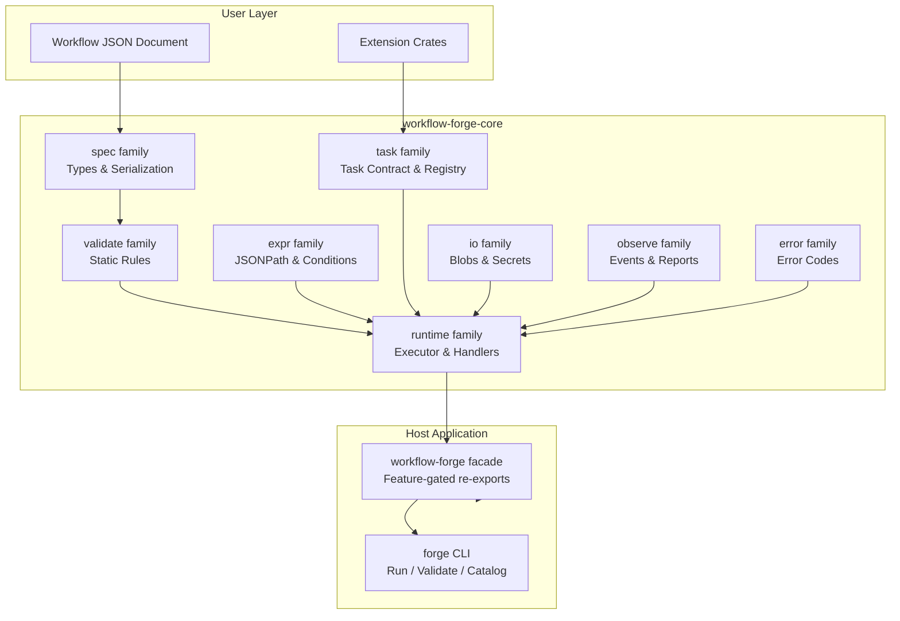
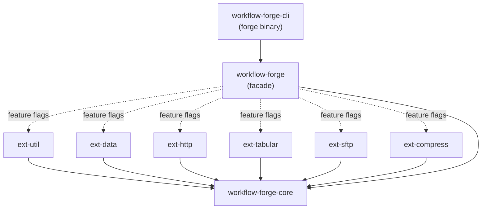
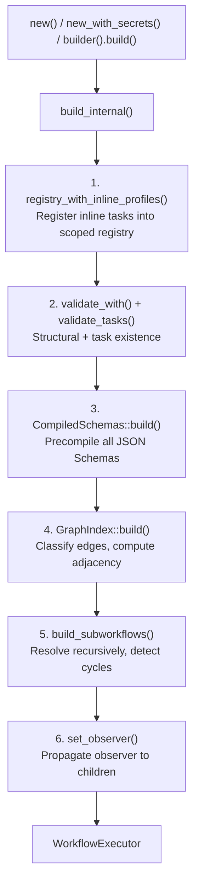
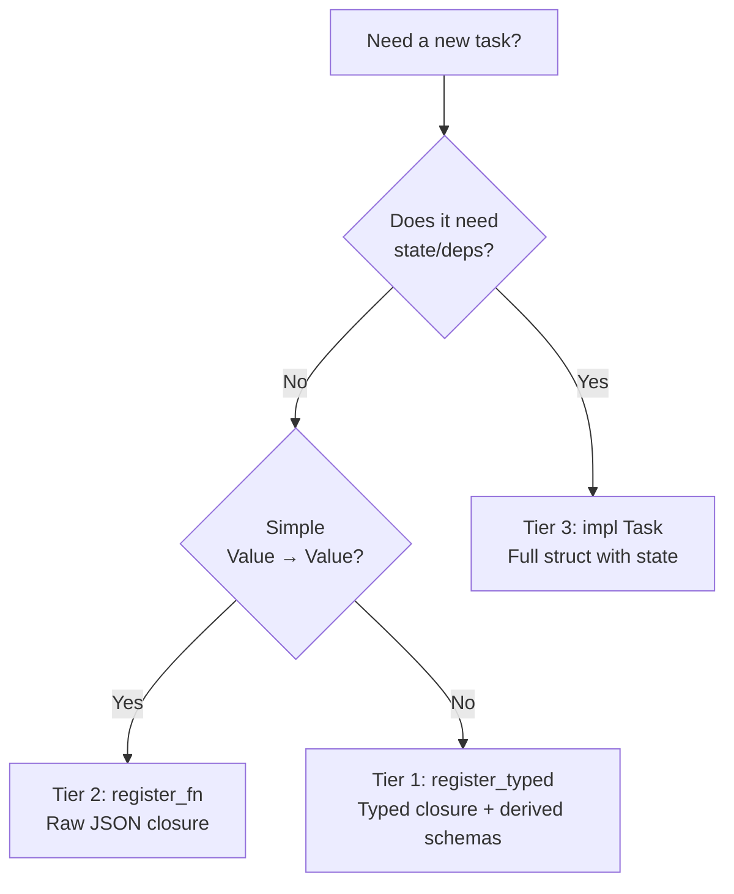

# Workflow Forge — Developer Manual

**Complete architecture, specification, and extension guide for the declarative JSON workflow engine v1.0**

> Target audience: developers who want to understand, embed, extend, or contribute to the engine.
> This manual is exhaustive. Every type, trait, decision, formula, rule, and edge case is documented.
> Source references point to `crates/core/src/`.

---

## Table of Contents

1. [Philosophy & Foundational Decisions](#1-philosophy--foundational-decisions)
2. [Workspace & Crate Layout](#2-workspace--crate-layout)
3. [The Spec Family — Complete Type Reference](#3-the-spec-family--complete-type-reference)
   - 3.1 [WorkflowDefinition](#31-workflowdefinition)
   - 3.2 [Node & NodeKind](#32-node--nodekind)
   - 3.3 [Node Types in Detail](#33-node-types-in-detail)
   - 3.4 [FlowEdge & EdgeTrigger](#34-flowedge--edgetrigger)
   - 3.5 [The Condition Mini-DSL](#35-the-condition-mini-dsl)
   - 3.6 [TaskProfile](#36-taskprofile)
   - 3.7 [Supporting Types](#37-supporting-types)
4. [The Validate Family — Complete Rule Reference](#4-the-validate-family--complete-rule-reference)
   - 4.1 [Validation Architecture](#41-validation-architecture)
   - 4.2 [Complete Rule Catalog](#42-complete-rule-catalog)
   - 4.3 [validate_tasks()](#43-validate_tasks)
   - 4.4 [Host Validation Rules](#44-host-validation-rules)
5. [The Runtime Family — Complete Execution Engine](#5-the-runtime-family--complete-execution-engine)
   - 5.1 [Executor Construction](#51-executor-construction)
   - 5.2 [GraphIndex](#52-graphindex)
   - 5.3 [CompiledSchemas](#53-compiledschemas)
   - 5.4 [WorkflowContext](#54-workflowcontext)
   - 5.5 [Execution Traversal](#55-execution-traversal)
   - 5.6 [Execution Policy](#56-execution-policy)
   - 5.7 [RunOptions & Cancellation](#57-runoptions--cancellation)
   - 5.8 [Subworkflow Registry](#58-subworkflow-registry)
6. [Handlers Deep Dive — Node Kind Semantics](#6-handlers-deep-dive--node-kind-semantics)
   - 6.1 [Start Node](#61-start-node)
   - 6.2 [End Node](#62-end-node)
   - 6.3 [Task Node](#63-task-node)
   - 6.4 [Foreach Node](#64-foreach-node)
   - 6.5 [Gateway Node](#65-gateway-node)
   - 6.6 [Loop Node](#66-loop-node)
   - 6.7 [Subworkflow Node](#67-subworkflow-node)
7. [The Expr Family — Expression Resolution](#7-the-expr-family--expression-resolution)
   - 7.1 [JSONPath Engine](#71-jsonpath-engine)
   - 7.2 [Mappings ($. convention)](#72-mappings--convention)
   - 7.3 [Shapes (@. convention)](#73-shapes--convention)
   - 7.4 [Condition Operators](#74-condition-operators)
8. [The Task Family — Extension Contract](#8-the-task-family--extension-contract)
   - 8.1 [Core Types](#81-core-types)
   - 8.2 [TaskRegistry](#82-taskregistry)
   - 8.3 [TypedTask](#83-typedtask)
   - 8.4 [FnTask](#84-fntask)
   - 8.5 [ProfileTask](#85-profiletask)
9. [The I/O Family — Resources](#9-the-io-family--resources)
   - 9.1 [Blobs](#91-blobs)
   - 9.2 [Secrets](#92-secrets)
10. [The Observe Family — Observability](#10-the-observe-family--observability)
    - 10.1 [Event System](#101-event-system)
    - 10.2 [InMemoryHistory](#102-inmemoryhistory)
    - 10.3 [TracingObserver](#103-tracingobserver)
    - 10.4 [JsonlObserver](#104-jsonlobserver)
11. [Error Model & Complete Catalog](#11-error-model--complete-catalog)
    - 11.1 [WorkflowError](#111-workflowerror)
    - 11.2 [Error Code Catalog](#112-error-code-catalog)
    - 11.3 [Extension Error Codes](#113-extension-error-codes)
12. [Extension Development Guide](#12-extension-development-guide)
    - 12.1 [Three Tiers of Task Authoring](#121-three-tiers-of-task-authoring)
    - 12.2 [Writing an Extension Crate](#122-writing-an-extension-crate)
    - 12.3 [Custom Condition Operators](#123-custom-condition-operators)
    - 12.4 [Custom Validation Rules](#124-custom-validation-rules)
    - 12.5 [Custom Blob Backends](#125-custom-blob-backends)
    - 12.6 [Custom Secret Providers](#126-custom-secret-providers)
    - 12.7 [Adding a New Node Kind](#127-adding-a-new-node-kind)
13. [Formulas & Formal Semantics](#13-formulas--formal-semantics)
    - 13.1 [Retry Backoff](#131-retry-backoff)
    - 13.2 [Gateway Semantics](#132-gateway-semantics)
    - 13.3 [Foreach Concurrency Model](#133-foreach-concurrency-model)
    - 13.4 [Loop Termination](#134-loop-termination)
    - 13.5 [Subworkflow Depth & Cycles](#135-subworkflow-depth--cycles)
14. [Decision Records](#14-decision-records)
15. [Testing & Debugging](#15-testing--debugging)
    - 15.1 [MockTask](#151-mocktask)
    - 15.2 [InMemoryHistory for Assertions](#152-inmemoryhistory-for-assertions)
    - 15.3 [Observers for Debugging](#153-observers-for-debugging)
16. [Performance Characteristics](#16-performance-characteristics)
17. [Appendices](#17-appendices)
    - A. [Complete Type Index](#a-complete-type-index)
    - B. [Complete Error Code Quick Reference](#b-complete-error-code-quick-reference)
    - C. [Glossary](#c-glossary)

---

## 1. Philosophy & Foundational Decisions

Workflow Forge is a **declarative, JSON-defined workflow engine** designed to be embedded as a Rust library first. It draws inspiration from BPMN, AWS Step Functions, and CNCF Serverless Workflow, but defines its own spec tailored for the Rust ecosystem.



### The Twelve Foundational Decisions

| #                  | Decision            | Choice                                       | Rationale                                                                                                                                                     |
| ------------------ | ------------------- | -------------------------------------------- | ------------------------------------------------------------------------------------------------------------------------------------------------------------- |
| 1                  | **Product form**    | Embeddable library first                     | CLI, server, durable runtime are later phases on the same core. No runtime process to manage.                                                                 |
| 2                  | **Structure**       | Explicit graph (`nodes` + `edges`)           | Not a nested tree. Directly editable, diffable, analyzable. A visual editor can render it without inferring structure.                                        |
| 3                  | **Execution (v1)**  | Ephemeral, in-memory, run-to-completion      | Durability is deferred. The event system is designed as its seed — events are a frozen journal ready for event sourcing.                                      |
| 4                  | **Data flow**       | Single global context document per execution | `$.trigger`, `$.nodes.<id>.output`, `$.workflow`. Every node reads via JSONPath and publishes to its slot. Simple, inspectable, no hidden state.              |
| 5                  | **Branching**       | Explicit `gateway` nodes                     | Exclusive, parallel, join. Conditions live in the node, labelled edges carry the result. Clearer than edge conditions — you can see the decision point.       |
| 6                  | **Extensions**      | Compile-time Rust traits                     | `Task` trait, `TaskManifest` contract. The manifest is serializable JSON — a WASM loader later is "just another loader" of                                    |
| the same contract. |
| 7                  | **Errors**          | Per-node policy + optional error edges       | `retry` (max, backoff, jitter), `timeout_ms`, `on: error` / `on: panic` edges. No compensation/sagas in v1.                                                   |
| 8                  | **Conditions**      | JSON mini-DSL                                | `{ "and": [...], "or": [...], "not": ... }` and `{ "path": "$.x", "eq": 1 }`. Validatable by JSON Schema, buildable by a UI. No embedded expression language. |
| 9                  | **Mappings**        | Pure JSONPath + literals                     | `"$.path"` resolves from context, everything else is literal. Transforms are explicit `data.*` nodes — one family reshapes data, mappings only wire it.       |
| 10                 | **Binaries**        | `$blob` convention + `BlobStore` trait       | `{ "$blob": "<id>", "name": "...", "size": ... }`. Large files stream by reference, never inline in JSON context. Temp dir in v1; injectable storage.         |
| 11                 | **Observability**   | Typed, serializable `ExecutionEvent`s        | Emitted through an `ExecutionObserver` trait. The future durable journal is frozen now — events carry total order across branches and sub-workflows.          |
| 12                 | **Node vocabulary** | Closed enum                                  | `NodeKind` is an internally-tagged enum. Adding a kind is a spec change. Composition (task + foreach + subworkflow) covers almost everything.                 |

---

## 2. Workspace & Crate Layout



### Dependency Rules

1. **Extensions depend only on `core`**, never on each other. Each exposes `pub fn register(&TaskRegistry)` and ships its own integration tests against the real executor.
2. **The `workflow-forge` facade** re-exports the core prelude and, behind feature flags, wires extensions into a ready-made `default_registry()`.
3. **Spec versioning is independent** of crate versioning. Workflows declare `"spec": "1.0"`. JSON Schemas live under `schemas/<version>/` with stable `$id`s. A crate bump never implies a spec bump.

### Feature Flag Matrix

| Feature          | Crate enabled                 | Tasks registered                                                         |
| ---------------- | ----------------------------- | ------------------------------------------------------------------------ |
| `util` (default) | `workflow-forge-ext-util`     | `util.noop`, `util.log`, `util.delay`, `util.idempotency_key`            |
| `data` (default) | `workflow-forge-ext-data`     | `data.transform`, `data.map`, `data.merge`, `data.template`, `data.cast` |
| `http` (default) | `workflow-forge-ext-http`     | `http.request`                                                           |
| `tabular`        | `workflow-forge-ext-tabular`  | `tabular.parse`, `tabular.write`                                         |
| `sftp`           | `workflow-forge-ext-sftp`     | `sftp.get`, `sftp.put`, `sftp.list`                                      |
| `compress`       | `workflow-forge-ext-compress` | `compress.gzip`, `compress.gunzip`, `compress.zip`, `compress.unzip`     |
| `full`           | All of the above              | All 18 tasks                                                             |
| `testing`        | (core feature)                | `MockTask` dry-run helpers                                               |

### Core Module Families

`workflow-forge-core` is organized into families with closed responsibilities:

```
spec      The language: pure serde types (nodes, edges, conditions, profiles). Data, no logic.
  ↓
validate  Static rules over a definition; accumulate errors (never fail-fast).
  ↓
runtime   Execution: executor, state context, subworkflow registry, precompiled indices, handlers.
expr      Expression resolution: $. mappings, @. shapes, condition operators, JSONPath.
task      The extension contract: Task trait, manifests, registry, profiles, typed/closure adapters.
io        Host resources: blobs ($blob) and secrets ($secret).
observe   Execution events, in-memory history, reports.
error     WorkflowError + the catalog of codes (error::codes).
```

| I want to add…        | Where                                                                 |
| --------------------- | --------------------------------------------------------------------- |
| a task (fast path)    | `register_typed` (typed, derived schemas) or `register_fn` (raw JSON) |
| a task (full control) | implement `Task` on a struct; register it                             |
| a task profile        | `TaskProfile` + `register_profile` (or inline `tasks` section)        |
| a condition operator  | implement `ConditionOperator`, register in `OperatorRegistry`         |
| a validation rule     | implement `ValidationRule` → `builder().rule(...)`                    |
| a blob backend        | implement `BlobStore` + `BlobStoreFactory` → `builder().blobs(...)`   |
| a secret provider     | implement `SecretProvider` → `builder().secrets(...)`                 |
| an error code         | add constant in `error::codes` + `ALL` array                          |
| an event kind         | add variant to `observe::EventKind`                                   |
| a node kind           | variant in `NodeKind` + handler + validation rules (spec change)      |

---

## 3. The Spec Family — Complete Type Reference

**Module:** `crates/core/src/spec/`  
**Rule:** Pure data types. No execution logic. No validation logic. Only serialization contracts.

### 3.1 WorkflowDefinition

**Source:** `spec/workflow.rs:9–35`

```rust
pub struct WorkflowDefinition {
    pub spec: String,                        // default "1.0"
    pub id: Option<String>,                  // auto-assigned if absent
    pub name: String,                        // required, human-readable
    pub version: String,                     // semantic version
    pub tasks: Vec<TaskProfile>,             // inline profiles (local to this document)
    pub workflows: Vec<WorkflowDefinition>,  // inline child workflows (recursive)
    pub nodes: Vec<Node>,                    // the graph vertices
    pub edges: Vec<FlowEdge>,                // the graph edges
}
```

| Field       | Type                      | Required | Default | Notes                                                               |
| ----------- | ------------------------- | -------- | ------- | ------------------------------------------------------------------- |
| `spec`      | `String`                  | No       | `"1.0"` | Version of the spec this document conforms to                       |
| `id`        | `Option<String>`          | No       | `None`  | Unique identifier; assigned if not provided                         |
| `name`      | `String`                  | Yes      | —       | Descriptive workflow name                                           |
| `version`   | `String`                  | Yes      | —       | Semantic version of this workflow definition                        |
| `tasks`     | `Vec<TaskProfile>`        | No       | `[]`    | Inline task profiles; scoped locally, never pollute shared registry |
| `workflows` | `Vec<WorkflowDefinition>` | No       | `[]`    | Inline sub-workflows; resolved before shared registry               |
| `nodes`     | `Vec<Node>`               | Yes      | —       | All nodes in the graph                                              |
| `edges`     | `Vec<FlowEdge>`           | No       | `[]`    | Directed edges defining control flow                                |

**Serde details:**

- `spec` uses `#[serde(default = "default_spec")]` which returns `"1.0".to_string()`
- `id` uses `#[serde(default)]` → `None`
- `tasks` uses `#[serde(default, skip_serializing_if = "Vec::is_empty")]`
- `workflows` uses `#[serde(default, skip_serializing_if = "Vec::is_empty")]`
- `edges` uses `#[serde(default)]` → `[]`

### 3.2 Node & NodeKind

**Source:** `spec/node/mod.rs:46–101`

```rust
pub struct Node {
    pub id: NodeId,
    #[serde(flatten)]
    pub kind: NodeKind,
}

#[serde(tag = "kind", rename_all = "snake_case")]
pub enum NodeKind {
    Start(event::StartNode),
    End(event::EndNode),
    Task(task::TaskNode),
    Foreach(foreach::ForeachNode),
    Loop(loop_node::LoopNode),
    Gateway(gateway::GatewayNode),
    Subworkflow(SubworkflowNode),
}
```

**Design:** `NodeKind` is an internally-tagged enum using the `kind` field as discriminator, serialized in `snake_case`. The `#[serde(flatten)]` on `Node::kind` means the variant's fields are merged into the parent object in JSON — the `kind` field and the variant fields appear at the same level.

```json
// Example: Task node
{ "id": "fetch", "kind": "task", "task": "http.request", "input": { "url": "$.trigger.url" } }

// Example: Gateway node
{ "id": "check", "kind": "gateway", "gateway": "exclusive", "branches": [...] }
```

**Why a closed enum?** The vocabulary of node kinds is defined by the spec, not by the host. Adding a kind requires: variant in `NodeKind`, handler module in `runtime/handlers/`, dispatch arm in `execute_from()`, and validation rules. This is deliberate — composition (task + foreach + subworkflow) covers almost all use cases, and a closed vocabulary enables complete static validation.

### 3.3 Node Types in Detail

#### StartNode

**Source:** `spec/node/event.rs`

```rust
pub struct StartNode {
    pub schema: Option<schemars::Schema>,  // JSON Schema for the trigger
    pub defaults: Option<Value>,           // default values merged into trigger
}
```

| Field      | Type                       | Default | Purpose                                                                         |
| ---------- | -------------------------- | ------- | ------------------------------------------------------------------------------- |
| `schema`   | `Option<schemars::Schema>` | `None`  | Validates the trigger input; if present, `SCHEMA_VALIDATION_FAILED` on mismatch |
| `defaults` | `Option<Value>`            | `None`  | JSON value shallow-merged into the trigger before validation                    |

**Semantics:** At execution, if `defaults` is present, its keys are merged into the trigger (existing keys are NOT overwritten). Then, if `schema` is present, the result is validated.

#### EndNode

**Source:** `spec/node/event.rs`

```rust
pub struct EndNode {
    pub status: EndStatus,            // success (default) / error / cancelled / custom
    pub output: Option<Value>,        // mapping to resolve for the final output
    pub schema: Option<schemars::Schema>,  // validates the resolved output
}

pub enum EndStatus {
    Success,
    Error,
    Cancelled,
    Custom(String),
}
```

| Field    | Type                       | Default   | Purpose                                                             |
| -------- | -------------------------- | --------- | ------------------------------------------------------------------- |
| `status` | `EndStatus`                | `Success` | Terminal status of the workflow                                     |
| `output` | `Option<Value>`            | `None`    | Mapping resolved against context; if absent, uses the carried token |
| `schema` | `Option<schemars::Schema>` | `None`    | Validates the resolved output                                       |

**Multiple end nodes:** When multiple ends are reached (parallel branches), the final output is an object `{end_node_id: output, ...}`.

#### TaskNode

**Source:** `spec/node/task.rs`

```rust
pub struct TaskNode {
    pub task: TaskId,                  // namespaced task id, e.g. "http.request"
    pub input: Option<Value>,          // mapping resolved against context
    pub retry: Option<RetryPolicy>,    // retry configuration
    pub timeout_ms: Option<u64>,       // per-attempt timeout in milliseconds
}

pub struct RetryPolicy {
    pub max: u32,                      // maximum total attempts (1 + retries)
    pub backoff: Backoff,              // strategy
    pub initial_ms: u64,               // base delay in milliseconds
    pub jitter: bool,                  // whether to apply random jitter
}

pub enum Backoff {
    Exponential,  // delay = initial_ms * 2^(attempt-1)
    Linear,       // delay = initial_ms * attempt
    Fixed,        // delay = initial_ms (no growth)
}
```

| Field        | Type                  | Default  | Purpose                                                        |
| ------------ | --------------------- | -------- | -------------------------------------------------------------- |
| `task`       | `TaskId`              | Required | References a task registered in the `TaskRegistry`             |
| `input`      | `Option<Value>`       | `None`   | Mapping; if absent, the node receives the predecessor's output |
| `retry`      | `Option<RetryPolicy>` | `None`   | Per-node retry policy                                          |
| `timeout_ms` | `Option<u64>`         | `None`   | Per-attempt timeout; `TASK_TIMEOUT` on expiry                  |

#### ForeachNode

**Source:** `spec/node/foreach.rs`

```rust
pub struct ForeachNode {
    pub task: TaskId,                      // task to invoke per element
    pub items: Value,                      // mapping → must resolve to array
    pub concurrency: u32,                  // max concurrent invocations (default 1)
    pub throttle_ms: u64,                  // min delay between invocations (default 0)
    pub on_item_error: OnItemError,        // Fail (abort) or Collect (gather errors)
    pub retry: Option<RetryPolicy>,        // per-element retry
    pub timeout_ms: Option<u64>,           // per-element timeout
}

pub enum OnItemError {
    Fail,     // first error aborts the entire foreach node
    Collect,  // continue all items, produce { ok: [...], failed: [...] }
}
```

| Field           | Type                  | Default  | Purpose                                           |
| --------------- | --------------------- | -------- | ------------------------------------------------- |
| `task`          | `TaskId`              | Required | Task to invoke for each element                   |
| `items`         | `Value`               | Required | JSONPath mapping; must resolve to an array        |
| `concurrency`   | `u32`                 | `1`      | Max concurrent invocations; must be ≥ 1           |
| `throttle_ms`   | `u64`                 | `0`      | Minimum milliseconds between starting invocations |
| `on_item_error` | `OnItemError`         | `Fail`   | Error handling strategy                           |
| `retry`         | `Option<RetryPolicy>` | `None`   | Per-element retry policy                          |
| `timeout_ms`    | `Option<u64>`         | `None`   | Per-element timeout                               |

#### LoopNode

**Source:** `spec/node/loop_node.rs`

```rust
pub struct LoopNode {
    pub task: TaskId,                    // task to invoke per iteration
    pub input: Option<Value>,            // mapping for the
 first iteration
    pub next: Option<Value>,             // mapping to produce the next iteration's input
    pub while_: Condition,               // continuation condition
    pub max_iterations: u32,             // hard cap on iterations (must be ≥ 1)
    pub on_max: OnMax,                   // Fail (error) or Stop (success with collected)
    pub collect: bool,                   // accumulate outputs into array
    pub retry: Option<RetryPolicy>,      // per-iteration retry
    pub timeout_ms: Option<u64>,         // per-iteration timeout
}

pub enum OnMax {
    Fail,  // LOOP_MAX_ITERATIONS_EXCEEDED
    Stop,  // terminate successfully with collected outputs
}
```

| Field            | Type                  | Default  | Purpose                                                              |
| ---------------- | --------------------- | -------- | -------------------------------------------------------------------- |
| `task`           | `TaskId`              | Required | Task invoked each iteration                                          |
| `input`          | `Option<Value>`       | `None`   | Mapping for first iteration input                                    |
| `next`           | `Option<Value>`       | `None`   | Mapping resolved after each iteration to produce the next input      |
| `while_`         | `Condition`           | Required | Condition evaluated before each iteration; if false, loop terminates |
| `max_iterations` | `u32`                 | Required | Hard ceiling; must be ≥ 1                                            |
| `on_max`         | `OnMax`               | `Fail`   | What happens when max_iterations reached with while still true       |
| `collect`        | `bool`                | `false`  | If true, outputs are accumulated into an array                       |
| `retry`          | `Option<RetryPolicy>` | `None`   | Per-iteration retry                                                  |
| `timeout_ms`     | `Option<u64>`         | `None`   | Per-iteration timeout                                                |

#### GatewayNode

**Source:** `spec/node/gateway.rs`

```rust
pub struct GatewayNode {
    pub gateway: GatewayKind,        // Exclusive / Parallel / Join
    pub branches: Vec<GatewayBranch>,  // only for Exclusive
}

pub enum GatewayKind {
    Exclusive,
    Parallel,
    Join,
}

pub struct GatewayBranch {
    pub when: Option<Condition>,  // condition to evaluate; if absent, treated as else
    pub edge: String,             // label matching an outgoing edge
    #[serde(default)]
    pub is_else: bool,            // true if this is the default branch
}
```

| Field                | Type                 | Required      | Purpose                                            |
| -------------------- | -------------------- | ------------- | -------------------------------------------------- |
| `gateway`            | `GatewayKind`        | Yes           | Type of gateway                                    |
| `branches`           | `Vec<GatewayBranch>` | For Exclusive | Ordered list of branches evaluated in sequence     |
| `branches[].when`    | `Option<Condition>`  | For non-else  | Condition; first match wins                        |
| `branches[].edge`    | `String`             | Yes           | Label matching an outgoing `FlowEdge.label`        |
| `branches[].is_else` | `bool`               | No            | Marks the fallback branch; at most one per gateway |

**Validation rules for gateways:**

- Exclusive: must have branches; branches ↔ outgoing edges must be bijective; ≤1 else; no duplicate edge labels
- Parallel: must have ≥2 outgoing edges; `branches` is ignored
- Join: must have ≥2 incoming normal-flow edges

#### SubworkflowNode

**Source:** `spec/node/mod.rs:87–101`

```rust
pub struct SubworkflowNode {
    pub workflow: String,            // name of the child workflow
    pub input: Option<Value>,        // mapping for the child's trigger
}
```

| Field      | Type            | Default  | Purpose                                                              |
| ---------- | --------------- | -------- | -------------------------------------------------------------------- |
| `workflow` | `String`        | Required | Name resolved against inline `workflows` first, then shared registry |
| `input`    | `Option<Value>` | `None`   | Mapping resolved against context; becomes the child's trigger        |

### 3.4 FlowEdge & EdgeTrigger

**Source:** `spec/workflow.rs:41–66`

```rust
pub struct FlowEdge {
    pub from: NodeId,                    // source node
    pub to: NodeId,                      // destination node
    pub label: Option<String>,           // matches a gateway branch's edge field
    pub on: Option<EdgeTrigger>,         // alternate trigger: error / panic
}

pub enum EdgeTrigger {
    Error,   // followed when the source node exhausts retries
    Panic,   // followed when the source node's task panics
}
```

| Field   | Type                  | Default  | Purpose                                                                            |
| ------- | --------------------- | -------- | ---------------------------------------------------------------------------------- |
| `from`  | `NodeId`              | Required | Source node ID                                                                     |
| `to`    | `NodeId`              | Required | Destination node ID                                                                |
| `label` | `Option<String>`      | `None`   | For exclusive gateways: connects a branch to its target                            |
| `on`    | `Option<EdgeTrigger>` | `None`   | `None` = normal flow; `Error` = after retry exhaustion; `Panic` = after task panic |

**Edge classification in the graph index:**

- `on: None` → normal flow, counted in `incoming_count` (join arity)
- `on: Error` → error flow, tracked separately in `outgoing_error`
- `on: Panic` → panic flow, tracked separately in `outgoing_panic`

**Validation:** `on: error` and `on: panic` edges may only originate from `task`, `foreach`, `loop`, or `subworkflow` nodes, and must never target a `join` gateway.

### 3.5 The Condition Mini-DSL

**Source:** `spec/condition.rs`

Conditions are JSON objects composable into a tree — no expression language, no parser, just structured data.

```rust
pub enum Condition {
    And { and: Vec<Condition> },
    Or { or: Vec<Condition> },
    Not { not: Box<Condition> },
    Compare(Comparison),
}

pub struct Comparison {
    pub path: String,        // JSONPath evaluated against the execution context
    pub op: CompareOp,       // operator + operand
}
```

**JSON representation:**

```json
{
  "and": [
    { "path": "$.nodes.fetch.output.status", "eq": 200 },
    {
      "or": [
        { "path": "$.trigger.priority", "in": ["high", "urgent"] },
        { "path": "$.trigger.retry_count", "gt": 3 }
      ]
    }
  ]
}
```

#### CompareOp — The 13 Built-in Operators

```rust
pub enum CompareOp {
    Eq(Value),              // "eq": strict JSON value equality
    Ne(Value),              // "ne": inequality
    Gt(Value),              // "gt": greater than (numbers or strings)
    Gte(Value),             // "gte": greater than or equal
    Lt(Value),              // "lt": less than
    Lte(Value),             // "lte": less than or equal
    In(Vec<Value>),         // "in": value is an element of the array
    Contains(Value),        // "contains": array contains element, or string contains substring
    Exists(bool),           // "exists": path resolves (true) or not (false)
    IsNull(bool),           // "is_null": value is null (true) or not (false)
    StartsWith(String),     // "starts_with": string prefix match
    EndsWith(String),       // "ends_with": string suffix match
    Matches(String),        // "matches": regex match
    Custom { key: String, operand: Value },  // any other key → resolved via OperatorRegistry
}
```

| Operator     | JSON key      | Operand type     | When path resolves                                               | When path is absent                                       |
| ------------ | ------------- | ---------------- | ---------------------------------------------------------------- | --------------------------------------------------------- |
| `Eq`         | `eq`          | any Value        | `value == operand`                                               | `false`                                                   |
| `Ne`         | `ne`          | any Value        | `value != operand`                                               | `false` (not true!)                                       |
| `Gt`         | `gt`          | number or string | `value > operand` (typed compare)                                | `false`                                                   |
| `Gte`        | `gte`         | number or string | `value >= operand`                                               | `false`                                                   |
| `Lt`         | `lt`          | number or string | `value < operand`                                                | `false`                                                   |
| `Lte`        | `lte`         | number or string | `value <= operand`                                               | `false`                                                   |
| `In`         | `in`          | array            | `operand.contains(value)`                                        | `false`                                                   |
| `Contains`   | `contains`    | any Value        | array contains element OR string contains substring              | `false`                                                   |
| `Exists`     | `exists`      | boolean          | `true` (if expected) or `false`                                  | `true` if expected=false, else `false`                    |
| `IsNull`     | `is_null`     | boolean          | `value.is_null() == expected`                                    | `false`                                                   |
| `StartsWith` | `starts_with` | string           | `value starts with prefix`                                       | `false`                                                   |
| `EndsWith`   | `ends_with`   | string           | `value ends with suffix`                                         | `false`                                                   |
| `Matches`    | `matches`     | string (regex)   | `regex.is_match(value)`                                          | `false`                                                   |
| `Custom`     | any other     | any Value        | delegated to `ConditionOperator::evaluate(Some(value), operand)` | delegated to `ConditionOperator::evaluate(None, operand)` |

**Custom deserialization:** `Condition` uses a manual `Deserialize` implementation that produces clear error messages — "a condition must be a JSON object", "a condition '{key}' does not allow additional keys", etc. — rather than serde's generic "data did not match any variant". `Comparison` also has custom deserialization that validates: exactly one operator, path is a string, typed operand validation for `in` (must be array), `exists`/`is_null` (must be boolean), `starts_with`/`ends_with`/`matches` (must be string).

**Number comparison:** `compare_order()` compares numbers exactly: it tries `i64` first, then `u64`, then falls back to `f64`. This preserves precision for large integers (above 2^53 where f64 loses precision) — critical for numeric IDs. Mixed types (e.g., number vs string) are not comparable and return `false`.

### 3.6 TaskProfile

**Source:** `spec/profile.rs:37–58`

```rust
pub struct TaskProfile {
    pub id: TaskId,                       // namespaced id under which the profile is registered
    pub extends: TaskId,                  // base task id already registered
    pub description: Option<String>,      // human-readable catalog description
    pub input_schema: Option<schemars::Schema>,   // profile-specific input schema
    pub output_schema: Option<schemars::Schema>,  // profile-specific output schema
    pub bind: Option<Value>,              // shape constructing base input from profile input
    pub output: Option<Value>,            // shape applied to base output
}
```

**Semantics:**

- `bind` is a `@.` shape resolved against the profile's input to produce the base task's input. `@` is the full input; `@.path` a subpath; everything else is literal.
- `output` is a `@.` shape applied to the base task's output.
- `$secret` objects within `bind` are resolved at registration time via `SecretProvider`.
- Once registered, a profile is indistinguishable from any other task — it appears in `catalog()`.

**Example:**

```json
{
  "id": "acme.create_order",
  "extends": "http.request",
  "input_schema": { "type": "object", "required": ["sku", "qty"] },
  "bind": {
    "url": "https://api.acme.com/orders",
    "method": "POST",
    "auth": { "type": "bearer", "token": { "$secret": "ACME_TOKEN" } },
    "body": "@"
  },
  "output": "@.body"
}
```

### 3.7 Supporting Types

#### NodeId

```rust
pub struct NodeId(pub String);

// Impls: Clone, PartialEq, Eq, Hash, Serialize, Deserialize, Display
// From<String>, From<&str>, Into<String>
```

#### TaskId

```rust
pub struct TaskId(pub String);

// Impls: Clone, PartialEq, Eq, Hash, Serialize, Deserialize, Display
// From<String>, From<&str>, Into<String>
```

#### Backoff

```rust
pub enum Backoff {
    Exponential,  // delay_n = initial_ms * 2^(n-1), saturating
    Linear,       // delay_n = initial_ms * n, saturating
    Fixed,        // delay_n = initial_ms (no growth)
}
```

#### OnItemError

```rust
pub enum OnItemError {
    Fail,     // first error aborts
    Collect,  // gather all results
}
```

#### OnMax

```rust
pub enum OnMax {
    Fail,  // LOOP_MAX_ITERATIONS_EXCEEDED error
    Stop,  // terminate successfully
}
```

#### EndStatus

```rust
pub enum EndStatus {
    Success,             // default
    Error,               // terminal error
    Cancelled,           // cancelled
    Custom(String),      // custom status string
}
```

#### GatewayKind

```rust
pub enum GatewayKind {
    Exclusive,  // evaluate branches, follow first match
    Parallel,   // fan-out all edges
    Join,       // fan-in: wait for all arrivals
}
```

---

## 4. The Validate Family — Complete Rule Reference

**Module:** `crates/core/src/validate/`  
**Rule:** Everything detectable before execution is detected here. Accumulate all errors, never fail-fast.

### 4.1 Validation Architecture

```mermaid
flowchart LR
    WF["WorkflowDefinition"] --> CTX["ValidationCtx::build()"]
    CTX --> R1["Rule 1: SpecSupported"]
    R1 --> R2["Rule 2: UniqueNodeIds"]
    R2 --> R3["Rule 3: EdgeReferences"]
    R3 --> R4["..."]
    R4 --> R13["Rule 13: Acyclicity"]
    R13 --> HOST["Host rules (builder().rule(...))"]
    HOST --> CHILD["Recurse into inline workflows"]
    CHILD --> ERRORS["Vec&lt;WorkflowError&gt;"]
```



**ValidationCtx** (`validate/context.rs`) precomputes shared indices once:

```rust
pub struct ValidationCtx<'w> {
    nodes: HashMap<&'w NodeId, &'w Node>,            // all nodes by id
    outgoing: HashMap<&'w NodeId, Vec<&'w FlowEdge>>, // outgoing edges (all types)
    incoming: HashMap<&'w NodeId, Vec<&'w FlowEdge>>, // incoming edges (all types)
    starts: Vec<&'w Node>,                             // all start nodes
}
```

These indices include broken references — a rule can inspect edges to nonexistent nodes and still report them. Rules that depend on referential integrity (reachability, acyclicity) check for prior `UNKNOWN_NODE_REF` errors and skip if found.

**The ValidationRule trait:**

```rust
pub trait ValidationRule: Send + Sync {
    fn codes(&self) -> &'static [&'static str];  // which error codes this rule may emit
    fn check(&self, wf: &WorkflowDefinition, ctx: &ValidationCtx, errors: &mut Vec<WorkflowError>);
}
```

**validate_with()** (`validate/mod.rs:52–79`):

```rust
pub fn validate_with(
    workflow: &WorkflowDefinition,
    extra: &[&dyn ValidationRule],
) -> Result<(), Vec<WorkflowError>> {
    let mut errors = Vec::new();
    let ctx = ValidationCtx::build(workflow);
    for rule in rules::BUILTIN.iter().chain(extra.iter()) {
        rule.check(workflow, &ctx, &mut errors);
    }
    // Recursively validate inline child workflows
    for child in &workflow.workflows {
        if let Err(child_errors) = validate_with(child, extra) {
            errors.extend(child_errors.into_iter().map(|mut e| {
                e.message = format!("in inline sub-workflow '{}': {}", child.name, e.message);
                e
            }));
        }
    }
    if errors.is_empty() { Ok(()) } else { Err(errors) }
}
```

### 4.2 Complete Rule Catalog

Rules run in the order listed. Rules 12-13 gate on rule 3 (if `UNKNOWN_NODE_REF` was reported, they skip because the graph isn't fully analyzable).

#### Rule 1: SpecSupported

**Source:** `validate/rules/structure.rs`

| Property    | Value                                                               |
| ----------- | ------------------------------------------------------------------- |
| Error codes | `UNSUPPORTED_SPEC`                                                  |
| Algorithm   | Check `workflow.spec` ∈ `SUPPORTED_SPECS` (currently `["1.0"]`)     |
| Purpose     | Prevent running workflows defined for a future/unknown spec version |

#### Rule 2: UniqueNodeIds

**Source:** `validate/rules/nodes.rs`

| Property    | Value                                                                        |
| ----------- | ---------------------------------------------------------------------------- |
| Error codes | `DUPLICATE_NODE_ID`                                                          |
| Algorithm   | Build a HashSet of node IDs; any collision → error for each duplicate        |
| Purpose     | Node IDs are the graph's identity; duplicates make edge resolution ambiguous |

#### Rule 3: EdgeReferences

**Source:** `validate/rules/edges.rs`

| Property    | Value                                                      |
| ----------- | ---------------------------------------------------------- |
| Error codes | `UNKNOWN_NODE_REF`                                         |
| Algorithm   | For each edge, check `from` and `to` exist in the node map |
| Purpose     | Every edge must connect existing nodes                     |
| Gates       | Rules 12-13 skip if this rule found errors                 |

#### Rule 4: StartEndPresence

**Source:** `validate/rules/nodes.rs`

| Property    | Value                                                                |
| ----------- | -------------------------------------------------------------------- |
| Error codes | `NO_START_NODE`, `MULTIPLE_START_NODES`, `NO_END_NODE`               |
| Algorithm   | Count start nodes (must be exactly 1), count end nodes (must be ≥ 1) |
| Purpose     | Every workflow needs one entry point and at least one exit point     |

#### Rule 5: StartEndEdges

**Source:** `validate/rules/edges.rs`

| Property    | Value                                                                  |
| ----------- | ---------------------------------------------------------------------- |
| Error codes | `START_HAS_INCOMING`, `END_HAS_OUTGOING`                               |
| Algorithm   | Start must have zero incoming edges; end must have zero outgoing edges |
| Purpose     | Start is the root of execution; ends are terminals                     |

#### Rule 6: ForeachConcurrency

**Source:** `validate/rules/nodes.rs`

| Property    | Value                                           |
| ----------- | ----------------------------------------------- |
| Error codes | `FOREACH_INVALID_CONCURRENCY`                   |
| Algorithm   | For each foreach node, verify `concurrency ≥ 1` |
| Purpose     | Concurrency of 0 would mean no items execute    |

#### Rule 7: SubworkflowName

**Source:** `validate/rules/nodes.rs`

| Property    | Value                                                     |
| ----------- | --------------------------------------------------------- |
| Error codes | `SUBWORKFLOW_MISSING_NAME`                                |
| Algorithm   | For each subworkflow node, verify `workflow` is non-empty |
| Purpose     | A nameless subworkflow reference can never resolve        |

#### Rule 8: InlineWorkflowNames

**Source:** `validate/rules/structure.rs`

| Property    | Value                                                              |
| ----------- | ------------------------------------------------------------------ |
| Error codes | `SUBWORKFLOW_DUPLICATE_NAME`                                       |
| Algorithm   | Check for duplicate `name` values in the `workflows` array         |
| Purpose     | Inline workflows are resolved by name; duplicates create ambiguity |

#### Rule 9: GatewayCoherence

**Source:** `validate/rules/gateway.rs`

| Property    | Value                                                                                                                                                                                                                                                      |
| ----------- | ---------------------------------------------------------------------------------------------------------------------------------------------------------------------------------------------------------------------------------------------------------- |
| Error codes | `GATEWAY_NO_BRANCHES`, `GATEWAY_MULTIPLE_ELSE`, `GATEWAY_DUPLICATE_EDGE_LABEL`, `GATEWAY_BRANCH_WITHOUT_WHEN`, `GATEWAY_BRANCH_WITHOUT_EDGE`, `GATEWAY_EDGE_WITHOUT_BRANCH`, `GATEWAY_BRANCHES_IGNORED`, `PARALLEL_TOO_FEW_OUTPUTS`, `JOIN_TOO_FEW_INPUTS` |

**Algorithm (per gateway):**

1. **Exclusive:**
   - Must have at least one branch → `GATEWAY_NO_BRANCHES`
   - At most one `else` branch → `GATEWAY_MULTIPLE_ELSE`
   - Every non-else branch must have `when` → `GATEWAY_BRANCH_WITHOUT_WHEN`
   - Branch labels ↔ outgoing edge labels must be bijective:
     - Branch label with no matching edge → `GATEWAY_BRANCH_WITHOUT_EDGE`
     - Outgoing edge label with no matching branch → `GATEWAY_EDGE_WITHOUT_BRANCH`
   - No duplicate edge labels → `GATEWAY_DUPLICATE_EDGE_LABEL`

2. **Parallel:**
   - `branches` field is ignored (warning: `GATEWAY_BRANCHES_IGNORED`)
   - Must have ≥ 2 outgoing edges → `PARALLEL_TOO_FEW_OUTPUTS`

3. **Join:**
   - Must have ≥ 2 incoming normal-flow edges → `JOIN_TOO_FEW_INPUTS`

#### Rule 10: KnownConditionOperators

**Source:** `validate/rules/conditions.rs`

| Property    | Value                                                                                                                                                  |
| ----------- | ------------------------------------------------------------------------------------------------------------------------------------------------------ |
| Error codes | `UNKNOWN_CONDITION_OPERATOR`                                                                                                                           |
| Algorithm   | Walk every condition tree in every gateway branch and loop `while_`; for each `CompareOp::Custom { key, .. }`, check `operator_registry.contains(key)` |
| Purpose     | Catch typos and unregistered operators at build time, not mid-execution                                                                                |

The `KnownConditionOperators` struct now optionally holds an `Arc<OperatorRegistry>`. If one was injected via `WorkflowExecutorBuilder::operator_registry()`, it is used; otherwise, the deprecated `operators::global()` serves as fallback.

#### Rule 11: EdgeTriggers

**Source:** `validate/rules/edges.rs`

| Property    | Value                                                                                                                                           |
| ----------- | ----------------------------------------------------------------------------------------------------------------------------------------------- |
| Error codes | `ERROR_EDGE_INVALID_SOURCE`, `ERROR_EDGE_TO_JOIN`                                                                                               |
| Algorithm   | `on: error`/`on: panic` edges may only originate from `task`, `foreach`, `loop`, or `subworkflow` nodes, and must never target a `join` gateway |
| Purpose     | Only task-invoking nodes can fail; error flow into a join would deadlock                                                                        |

#### Rule 12: Reachability

**Source:** `validate/rules/graph.rs`

| Property    | Value                                                                                        |
| ----------- | -------------------------------------------------------------------------------------------- |
| Error codes | `UNREACHABLE_NODE`                                                                           |
| Algorithm   | BFS from the start node following all normal-flow edges; any node not visited is unreachable |
| Gates       | Skipped if rule 3 found errors                                                               |
| Purpose     | Nodes disconnected from the start can never execute                                          |

#### Rule 13: Acyclicity

**Source:** `validate/rules/graph.rs`

| Property    | Value                                                                                                         |
| ----------- | ------------------------------------------------------------------------------------------------------------- |
| Error codes | `CYCLE_DETECTED`                                                                                              |
| Algorithm   | Kahn topological sort on all nodes using normal-flow edges; if the sorted count < total nodes, a cycle exists |
| Gates       | Skipped if rule 3 found errors                                                                                |
| Purpose     | Cycles would cause infinite execution in v1's run-to-completion model                                         |

### 4.3 validate_tasks()

**Source:** `validate/mod.rs:84–119`

After structural validation, `validate_tasks()` checks that every task referenced by `task`, `foreach`, and `loop` nodes is registered in the `TaskRegistry`:

```
Error: TASK_NOT_FOUND
Message: "Node '{id}' references task '{task}' which is not registered"
```

### 4.4 Host Validation Rules

Custom rules are injected via the builder pattern and run after built-ins, including recursively into child workflows:

```rust
struct MyRule;
impl ValidationRule for MyRule {
    fn codes(&self) -> &'static [&'static str] { &["MY_ERROR_CODE"] }
    fn check(&self, wf: &WorkflowDefinition, ctx: &ValidationCtx, errors: &mut Vec<WorkflowError>) {
        // custom validation logic
    }
}

let executor = WorkflowExecutor::builder(workflow, registry)
    .rule(MyRule)
    .build()?;
```

---

## 5. The Runtime Family — Complete Execution Engine

**Module:** `crates/core/src/runtime/`

### 5.1 Executor Construction



**Three construction entry points:**

1. `WorkflowExecutor::new(workflow, registry)` — uses `EnvSecrets`, no subworkflow registry
2. `WorkflowExecutor::new_with_secrets(workflow, registry, secrets)` — custom secret provider
3. `WorkflowExecutor::builder(workflow, registry).secrets(...).workflows(...).blobs(...).observer(...).rule(...).operator_registry(...).build()` — full dependency injection

**Step 1 — Scoped registry:** If the workflow has inline `tasks` (profiles), they are registered into a `registry.scoped()` copy. The shared registry is never mutated. Registration failures fail the build.

**Step 2 — Validation:** `validate_with()` runs all rules against the workflow definition. `validate_tasks()` checks every task reference exists. Both accumulate all errors.

**Step 3 — Schema compilation:** `CompiledSchemas::build()` precompiles every JSON Schema into a `jsonschema::Validator`. Sources: start trigger schema, end output schema, and each referenced task's input/output schemas. A schema that fails to compile produces `INVALID_SCHEMA`.

**Step 4 — Graph indexing:** `GraphIndex::build()` classifies every edge and precomputes adjacency maps and the start node.

**Step 5 — Subworkflow resolution:** Each `subworkflow` node is resolved: inline `workflows` first, then the shared `WorkflowRegistry`. A child executor is built recursively. An ancestry stack detects cycles (`SUBWORKFLOW_CYCLE`) and enforces `MAX_SUBWORKFLOW_DEPTH = 8` (`SUBWORKFLOW_DEPTH_EXCEEDED`). Missing children → `SUBWORKFLOW_NOT_FOUND`.

**Step 6 — Observer propagation:** The observer is set recursively on all child executors.

**The resulting WorkflowExecutor:**

```rust
pub struct WorkflowExecutor {
    pub(crate) workflow: WorkflowDefinition,
    pub(crate) registry: Arc<TaskRegistry>,
    pub(crate) index: GraphIndex,
    pub(crate) schemas: CompiledSchemas,
    pub(crate) observer: Option<Arc<dyn ExecutionObserver>>,
    pub(crate) blobs: Arc<dyn BlobStoreFactory>,
    pub(crate) subworkflows: HashMap<NodeId, WorkflowExecutor>,
    pub(crate) operator_registry: Option<Arc<OperatorRegistry>>,
}
```

**WorkflowExecutorBuilder** (`executor.rs:121–193`):

```rust
#[must_use]
pub struct WorkflowExecutorBuilder<'s> {
    workflow: WorkflowDefinition,
    registry: Arc<TaskRegistry>,
    secrets: &'s dyn SecretProvider,
    workflows: Option<Arc<WorkflowRegistry>>,
    blobs: Option<Arc<dyn BlobStoreFactory>>,
    observer: Option<Arc<dyn ExecutionObserver>>,
    rules: Vec<Box<dyn ValidationRule>>,
    operator_registry: Option<Arc<OperatorRegistry>>,
}
```

Methods: `secrets()`, `workflows()`, `blobs()`, `observer()`, `rule()`, `operator_registry()`, `build()`.

### 5.2 GraphIndex

**Source:** `runtime/graph.rs:7–97`

```rust
pub(crate) struct GraphIndex {
    nodes: HashMap<NodeId, Node>,
    outgoing: HashMap<NodeId, Vec<FlowEdge>>,        // normal flow
    outgoing_error: HashMap<NodeId, Vec<FlowEdge>>,   // on: error
    outgoing_panic: HashMap<NodeId, Vec<FlowEdge>>,   // on: panic
    pub(crate) incoming_count: HashMap<NodeId, usize>, // normal-flow in-degree
    pub(crate) start: NodeId,
}
```

**Edge classification during build:**

- `on: None` → `outgoing`, count in `incoming_count`
- `on: Some(Error)` → `outgoing_error`
- `on: Some(Panic)` → `outgoing_panic`

**Accessor methods:**

- `node(id)` — panics if missing (validation guarantees existence)
- `outgoing_edges(id)` — normal flow edges, returns `&[]` if none
- `error_edges(id)` — error-triggered edges
- `panic_edges(id)` — panic-triggered edges

Only normal-flow edges count toward a join's expected arity. Error/panic routes are separate — they don't participate in join fan-in.

### 5.3 CompiledSchemas

**Source:** `runtime/schemas.rs`

```rust
pub(crate) struct CompiledSchemas {
    pub(crate) nodes: HashMap<NodeId, jsonschema::Validator>,    // start/end schemas
    pub(crate) tasks: HashMap<TaskId, (Option<jsonschema::Validator>, Option<jsonschema::Validator>)>,
    //                                   input validator            output validator
}
```

**Compilation:** Each `schemars::Schema` is serialized to a `serde_json::Value`, then compiled via `jsonschema::validator_for()`. Compilation failures → `INVALID_SCHEMA`. Schemas are compiled once at construction, not per-attempt.

**Validation helper:**

```rust
pub(crate) fn validate_compiled(validator: &jsonschema::Validator, data: &Value) -> Result<(), String> {
    if validator.is_valid(data) { Ok(()) }
    else {
        let errors: Vec<String> = validator.iter_errors(data).map(|e| e.to_string()).collect();
        Err(errors.join("; "))
    }
}
```

### 5.4 WorkflowContext

**Source:** `runtime/context.rs`

```rust
pub struct WorkflowContext {
    execution_id: String,                     // UUID v7
    parent_execution_id: Option<String>,      // set for sub-workflows
    started_at: Instant,                      // execution start time
    state: parking_lot::RwLock<Value>,        // { trigger, nodes, workflow }
    blobs: Arc<dyn BlobStore>,                // shared with child contexts
    event_seq: Arc<AtomicU64>,                // total event order across the tree
}
```

**The state document:**

```json
{
  "trigger": {
    /* initial input */
  },
  "nodes": {
    "fetch": { "output": { "status": 200, "body": { "name": "ada" } } },
    "check": {
      "output": {
        /* ... */
      }
    },
    "fetch": { "error": { "code": "TIMEOUT", "message": "..." } }
  },
  "workflow": {
    "id": "wf-123",
    "name": "sync-user",
    "version": "1.0.0",
    "execution_id": "01J..."
  }
}
```

**Key methods:**

| Method                | Signature                              | Description                                        |
| --------------------- | -------------------------------------- | -------------------------------------------------- |
| `new`                 | `(workflow, trigger) -> Self`          | Creates context with `TempDirBlobFactory`          |
| `with_blob_factory`   | `(workflow, trigger, factory) -> Self` | Creates context with custom blob factory           |
| `child_of`            | `(workflow, trigger, parent) -> Self`  | Child context: own state, shared blobs + event_seq |
| `execution_id`        | `() -> &str`                           | Current execution UUID                             |
| `parent_execution_id` | `() -> Option<&str>`                   | Parent execution UUID                              |
| `elapsed`             | `() -> Duration`                       | Time since execution start                         |
| `with_state`          | `(FnOnce(&Value) -> R) -> R`           | Read state under lock, no clone                    |
| `snapshot`            | `() -> Value`                          | Clone of full state                                |
| `set_node_output`     | `(node_id, output)`                    | Publish `$.nodes.<id>.output`                      |
| `node_output`         | `(node_id) -> Option<Value>`           | Read a node's output                               |
| `set_node_error`      | `(node_id, error)`                     | Publish `$.nodes.<id>.error`                       |
| `blobs`               | `() -> &Arc<dyn BlobStore>`            | Blob storage reference                             |
| `next_event_seq`      | `() -> u64`                            | Next sequence number (atomic increment)            |

**Child contexts:** `child_of()` creates a new context with its own `execution_id` and state document, but **shares** the parent's `blobs` and `event_seq`. This means:

- `$blob` references cross the parent-child boundary
- The total event order spans the entire execution tree
- Only the root execution cleans up blobs

### 5.5 Execution Traversal

```mermaid
sequenceDiagram
    participant H as Host
    participant E as Executor
    participant C as Context
    participant S as RunState
    participant N as Node Handler

    H->>E: run(trigger)
    E->>C: WorkflowContext::with_blob_factory()
    E->>E: emit(WorkflowStarted)
    E->>E: run_inner()
    E->>E: execute_from(start, trigger)

    rect rgb(30, 30, 60)
        Note over E,N: Per-node execution
        E->>E: emit(NodeStarted)
        E->>N: dispatch by NodeKind
        N-->>E: Result<Value, WorkflowError>
        E->>E: after_task_result()
        alt success
            E->>C: set_node_output()
            E->>E: emit(NodeCompleted)
            E->>E: continue_through(outgoing_edges)
        else error with route
            E->>C: set_node_error()
            E->>E: emit(NodeFailed { error_routed: true })
            E->>E: continue_through(error_edges)
        else error without route
            E-->>E: return Err
        end
    end

    E->>S: read ends
    alt 0 ends
        E-->>H: Err(NO_OUTPUT)
    else 1 end
        E-->>H: Ok(end_output)
    else N ends
        E-->>H: Ok({end_id: output, ...})
    end
    E->>C: blobs.cleanup()
```



**The execution call chain:**

```
run(trigger)
  → run_with(trigger, RunOptions::default())
    → run_bounded(trigger, ctx, options)
      → run_with_ctx(trigger, ctx)          // emits WorkflowStarted/Completed/Failed
        → run_inner(trigger, ctx)
          → execute_from(start, carried, None, ctx, state)
            → [dispatch by NodeKind]
              → after_task_result()
                → continue_through(edges, carried, ctx, state)
                  → execute_from(next, carried, origin, ctx, state)  // recursive
```

**RunState:**

```rust
pub(crate) struct RunState {
    pub(crate) joins: Mutex<HashMap<NodeId, JoinArrivals>>,
    pub(crate) ends: Mutex<Vec<(NodeId, Value)>>,
}
```

**continue_through()** (`executor.rs:674–699`):

- `[]` (no edges) → `Ok(())` (terminal)
- `[edge]` (single edge) → sequential `execute_from()`
- `many` (multiple edges) → concurrent via `futures::future::try_join_all()`
  - First error short-circuits and sibling futures are dropped
  - All successes → `Ok(())`

**after_task_result()** (`executor.rs:704–759`):

- **Success path:** emit `NodeCompleted`, publish output, continue through normal edges
- **Error path:** check error code for `TASK_PANIC` → route through `panic_edges`; otherwise route through `error_edges`. If no route edges exist, propagate the error up (execution fails). If route edges exist, emit `NodeFailed` with `error_routed: true`, serialize the error as the carried token, and continue.

**Join semantics:**

1. When a branch reaches a join, it appends `(origin_node_id, Arc<Value>)` to the join's arrivals under a mutex
2. If `arrivals.len() < incoming_count`, the branch terminates (the last arrival will continue)
3. If `arrivals.len() == incoming_count`, the entry is removed from the map, the join "completes":
   - Emits `NodeStarted` + `NodeCompleted` events (deferred from actual start)
   - Builds output object `{origin_node_id: output, ...}`
   - Continues through the join's outgoing edges

**Join starvation detection:** After traversal completes, any joins remaining in `state.joins` with < expected arrivals are reported as `JOIN_INCOMPLETE` with a diagnostic message listing which branches arrived and which didn't.

**Output aggregation:** After traversal:

- 0 ends → `NO_OUTPUT`
- 1 end → that end's value
- N ends → `{end_node_id: value, ...}` (parallel branches reaching different ends)

### 5.6 Execution Policy

**Source:** `runtime/policy.rs`

`execute_with_policy()` is the shared path for task nodes and foreach items. It wraps a task invocation with schema validation, timeout, panic capture, and retry.

```
execute_with_policy(task, node_id, input, policy, ctx):
  1. Validate input schema → TASK_INPUT_INVALID if fails
  2. attempt = 0
  3. LOOP:
     a. attempt += 1
     b. Emit TaskAttemptStarted (input only on first attempt)
     c. Execute: AssertUnwindSafe(task.execute()).catch_unwind()
        - With timeout: wrap in tokio::time::timeout(ms, execution)
        - Without timeout: await directly
     d. On timeout → TASK_TIMEOUT
     e. On panic  → TASK_PANIC (payload downcast to string message)
     f. On success → validate output schema → return output
     g. On error:
        - If TASK_PANIC → never retry, return error
        - If attempt ≤ retry.max → calculate delay, sleep, continue loop
        - Else → return error
```

**Backoff formulas:**

| Strategy    | Formula                                        | Example (initial=100ms)            |
| ----------- | ---------------------------------------------- | ---------------------------------- |
| Exponential | `delay(n) = initial_ms * 2^(n-1)` (saturating) | n=1:100, n=2:200, n=3:400, n=4:800 |
| Linear      | `delay(n) = initial_ms * n` (saturating)       | n=1:100, n=2:200, n=3:300, n=4:400 |
| Fixed       | `delay(n) = initial_ms`                        | n=any:100                          |

All multiplication is saturating — no overflow even at extreme values (e.g., `u64::MAX / 2` with exponential at attempt 60).

**Jitter:**

```
jittered(delay, jitter_enabled):
  if !jitter_enabled or delay == 0: return delay
  return uniform_random(0, delay.as_millis())
```

Full jitter: the actual delay is uniformly distributed between 0 and the computed backoff.

**Retry-After floor:**

```
effective_delay = max(jittered_backoff, retry_after_ms)
```

When a task sets `WorkflowError.retry_after_ms` (e.g., from an HTTP `Retry-After` header), the engine never retries sooner than the server requested. But a larger backoff is still respected — it's a floor, not a ceiling.

**Panic handling:**

```rust
fn panic_error(task_id: &TaskId, payload: Box<dyn Any + Send>) -> WorkflowError {
    let message = payload
        .downcast_ref::<&str>().map(|s| (*s).to_string())
        .or_else(|| payload.downcast_ref::<String>().cloned())
        .unwrap_or_else(|| "non-textual payload".to_string());
    WorkflowError::new(TASK_PANIC, format!("Task '{task_id}' panicked: {message}"))
}
```

A panic is a bug, not a transient failure — it **never** retries and routes exclusively through `on: panic` edges (not `on: error`).

### 5.7 RunOptions & Cancellation

```rust
#[must_use]
pub struct RunOptions {
    pub deadline: Option<Duration>,         // total execution time limit
    pub cancel: Option<CancellationToken>,  // external cancellation
}
```

**run_bounded()** (`executor.rs:464–493`):

```rust
async fn run_bounded(&self, trigger: WorkflowData, ctx: &WorkflowContext, options: &RunOptions) -> WorkflowResult {
    let work = self.run_with_ctx(trigger, ctx);
    match (options.deadline, options.cancel.clone()) {
        (None, None) => work.await,
        (Some(deadline), None) => tokio::select! { result = work => result, _ = sleep(deadline) => Err(timeout_error(deadline)) },
        (None, Some(token)) => tokio::select! { result = work => result, _ = token.cancelled() => Err(cancelled_error()) },
        (Some(deadline), Some(token)) => tokio::select! { biased;
            _ = token.cancelled() => Err(cancelled_error()),
            result = work => result,
            _ = sleep(deadline) => Err(timeout_error(deadline)),
        },
    }
}
```

**Race condition resolution:** When both deadline and cancellation are present, `tokio::select! { biased; }` ensures the cancellation branch is checked first. If both fire simultaneously, cancellation wins — the caller explicitly requested cancellation, which is more intentional than a deadline expiry.

### 5.8 Subworkflow Registry

**Source:** `runtime/registry.rs`

```rust
pub struct WorkflowRegistry {
    workflows: parking_lot::RwLock<HashMap<String, Arc<WorkflowDefinition>>>,
}
```

| Method     | Signature                                   | Description                                           |
| ---------- | ------------------------------------------- | ----------------------------------------------------- |
| `new`      | `() -> Self`                                | Empty registry                                        |
| `register` | `(workflow) -> Result<(), WorkflowError>`   | Insert by name; `WORKFLOW_NAME_CONFLICT` if duplicate |
| `get`      | `(name) -> Option<Arc<WorkflowDefinition>>` | Lookup by name                                        |
| `contains` | `(name) -> bool`                            | Existence check                                       |
| `list`     | `() -> Vec<String>`                         | All registered names                                  |

**Resolution order:** When a `SubworkflowNode` references `workflow: "X"`:

1. Search the document's inline `workflows` array (local precedence)
2. Search the shared `WorkflowRegistry` (if provided)
3. If not found → `SUBWORKFLOW_NOT_FOUND`

---

## 6. Handlers Deep Dive — Node Kind Semantics

**Module:** `crates/core/src/runtime/handlers/`  
**Dispatch:** `executor.rs::execute_from()` matches on `NodeKind` and calls the appropriate handler.

### 6.1 Start Node

**Source:** `handlers/event.rs`

**Algorithm:**

1. If `defaults` is set, shallow-merge its keys into the trigger (existing keys not overwritten)
2. If `schema` is set, validate the merged trigger → `SCHEMA_VALIDATION_FAILED` on mismatch
3. Publish the validated trigger as the node's output: `ctx.set_node_output(node_id, trigger)`
4. Emit `NodeCompleted` with duration
5. Continue through normal outgoing edges with the trigger as carried token

**Event:** `NodeStarted` (kind: "start"), `NodeCompleted`

### 6.2 End Node

**Source:** `handlers/event.rs`

**Algorithm:**

1. Resolve output: if `output` mapping is present, resolve it against the context; otherwise use the carried token
2. If `schema` is set, validate → `OUTPUT_SCHEMA_VALIDATION_FAILED` on mismatch
3. Append `(node_id, value)` to `RunState.ends`
4. Do NOT continue traversal — end nodes are terminals

**Event:** `NodeStarted` (kind: "end"), `NodeCompleted`

### 6.3 Task Node

**Source:** `handlers/task.rs`

**Algorithm:**

1. Resolve input: if `input` mapping is present, resolve against context; otherwise use the carried token
2. Look up the task in the registry (validated at build time — safe unwrap)
3. Call `execute_with_policy()` with the task, node_id, resolved input, and policy (retry, timeout_ms, emit_attempts=true)
4. Route result through `after_task_result()`

**Event:** `TaskAttemptStarted` per attempt, `TaskAttemptFailed` on retryable failures, `NodeCompleted` or `NodeFailed`

### 6.4 Foreach Node

**Source:** `handlers/foreach.rs`

**Algorithm:**

1. Resolve `items` mapping → must be an array, else `FOREACH_ITEMS_NOT_ARRAY`
2. If array is empty → node completes with empty output
3. Convert items into a stream of futures, each invoking `execute_with_policy()` for the element
4. Apply concurrency: `futures::stream::iter(items).map(|item| execute_item(item)).buffered(concurrency)`
5. Apply throttle: before each item starts, check if `throttle_ms` has elapsed since the last start (using `Mutex<Instant>`)
6. On each item result:
   - Success → emit `ForeachItemCompleted`
   - Error with `on_item_error: Fail` → abort the stream, emit `ForeachItemFailed`
   - Error with `on_item_error: Collect` → record failure, continue
7. A panic in any item → always aborts the entire foreach node (panic routes through `on: panic`)
8. Output format for `Collect`: `{ "ok": [...], "failed": [...] }`

**Concurrency model:** `stream::buffered(C)` polls up to C futures concurrently. When one completes, the next item in the stream begins. This is cooperative concurrency within a single tokio task.

### 6.5 Gateway Node

**Source:** `handlers/gateway.rs`

#### Exclusive Gateway

**Algorithm:**

1. Evaluate branches in declaration order using `pick_branch()`
2. `pick_branch()`: for each branch, evaluate `when` condition against the context; first `true` → return that branch's `edge` label
3. If no branch matched and there's an `else` branch → return its label
4. If no branch matched and no `else` → `NO_BRANCH_MATCHED` error
5. Filter outgoing edges by the winning label
6. Continue through the matching edges

**Events:** `NodeCompleted` with the carried value as output

#### Parallel Gateway

**Algorithm:**

1. Publish carried value as node output
2. Continue through ALL outgoing edges concurrently

**Events:** `NodeCompleted`

#### Join Gateway

**Algorithm:**

1. Read `incoming_count` (expected arrivals)
2. Append `(origin_node_id, carried_value)` to arrivals under mutex
3. If arrivals < expected: terminate this branch (return `Ok(())`)
4. If arrivals == expected: remove the join entry from state, build output object, continue

**Output format:** `{ "origin_node_a_id": output_a, "origin_node_b_id": output_b, ... }`

**Events:** `NodeStarted` + `NodeCompleted` (emitted together when the join completes)

**Why deferred events?** A join "starts" when its first branch arrives but the event is emitted only at completion. This avoids confusing event sequences where `NodeStarted` appears long before `NodeCompleted`. The join's `NodeStarted` and `NodeCompleted` are emitted back-to-back when the last branch arrives.

### 6.6 Loop Node

**Source:** `handlers/loop_node.rs`

**Algorithm:**

1. Resolve initial `input` mapping (or use carried token)
2. `iteration = 0`; `outputs = []` (if `collect` is enabled)
3. LOOP:
   a. `iteration += 1`
   b. Evaluate `while_` condition against context → if `false`, break
   c. Invoke task with `execute_with_policy()`
   d. On success:
   - Emit `LoopIterationCompleted`
   - If `collect`: append output to `outputs`
   - Resolve `next` mapping to produce the next iteration's input
     e. On error:
   - Emit `LoopIterationFailed`
   - The loop node fails with this error (routed through `after_task_result`)
     f. If `iteration >= max_iterations` and `while_` is still true:
   - `on_max: Fail` → `LOOP_MAX_ITERATIONS_EXCEEDED`
   - `on_max: Stop` → break (success)
4. Output: if `collect`, output is the accumulated array; otherwise, output of the last iteration

### 6.7 Subworkflow Node

**Source:** `handlers/subworkflow.rs`

**Algorithm:**

1. Resolve `input` mapping (or use carried token) → this becomes the child's trigger
2. Create child context: `WorkflowContext::child_of(child_definition, trigger, parent_ctx)`
3. Look up the pre-built child executor from `self.subworkflows[node_id]` (validated at construction)
4. Run the child executor: `child.run_with_ctx(trigger, child_ctx)`
5. Route the child's result:
   - **Success:** the child's output becomes this node's output
   - **Error or Panic:** propagates up; routed through `after_task_result()` which checks for `on: error`/`on: panic` edges on the parent

**Key detail:** The child executor is pre-built and validated at parent construction time. At execution, it's simply invoked — no validation overhead.

**Event sequencing:** The child shares the parent's `event_seq` counter, so events from the child and parent are interleaved in total order. The parent emits a `NodeCompleted`/`NodeFailed` for the subworkflow node after the child finishes.

---

## 7. The Expr Family — Expression Resolution

**Module:** `crates/core/src/expr/`

### 7.1 JSONPath Engine

**Source:** `expr/path.rs`

```rust
pub fn query_first<'a>(doc: &'a Value, path: &str) -> Result<Option<&'a Value>, String> {
    let matches = doc.query(path).map_err(|e| e.to_string())?;
    Ok(matches.into_iter().next())
}
```

**Semantics:** All paths are singular — the first match wins. Wildcards are not supported in v1 mappings. The underlying library is `jsonpath-rust`.

**Regex cache:**

```rust
pub fn cached_regex(pattern: &str) -> Result<regex::Regex, WorkflowError> {
    // Process-global cache in parking_lot::RwLock<HashMap<String, regex::Regex>>
    // Used by the `matches` operator to avoid recompiling the same pattern
}
```

### 7.2 Mappings ($. convention)

**Source:** `expr/mapping.rs`

**Used by:** Node `input` fields, foreach `items`, end node `output`, subworkflow `input`

```rust
pub fn resolve(mapping: &Value, context: &Value) -> Result<Value, WorkflowError>
```

**Resolution rules:**

| Input type                 | Behavior                                      |
| -------------------------- | --------------------------------------------- |
| String starting with `$$.` | Escape: produce literal `$.rest`              |
| String starting with `$.`  | JSONPath: query against context → first match |
| Other string               | Literal: return as-is                         |
| Array                      | Recurse into each element                     |
| Object                     | Recurse into each value                       |
| Number, Bool, Null         | Literal: return clone                         |

**Error semantics:**

- Path that doesn't parse → `INVALID_JSONPATH`
- Path that resolves to nothing → `MAPPING_PATH_NOT_FOUND`

**Why error on absent path?** In an input mapping, a missing path almost always means a typo or a bug in the workflow definition. Optional values should be prepared with a `data.*` node beforehand (e.g., `data.merge` with defaults).

### 7.3 Shapes (@. convention)

**Source:** `expr/shape.rs`

**Used by:** `data.transform`, `data.map`, profile `bind`/`output`

```rust
pub fn apply_shape(shape: &Value, source: &Value) -> Result<Value, WorkflowError>
```

**Resolution rules:**

| Input type                 | Behavior                                                      |
| -------------------------- | ------------------------------------------------------------- |
| `"@"`                      | Return entire source                                          |
| String starting with `@@.` | Escape: produce literal `@.rest`                              |
| String starting with `@.`  | JSONPath: query against source with `$.` prefix → first match |
| Other string               | Literal: return as-is                                         |
| Array                      | Recurse into each element                                     |
| Object                     | Recurse into each value                                       |
| Number, Bool, Null         | Literal: return clone                                         |

**Key difference from mappings:** A path that doesn't resolve produces `null`, not an error. Shapes fill in structures — missing fields are expected to become `null`.

### 7.4 Condition Operators

**Source:** `expr/operators.rs`

#### The ConditionOperator Trait

```rust
pub trait ConditionOperator: Send + Sync + 'static {
    fn key(&self) -> &'static str;
    fn evaluate(&self, value: Option<&Value>, operand: &Value) -> Result<bool, WorkflowError>;
}
```

**Rules for custom operators:**

- The key must not collide with a built-in operator (those never reach `Custom`)
- `value` is `None` when the path does not resolve — decide your own absence semantics
- Only fail on definition errors (invalid regex, bad operand type), not on data

#### OperatorRegistry

```rust
pub struct OperatorRegistry {
    ops: parking_lot::RwLock<HashMap<String, Arc<dyn ConditionOperator>>>,
}
```

Thread-safe, index-based. Methods: `register()`, `get()`, `contains()`, `list()`.

**Injection:** The registry can be provided via `WorkflowExecutorBuilder::operator_registry()`. The global `operators::global()` is deprecated but still available as a fallback.

#### Condition Evaluation

```rust
impl Condition {
    pub fn evaluate_with(&self, context: &Value, registry: &OperatorRegistry) -> Result<bool, WorkflowError>
}
```

| Variant        | Evaluation                                      |
| -------------- | ----------------------------------------------- |
| `And { and }`  | All must be true; short-circuits on first false |
| `Or { or }`    | At least one true; short-circuits on first true |
| `Not { not }`  | Negation of inner                               |
| `Compare(cmp)` | Delegates to `Comparison::evaluate_with()`      |

#### Comparison Evaluation

```rust
impl Comparison {
    pub fn evaluate_with(&self, context: &Value, registry: &OperatorRegistry) -> Result<bool, WorkflowError>
}
```

1. Resolve `self.path` via `query_first()` → `INVALID_JSONPATH` on parse error
2. Handle path-absence operators first:
   - `Exists(expected)` → `value.is_some() == expected`
   - `Custom { key, operand }` → lookup operator in registry, call `evaluate(value, operand)`; `UNKNOWN_CONDITION_OPERATOR` if not found
3. If value is `None` (path didn't resolve) → return `false` for all built-in operators
4. Evaluate the operator with the resolved value

#### Number Comparison (compare_order)

```rust
fn compare_order(a: &Value, b: &Value) -> Option<Ordering> {
    match (a, b) {
        (Number(x), Number(y)) => {
            if let (Some(i), Some(j)) = (x.as_i64(), y.as_i64()) { return Some(i.cmp(&j)); }
            if let (Some(i), Some(j)) = (x.as_u64(), y.as_u64()) { return Some(i.cmp(&j)); }
            x.as_f64()?.partial_cmp(&y.as_f64()?)
        }
        (String(x), String(y)) => Some(x.as_str().cmp(y.as_str())),
        _ => None,  // mixed types are not comparable
    }
}
```

**Why i64/u64 before f64?** f64 loses precision for integers above 2^53. Large numeric IDs would compare incorrectly if cast to float. The exact integer comparison preserves correctness.

---

## 8. The Task Family — Extension Contract

**Module:** `crates/core/src/task/`

### 8.1 Core Types

#### Task Trait

```rust
#[async_trait]
pub trait Task: Send + Sync + 'static {
    fn manifest(&self) -> &TaskManifest;
    async fn execute(&self, ctx: &WorkflowContext, input: WorkflowData) -> WorkflowResult;
    fn task_id(&self) -> &TaskId { &self.manifest().id }
}
```

#### TaskManifest

```rust
pub struct TaskManifest {
    pub id: TaskId,                                    // namespaced unique id
    pub description: Option<String>,                   // human-readable
    pub input_schema: Option<schemars::Schema>,        // JSON Schema for input
    pub output_schema: Option<schemars::Schema>,       // JSON Schema for output
}
```

The manifest is serializable. `TaskRegistry::catalog()` exports all registered manifests as JSON — this is the contract that powers validation, documentation, and future visual editors.

#### WorkflowData

```rust
pub struct WorkflowData(pub serde_json::Value);

// Deref to Value, From<Value>, Into<Value>
// Impl: Serialize, Deserialize, Clone, Debug, Default
```

**Helper methods:**

| Method        | Returns                       | Description             |
| ------------- | ----------------------------- | ----------------------- |
| `as_str()`    | `Option<&str>`                | String value            |
| `as_i64()`    | `Option<i64>`                 | Signed 64-bit integer   |
| `as_u64()`    | `Option<u64>`                 | Unsigned 64-bit integer |
| `as_f64()`    | `Option<f64>`                 | 64-bit float            |
| `as_bool()`   | `Option<bool>`                | Boolean value           |
| `as_array()`  | `Option<&Vec<Value>>`         | Array reference         |
| `as_object()` | `Option<&Map<String, Value>>` | Object reference        |
| `is_null()`   | `bool`                        | Null check              |

#### TaskCtx

```rust
pub struct TaskCtx {
    execution_id: String,
    parent_execution_id: Option<String>,
    blobs: Arc<dyn BlobStore>,
}
```

An owned, cheap-to-clone snapshot of per-execution resources. Passed **by value** to closure-based tasks so their futures are `'static` and closure inference stays clean.

| Method                   | Returns               | Description                |
| ------------------------ | --------------------- | -------------------------- |
| `execution_id()`         | `&str`                | Current execution UUID     |
| `parent_execution_id()`  | `Option<&str>`        | Parent execution UUID      |
| `blobs()`                | `&Arc<dyn BlobStore>` | Blob storage               |
| `idempotency_key(value)` | `String`              | UUID v5 derived from value |

### 8.2 TaskRegistry

**Source:** `task/registry.rs`

```rust
pub struct TaskRegistry {
    tasks: Arc<parking_lot::RwLock<HashMap<TaskId, Arc<dyn Task>>>>,
}
```

Thread-safe via `parking_lot::RwLock` (no poisoning). Concurrent reads, occasional writes.

| Method                               | Signature                      | Description                             |
| ------------------------------------ | ------------------------------ | --------------------------------------- |
| `new()`                              | `-> Self`                      | Empty registry                          |
| `register(task)`                     | where T: Task                  | Insert by task_id; overwrites if exists |
| `register_arc(task)`                 | `Arc<dyn Task>`                | Same, with pre-wrapped Arc              |
| `register_typed(id, f)`              | typed closure                  | TypedTask with derived schemas          |
| `register_fn(id, f)`                 | raw JSON closure               | FnTask without schemas                  |
| `register_profile(profile, secrets)` | `-> Result<(), WorkflowError>` | ProfileTask; resolves secrets           |
| `get(task_id)`                       | `-> Option<Arc<dyn Task>>`     | Lookup                                  |
| `contains(task_id)`                  | `-> bool`                      | Existence check                         |
| `list()`                             | `-> Vec<TaskId>`               | All registered ids                      |
| `catalog()`                          | `-> Vec<TaskManifest>`         | All manifests, sorted by id             |
| `scoped()`                           | `-> TaskRegistry`              | Shallow copy (shared Arcs, cloned map)  |

**FromIterator impl:**

```rust
impl<T: Task> FromIterator<T> for TaskRegistry {
    fn from_iter<I: IntoIterator<Item = T>>(iter: I) -> Self {
        let registry = TaskRegistry::new();
        for task in iter { registry.register(task); }
        registry
    }
}
```

**scoped()** creates a shallow copy where the inner `Arc<dyn Task>` references are shared but the map is independent. This is the foundation for per-document inline profiles — the shared registry is never mutated.

### 8.3 TypedTask

**Source:** `task/typed.rs`

```rust
#[must_use]
pub struct TypedTask<In, Out, F> {
    manifest: TaskManifest,
    f: F,
    _pd: PhantomData<fn(In) -> Out>,
}
```

**Construction:**

```rust
TypedTask::new("acme.create_shipment", |ctx, input: CreateShipmentIn| async move { ... })
    .description("Creates a shipment in the ACME system")
```

`new()` derives `input_schema` and `output_schema` via `schemars::schema_for!(In)` and `schemars::schema_for!(Out)`.

**Execution:** `execute()` deserializes the input to `In` (failure → `TASK_INPUT_INVALID`), runs the closure, serializes the output from `Out` (failure → `TASK_OUTPUT_INVALID`).

**Why two validation layers?** The engine validates against the JSON Schema (derived by `schemars`) AND serde deserializes with the same attributes. They stay aligned because `schemars` reads the same `#[serde(...)]` annotations the deserializer uses. Nested types and enums with internal `$ref`/`$defs` are fully enforced.

**Tolerance by default:** `schemars` does not emit `additionalProperties: false` and serde ignores unknown fields. To make validation strict, add `#[serde(deny_unknown_fields)]` — this flips BOTH layers to strict because `schemars` honors it.

### 8.4 FnTask

**Source:** `task/typed.rs`

```rust
#[must_use]
pub struct FnTask<F> {
    manifest: TaskManifest,
    f: F,
}
```

A closure over raw `WorkflowData`. No schemas, no deserialization. For trivial transformations.

```rust
registry.register_fn("util.echo", |_ctx, input| async move { Ok(input) });
```

Use `TypedTask` when you have structs; use `FnTask` for quick `Value` manipulation.

### 8.5 ProfileTask

**Source:** `task/profile.rs`

A `ProfileTask` wraps a base task with preconfigured `bind` and `output` shapes:

```
execute(profile_input):
  1. Apply bind shape to profile_input → base_input
  2. Validate base_input against base's input_schema → PROFILE_BIND_INVALID
  3. Invoke base task with base_input → base_output
  4. Apply output shape to base_output → final_output
  5. Return final_output
```

**Registration:** Secrets in `bind` are resolved once at registration time, not at execution. Registration errors: `PROFILE_BASE_NOT_FOUND`, `PROFILE_ID_CONFLICT`, `SECRET_NOT_FOUND`.

---

## 9. The I/O Family — Resources

**Module:** `crates/core/src/io/`

### 9.1 Blobs

#### BlobRef

```rust
pub struct BlobRef {
    #[serde(rename = "$blob")]
    pub id: String,                // unique identifier
    pub name: Option<String>,      // suggested filename
    pub size: Option<u64>,         // size in bytes
}
```

Serializes as `{ "$blob": "01J...", "name": "data.csv", "size": 1024 }`.

#### BlobStore Trait

```rust
#[async_trait]
pub trait BlobStore: Send + Sync + 'static {
    async fn put(&self, data: Vec<u8>, name: Option<String>) -> Result<BlobRef, WorkflowError>;
    async fn get(&self, blob: &BlobRef) -> Result<Vec<u8>, WorkflowError>;
    async fn import_file(&self, path: &Path, name: Option<String>) -> Result<BlobRef, WorkflowError>;
    fn local_path(&self, blob: &BlobRef) -> Result<PathBuf, WorkflowError>;
    async fn cleanup(&self) -> Result<(), WorkflowError>;
}

pub trait BlobStoreFactory: Send + Sync {
    fn create(&self, execution_id: &str) -> Arc<dyn BlobStore>;
}
```

#### TempDirBlobStore (v1 default)

**Directory:** `{tmp}/workflow-forge-{execution_id}`  
**IDs:** UUID v7  
**Path validation:** Only alphanumeric characters and hyphens allowed → `INVALID_BLOB_ID` for anything else (prevents path traversal)  
**I/O:** `tokio::fs` for async operations  
**Cleanup:** `remove_dir_all` on completion; `Drop` guard as safety net

**Error codes:** `INVALID_BLOB_ID`, `BLOB_NOT_FOUND`, `BLOB_IO_ERROR`

**Injection:** `builder().blobs(my_factory)` — implement `BlobStore` + `BlobStoreFactory` for S3, in-memory, database, etc.

### 9.2 Secrets

```rust
pub trait SecretProvider: Send + Sync {
    fn get(&self, name: &str) -> Option<String>;
}

// Default: std::env::var(name)
pub struct EnvSecrets;
```

**Resolution:** `resolve_secrets(&mut Value, provider)` recursively replaces `{"$secret":"NAME"}` objects with the provider's value. Called at **profile registration time** — versioned definitions never embed credentials.

**Error:** `SECRET_NOT_FOUND` when a secret name is not in the provider.

**Injection:** `builder().secrets(my_provider)` or `register_profile(profile, provider)`.

---

## 10. The Observe Family — Observability

**Module:** `crates/core/src/observe/`

### 10.1 Event System

```rust
pub trait ExecutionObserver: Send + Sync {
    fn on_event(&self, event: &ExecutionEvent);  // synchronous, must not block
}

pub struct ExecutionEvent {
    pub execution_id: String,
    pub parent_execution_id: Option<String>,
    pub seq: u64,            // total order across branches AND sub-workflows
    pub elapsed_ms: u64,     // milliseconds since execution start
    pub kind: EventKind,
}

#[serde(tag = "type", rename_all = "snake_case")]
pub enum EventKind {
    WorkflowStarted      { workflow: Value, trigger: Value },
    NodeStarted          { node_id: String, kind: String },
    TaskAttemptStarted   { node_id: String, attempt: u32, input: Option<Value> },
    TaskAttemptFailed    { node_id: String, attempt: u32, error: WorkflowError, will_retry: bool, next_delay_ms: Option<u64> },
    NodeCompleted        { node_id: String, output: Value, duration_ms: u64 },
    NodeFailed           { node_id: String, error: WorkflowError, error_routed: bool },
    ForeachItemCompleted { node_id: String, index: usize, output: Value },
    ForeachItemFailed    { node_id: String, index: usize, error: WorkflowError },
    LoopIterationCompleted { node_id: String, index: usize, output: Value },
    LoopIterationFailed  { node_id: String, index: usize, error: WorkflowError },
    WorkflowCompleted    { output: Value, duration_ms: u64 },
    WorkflowFailed       { error: WorkflowError, duration_ms: u64 },
}
```

**Event sequencing:** `seq` is a shared `AtomicU64` across an execution and all its sub-workflows. Events from parallel branches and child workflows are interleaved but the `seq` provides a total order — sort by `seq` to reconstruct the full timeline.

### 10.2 InMemoryHistory

**Source:** `observe/history.rs`

```rust
pub struct InMemoryHistory {
    events: parking_lot::Mutex<Vec<ExecutionEvent>>,
}
```

Accumulates events and produces `ExecutionReport`:

```rust
pub struct ExecutionReport {
    pub execution_id: Option<String>,
    pub workflow: Option<Value>,
    pub status: ExecutionStatus,         // Running | Completed | Failed
    pub duration_ms: Option<u64>,
    pub output: Option<Value>,
    pub error: Option<WorkflowError>,
    pub nodes: Vec<NodeReport>,
}

pub struct NodeReport {
    pub node_id: String,
    pub kind: String,
    pub status: NodeStatus,              // Running | Completed | Failed | ErrorRouted
    pub attempts: u32,
    pub duration_ms: Option<u64>,
    pub output: Option<Value>,
    pub error: Option<WorkflowError>,
    pub items_ok: Option<usize>,         // foreach/loop
    pub items_failed: Option<usize>,     // foreach/loop
}
```

Methods: `report()` (root execution), `report_for(id)`, `executions()`.

### 10.3 TracingObserver

Emits every event through the `tracing` crate:

- Failures (`workflow_failed`, `node_failed`, `task_attempt_failed`) at `error` level
- Everything else at `info` level
- Structured fields: `execution_id`, `seq`, `elapsed_ms`, `node_id`

### 10.4 JsonlObserver

Appends each event as one JSON line to any `Write` implementor. Flushes per line for durability.

```rust
let observer = JsonlObserver::to_file("execution.log")?;
let executor = executor.with_observer(Arc::new(observer));
```

**Format:** One JSON object per line, each a complete, parseable `ExecutionEvent`. Replayable — sort by `seq` to reconstruct the timeline.

---

## 11. Error Model & Complete Catalog

**Module:** `crates/core/src/error/`

### 11.1 WorkflowError

```rust
pub struct WorkflowError {
    pub code: String,                                    // stable identifier from error::codes
    pub message: String,                                 // human-readable description
    pub source_task: Option<String>,                     // originating task/node
    pub payload: Option<Box<WorkflowData>>,              // offending input
    pub response: Option<Box<WorkflowData>>,             // partial output before failure
    pub retry_after_ms: Option<u64>,                     // floor for retry delay
    #[serde(skip)]
    pub source: Option<Box<dyn Error + Send + Sync>>,    // root cause (not serialized)
}
```

**Serialization contract:** `source` is `#[serde(skip)]` — the root cause is not serialized (it may contain OS-level types). When cloning, `source` is set to `None`. The other fields serialize fully, enabling `WorkflowError` to travel between nodes (`on: error` routes carry it as a JSON value) and appear in observability events.

**Builder methods:**

- `new(code, message)` → base error
- `with_source_task(task_id)` → sets the originating node
- `with_retry_after_ms(ms)` → sets the retry floor

**Display:** `[source_task] message` (if source_task is set) or `message` (otherwise).

### 11.2 Error Code Catalog

Error codes are `SCREAMING_SNAKE_CASE` constants whose value equals their name. A code's value **never changes** — it is part of the serialization contract. The `ALL` array lists every code; a test enforces uniqueness.

#### Structure (build-time validation)

| Code                   | Trigger                                                 |
| ---------------------- | ------------------------------------------------------- |
| `UNSUPPORTED_SPEC`     | `spec` field is not in `["1.0"]`                        |
| `DUPLICATE_NODE_ID`    | Two or more nodes share the same `id`                   |
| `UNKNOWN_NODE_REF`     | An edge's `from` or `to` references a non-existent node |
| `NO_START_NODE`        | No node has `kind: "start"`                             |
| `MULTIPLE_START_NODES` | More than one start node                                |
| `NO_END_NODE`          | No node has `kind: "end"`                               |
| `START_HAS_INCOMING`   | A start node has incoming edges                         |
| `END_HAS_OUTGOING`     | An end node has outgoing edges                          |
| `UNREACHABLE_NODE`     | A node is not reachable from start via normal edges     |
| `CYCLE_DETECTED`       | The graph contains a cycle via normal edges             |

#### Gateways

| Code                           | Trigger                                                             |
| ------------------------------ | ------------------------------------------------------------------- |
| `GATEWAY_NO_BRANCHES`          | Exclusive gateway has no branches                                   |
| `GATEWAY_MULTIPLE_ELSE`        | More than one `else` branch                                         |
| `GATEWAY_DUPLICATE_EDGE_LABEL` | Two branches or edges share the same label (fan-out from exclusive) |
| `GATEWAY_BRANCH_WITHOUT_WHEN`  | Non-else branch has no `when` condition                             |
| `GATEWAY_BRANCH_WITHOUT_EDGE`  | Branch label has no matching outgoing edge                          |
| `GATEWAY_EDGE_WITHOUT_BRANCH`  | Outgoing edge label has no matching branch                          |
| `GATEWAY_BRANCHES_IGNORED`     | Parallel/join gateway declares branches (ignored, but warned)       |
| `PARALLEL_TOO_FEW_OUTPUTS`     | Parallel gateway has < 2 outgoing edges                             |
| `JOIN_TOO_FEW_INPUTS`          | Join gateway has < 2 incoming normal-flow edges                     |

#### Edges & Special Nodes

| Code                          | Trigger                                             |
| ----------------------------- | --------------------------------------------------- |
| `ERROR_EDGE_INVALID_SOURCE`   | `on: error`/`on: panic` edge from non-task node     |
| `ERROR_EDGE_TO_JOIN`          | `on: error`/`on: panic` edge targets a join gateway |
| `FOREACH_INVALID_CONCURRENCY` | Foreach `concurrency` < 1                           |
| `LOOP_INVALID_MAX_ITERATIONS` | Loop `max_iterations` < 1                           |
| `SUBWORKFLOW_MISSING_NAME`    | Subworkflow node has empty `workflow` field         |
| `SUBWORKFLOW_DUPLICATE_NAME`  | Two inline workflows share the same name            |
| `TASK_NOT_FOUND`              | Node references a task not in the registry          |
| `INVALID_SCHEMA`              | A JSON Schema fails to compile                      |

#### Builder / Registry

| Code                         | Trigger                                                  |
| ---------------------------- | -------------------------------------------------------- |
| `SUBWORKFLOW_NOT_FOUND`      | Subworkflow name not found (inline or registry)          |
| `SUBWORKFLOW_CYCLE`          | Subworkflow references itself (directly or transitively) |
| `SUBWORKFLOW_DEPTH_EXCEEDED` | Nesting exceeds `MAX_SUBWORKFLOW_DEPTH = 8`              |
| `PROFILE_ID_CONFLICT`        | Profile id already exists in registry                    |
| `PROFILE_BASE_NOT_FOUND`     | Profile's `extends` task is not registered               |
| `WORKFLOW_NAME_CONFLICT`     | Workflow name already exists in registry                 |

#### Expressions

| Code                         | Trigger                               |
| ---------------------------- | ------------------------------------- |
| `INVALID_JSONPATH`           | JSONPath string fails to parse        |
| `INVALID_REGEX`              | Regex pattern fails to compile        |
| `MAPPING_PATH_NOT_FOUND`     | `$.` mapping path resolves to nothing |
| `UNKNOWN_CONDITION_OPERATOR` | Custom operator not in registry       |

#### Runtime

| Code                              | Trigger                                              |
| --------------------------------- | ---------------------------------------------------- |
| `SCHEMA_VALIDATION_FAILED`        | Trigger doesn't match start node schema              |
| `OUTPUT_SCHEMA_VALIDATION_FAILED` | End output doesn't match schema                      |
| `TASK_INPUT_INVALID`              | Task input doesn't match input schema                |
| `TASK_OUTPUT_INVALID`             | Task output doesn't match output schema              |
| `TASK_TIMEOUT`                    | Task exceeds `timeout_ms`                            |
| `TASK_PANIC`                      | Task panics (bug in extension)                       |
| `FOREACH_ITEMS_NOT_ARRAY`         | Foreach `items` mapping doesn't resolve to array     |
| `LOOP_MAX_ITERATIONS_EXCEEDED`    | Loop reaches max with `on_max: Fail`                 |
| `NO_BRANCH_MATCHED`               | No exclusive gateway branch matched and no `else`    |
| `JOIN_INCOMPLETE`                 | Execution ends with joins waiting for branches       |
| `NO_OUTPUT`                       | No end node reached                                  |
| `PROFILE_BIND_INVALID`            | Profile's bind produces input that fails base schema |
| `EXECUTION_TIMEOUT`               | Total execution deadline exceeded                    |
| `EXECUTION_CANCELLED`             | CancellationToken was triggered                      |

#### Resources

| Code               | Trigger                                |
| ------------------ | -------------------------------------- |
| `INVALID_BLOB_ID`  | Blob id contains invalid characters    |
| `BLOB_NOT_FOUND`   | Referenced blob doesn't exist in store |
| `BLOB_IO_ERROR`    | I/O error in blob store                |
| `SECRET_NOT_FOUND` | `$secret` name not in provider         |

### 11.3 Extension Error Codes

Extensions may define their own error codes following the same conventions:

**data extension:**

- `TEMPLATE_INVALID` — unclosed placeholder in template
- `TEMPLATE_VALUE_MISSING` — placeholder not found in values
- `CAST_INPUT_INVALID` — cast input doesn't match contract
- `CAST_FIELD_INVALID` — value cannot be converted and `on_invalid: fail`

**http extension:**

- `HTTP_INPUT_INVALID` — request input doesn't match contract
- `HTTP_REQUEST_FAILED` — network-level failure
- `HTTP_STATUS_ERROR` — response status indicates error

---

## 12. Extension Development Guide

### 12.1 Three Tiers of Task Authoring



**Tier 1 — `register_typed`:** Best for most tasks. Define input/output structs, derive schemas, write a closure. The engine handles deserialization, validation, and catalog generation.

```rust
use serde::{Deserialize, Serialize};
use schemars::JsonSchema;

#[derive(Deserialize, JsonSchema)]
struct GreetIn { name: String }

#[derive(Serialize, JsonSchema)]
struct GreetOut { greeting: String }

registry.register_typed("demo.greet", |_ctx, input: GreetIn| async move {
    Ok(GreetOut { greeting: format!("Hello, {}!", input.name) })
});
```

**Tier 2 — `register_fn`:** For quick JSON manipulation. No schemas, no type safety, but zero boilerplate.

```rust
registry.register_fn("util.echo", |_ctx, input| async move { Ok(input) });
```

**Tier 3 — `impl Task`:** Full control. Carry state (DB pool, HTTP client, configuration). Read the full `&WorkflowContext`.

```rust
struct MyTask {
    manifest: TaskManifest,
    pool: sqlx::PgPool,
}

#[async_trait]
impl Task for MyTask {
    fn manifest(&self) -> &TaskManifest { &self.manifest }
    async fn execute(&self, ctx: &WorkflowContext, input: WorkflowData) -> WorkflowResult {
        // full access to ctx, self.pool, etc.
    }
}
```

### 12.2 Writing an Extension Crate

1. **Create** `crates/extensions/<name>` depending only on `workflow-forge-core`
2. **Expose** `pub fn register(&TaskRegistry)` that registers each task with its manifest
3. **Ship** integration tests against the real executor
4. **Optionally** wire a feature flag in the `workflow-forge` facade

```toml
# Cargo.toml
[dependencies]
workflow-forge-core = { workspace = true }
```

```rust
// src/lib.rs
use workflow_forge_core::task::TaskRegistry;

pub fn register(registry: &TaskRegistry) {
    registry.register(MyTask::default());
    registry.register(AnotherTask::default());
}
```

### 12.3 Custom Condition Operators

```rust
use workflow_forge_core::expr::operators::{ConditionOperator, OperatorRegistry};
use workflow_forge_core::error::WorkflowError;
use serde_json::Value;

struct Between;
impl ConditionOperator for Between {
    fn key(&self) -> &'static str { "between" }

    fn evaluate(&self, value: Option<&Value>, operand: &Value) -> Result<bool, WorkflowError> {
        let (Some(v), Some(range)) = (value.and_then(Value::as_f64), operand.as_array()) else {
            return Ok(false);
        };
        let (Some(lo), Some(hi)) = (range.first().and_then(Value::as_f64),
                                    range.get(1).and_then(Value::as_f64)) else {
            return Ok(false);
        };
        Ok(lo <= v && v <= hi)
    }
}

let registry = OperatorRegistry::new();
registry.register(Between);

let executor = WorkflowExecutor::builder(workflow, task_registry)
    .operator_registry(Arc::new(registry))
    .build()?;
```

**Rules:**

- Key must not collide with built-in operators (`eq`, `ne`, etc.)
- `value` is `None` when the path doesn't resolve — decide your absence semantics
- Only fail for definition errors (bad operand type, invalid regex)

### 12.4 Custom Validation Rules

```rust
struct ForbidExternalCalls;
impl ValidationRule for ForbidExternalCalls {
    fn codes(&self) -> &'static [&'static str] { &["EXTERNAL_CALL_FORBIDDEN"] }
    fn check(&self, wf: &WorkflowDefinition, _ctx: &ValidationCtx, errors: &mut Vec<WorkflowError>) {
        for node in &wf.nodes {
            if matches!(&node.kind, NodeKind::Task(t) if t.task.0.starts_with("http.")) {
                errors.push(WorkflowError::new("EXTERNAL_CALL_FORBIDDEN",
                    format!("Node '{}' calls external HTTP", node.id)));
            }
        }
    }
}
```

### 12.5 Custom Blob Backends

Implement `BlobStore` + `BlobStoreFactory`, then inject:

```rust
builder.blobs(Arc::new(MyS3BlobFactory::new(bucket, client)))
```

The `TempDirBlobStore` in `io/blob.rs` serves as a reference implementation.

### 12.6 Custom Secret Providers

```rust
struct VaultSecrets { client: vault::Client }
impl SecretProvider for VaultSecrets {
    fn get(&self, name: &str) -> Option<String> {
        self.client.read_secret(name).ok()
    }
}

builder.secrets(&VaultSecrets { client });
```

### 12.7 Adding a New Node Kind

**This is a spec change.** The checklist:

1. Add variant to `spec::node::NodeKind`
2. Create handler module in `runtime::handlers/`
3. Add dispatch arm in `runtime::executor::execute_from()`
4. Add validation rules in `validate/rules/`
5. Update the JSON Schema in `schemas/<version>/workflow.schema.json`

**When NOT to add a node kind:** Composition (task + foreach + subworkflow) covers most use cases. If you're adding a kind for a specific integration, write a task instead. Node kinds are for control flow primitives, not business logic.

---

## 13. Formulas & Formal Semantics

### 13.1 Retry Backoff

Let:

- \( n \) = attempt number (1-indexed)
- \( B \) = initial delay in milliseconds (`initial_ms`)
- \( D(n) \) = computed delay for attempt \( n \)

| Strategy    | Formula                      | Saturating |
| ----------- | ---------------------------- | :--------: |
| Exponential | \( D(n) = B \cdot 2^{n-1} \) |    Yes     |
| Linear      | \( D(n) = B \cdot n \)       |    Yes     |
| Fixed       | \( D(n) = B \)               |    Yes     |

**Jitter:**

\[
D\_{\text{jitter}}(n) = \begin{cases}
D(n) & \text{if jitter disabled or } D(n) = 0 \\
U(0, D(n)) & \text{otherwise}
\end{cases}
\]

Where \( U(a,b) \) is a uniform random integer in \( [a, b] \).

**Effective delay (with Retry-After floor):**

\[
D*{\text{effective}}(n) = \max(D*{\text{jitter}}(n), R)
\]

Where \( R \) = `retry_after_ms` from the error (0 if absent). The `Retry-After` hint is a **floor**, not a ceiling — a larger backoff is still respected.

**Retry decision:** A panic (\( TASK_PANIC \)) **never** retries. Otherwise, retry while \( n \leq \text{max} \).

### 13.2 Gateway Semantics

**Exclusive Gateway:**

Let \( B = [b_1, b_2, ..., b_k] \) be the ordered branches, each with condition \( C_i \) and edge label \( L_i \).

\[
\text{winner} = \begin{cases}
L*i & \text{if } \exists i: \text{eval}(C_i) = \text{true} \land \forall j < i: \text{eval}(C_j) = \text{false} \\
L*{\text{else}} & \text{if } \exists \text{ else branch and no } C_i \text{ matched} \\
\text{NO_BRANCH_MATCHED} & \text{otherwise}
\end{cases}
\]

Then: follow all outgoing edges where `edge.label == Some(winner)`.

**Parallel Gateway:** Follow all outgoing edges concurrently. Output = carried token.

**Join Gateway:**

Let \( A = [(s_1, v_1), (s_2, v_2), ..., (s_m, v_m)] \) be arrivals where \( s_i \) = source node id and \( v_i \) = carried value. The join completes when \( m = \text{incoming_count} \). Output:

\[
\text{output} = \{ s_1: v_1, s_2: v_2, ..., s_m: v_m \}
\]

If the execution ends with any join where \( 0 < m < \text{incoming_count} \), the error is `JOIN_INCOMPLETE`.

### 13.3 Foreach Concurrency Model

Items are processed via `futures::stream::iter(items).map(|i| execute(i)).buffered(C)` where \( C \) = concurrency. The buffered stream polls up to C futures concurrently; when one completes, the next item in the stream begins.

**Throttle:** Before starting item \( i \) (after item \( i-1 \) started at \( t\_{i-1} \)):

\[
\text{sleep}(\max(0, \text{throttle_ms} - (t*{\text{now}} - t*{i-1})))
\]

**Error model:**

- `on_item_error = Fail`: first error aborts all remaining items. Output = the error.
- `on_item_error = Collect`: all items complete. Output = \( \{ \text{ok}: [r_1, r_2, ...], \text{failed}: [e_1, e_2, ...] \} \)

### 13.4 Loop Termination

A loop terminates when:

1. `while_` condition evaluates to `false` (success), OR
2. `iteration >= max_iterations` with `on_max = Stop` (success), OR
3. `iteration >= max_iterations` with `on_max = Fail` (error: `LOOP_MAX_ITERATIONS_EXCEEDED`), OR
4. Any iteration fails (the error propagates up through `after_task_result`)

**Order:** Condition is evaluated BEFORE each iteration. The first iteration runs only if the initial condition is true.

### 13.5 Subworkflow Depth & Cycles

**Maximum depth:** `MAX_SUBWORKFLOW_DEPTH = 8` (root is level 1). A workflow at level 8 cannot have subworkflow nodes.

**Cycle detection:** During recursive construction, an `ancestry: &mut Vec<String>` stack tracks the chain of workflow names. Before resolving a child, check if `child.name ∈ ancestry` → `SUBWORKFLOW_CYCLE`.

**Error propagation:** Child validation/construction errors are wrapped: `"in sub-workflow '{name}': {child_error}"`.

---

## 14. Decision Records

### DR-01: Explicit Graph vs. Nested Tree

**Context:** Workflow definitions could be nested JSON trees (like AWS Step Functions' ASL) or explicit graphs with nodes + edges.

**Decision:** Explicit graph.

**Consequences:**

- (+) Directly editable and diffable — no inference step to extract the graph
- (+) Visual editors get the structure for free
- (+) Validation is simpler (edges reference nodes, not implicit nesting)
- (-) More verbose than a tree for linear workflows
- (-) Requires explicit edge definitions even for simple sequences

### DR-02: Ephemeral Execution for v1

**Context:** A workflow engine can store execution state durably (event sourcing) or run entirely in memory.

**Decision:** Ephemeral, in-memory execution for v1.

**Consequences:**

- (+) Simpler implementation — no storage layer, no recovery logic
- (+) Faster — no I/O overhead for state persistence
- (+) The event system was designed as a frozen journal, so durable execution is additive
- (-) No crash recovery — a process restart loses in-flight executions
- (-) No long-running workflows (days/weeks) without an external scheduler

### DR-03: Single Context Document vs. Message Passing

**Context:** Data flow between nodes could use message passing (each node receives a message, produces a message) or a shared context document.

**Decision:** Single context document with JSONPath-based data access.

**Consequences:**

- (+) Simple mental model — one document, inspectable at any point
- (+) JSONPath is a well-known standard
- (+) Nodes can read any predecessor's output, not just the immediate one
- (-) The document grows with every node's output (memory concern for large workflows)
- (-) No isolation — a buggy task could theoretically read/modify any part of the context

### DR-04: Gateway Nodes vs. Edge Conditions

**Context:** Branching logic could live on edges (conditions on transitions) or on explicit gateway nodes.

**Decision:** Explicit gateway nodes.

**Consequences:**

- (+) The decision point is visible — you can see where the flow branches
- (+) Multiple branches evaluated at one point (exclusive gateway)
- (+) Parallel/join semantics are explicit and validated
- (-) More nodes for simple if/else compared to edge conditions
- (-) Gateway ↔ edge label bijection adds validation complexity

### DR-05: Compile-time Traits vs. Dynamic Plugins

**Context:** Extensions could load dynamically (WASM, shared libraries) or be compiled in.

**Decision:** Compile-time Rust traits for v1; the manifest contract is frozen so WASM is "just another loader" later.

**Consequences:**

- (+) Type safety — the compiler verifies the task contract
- (+) Performance — no serialization/deserialization boundary between engine and extension
- (+) Simpler — no sandboxing, no runtime loader
- (-) Extensions require recompilation
- (-) No hot-reloading of tasks

### DR-06: JSON Conditions vs. Expression Language

**Context:** Conditions could use an embedded expression language (like `$.status == 200 && $.priority > 3`) or structured JSON.

**Decision:** JSON mini-DSL (and/or/not/comparisons).

**Consequences:**

- (+) Validatable by JSON Schema — no custom parser to write or trust
- (+) Buildable by a UI — structured data is easier to generate than expression strings
- (+) No injection risk — no string evaluation
- (-) Verbose for complex conditions
- (-) No arithmetic expressions (must use `data.*` nodes beforehand)

### DR-07: Pure JSONPath Mappings vs. Transform-in-Mapping

**Context:** Mappings could support inline transformations (e.g., `"$.a + $.b"`) or be pure JSONPath + literals.

**Decision:** Pure JSONPath + literals. Transforms are explicit `data.*` nodes.

**Consequences:**

- (+) One place reshapes data — transforms are visible in the graph
- (+) Mappings are simpler and more predictable
- (+) Transforms are testable as standalone nodes
- (-) More nodes for simple arithmetic or concatenation
- (-) Cannot express complex transforms inline

### DR-08: $blob Convention vs. Inline Binaries

**Context:** Large files could be inline in the JSON context or referenced by id.

**Decision:** `$blob` convention with injectable `BlobStore`.

**Consequences:**

- (+) JSON context stays small — no base64 blobs in memory
- (+) Streaming — large files never fully loaded into JSON
- (+) Swappable storage — temp dir, S3, in-memory
- (-) Tasks must explicitly handle blob references
- (-) Blob lifecycle tied to execution (no cross-execution sharing in v1)

### DR-09: NodeKind as Closed Enum

**Context:** Node kinds could be an open trait (anyone can add a kind) or a closed enum.

**Decision:** Closed enum.

**Consequences:**

- (+) Complete static validation — the compiler and validator know every possible kind
- (+) Exhaustive pattern matching — no `_ => {}` fallback that hides bugs
- (+) The JSON Schema can fully describe the language
- (-) Adding a kind requires modifying core (spec change)
- (-) Cannot add kinds from an extension crate

### DR-10: Error Accumulation vs. Fail-Fast

**Context:** Validation could stop at the first error or collect all errors.

**Decision:** Accumulate all errors.

**Consequences:**

- (+) Fix everything in one pass — better developer experience
- (+) Rules can inspect prior errors (gating: reachability skipping on broken refs)
- (-) Slightly more complex implementation (Vec accumulation)

### DR-11: parking_lot vs. std::sync

**Context:** The core uses locks for shared state (context, registry, operators). `std::sync` locks can poison on panic.

**Decision:** Migrate to `parking_lot` (post-v0.1 improvement).

**Consequences:**

- (+) No lock poisoning — a panic in one holder doesn't corrupt the lock
- (+) Better performance (parking_lot is generally faster)
- (+) Cleaner API — no `.unwrap()`/`.expect()` on lock calls
- (-) Additional dependency (but lightweight and widely used)

### DR-12: OperatorRegistry Injection vs. Global

**Context:** The operator registry could be a global singleton or an injected dependency.

**Decision:** Injectable via `WorkflowExecutorBuilder`; `global()` deprecated but kept as fallback.

**Consequences:**

- (+) Testable — each test can have its own registry
- (+) No hidden global state — explicit dependency
- (+) Multiple executors can have different operator sets
- (-) Slightly more verbose setup

---

## 15. Testing & Debugging

### 15.1 MockTask

**Source:** `crates/core/src/testing.rs` (behind `testing` feature)

```rust
let mock = MockTask::returning("http.request", json!({ "status": 200 }));
let calls = mock.call_log();  // grab BEFORE registering
registry.register(mock);

// After execution:
assert_eq!(calls.count(), 1);
assert_eq!(calls.nth(0), Some(json!({ "url": "https://api.example.com" })));
```

**Three behaviors:**

| Method                                     | Behavior                   |
| ------------------------------------------ | -------------------------- |
| `MockTask::returning(id, value)`           | Always returns `value`     |
| `MockTask::failing(id, error)`             | Always fails with `error`  |
| `MockTask::with_fn(id, \|input\| { ... })` | Computes result from input |

**CallLog:** A shared, read-only view of all inputs the mock received. Clone it before registering — registration moves the mock into the registry.

**Dry-run pattern:**

1. Replace real tasks with mocks in a fresh registry
2. Run the workflow with the real executor
3. Assert the output AND what was called

### 15.2 InMemoryHistory for Assertions

```rust
let history = Arc::new(InMemoryHistory::new());
let executor = WorkflowExecutor::new(workflow, registry)?
    .with_observer(history.clone());

executor.run(trigger).await?;

let report = history.report();
assert_eq!(report.status, ExecutionStatus::Completed);
assert_eq!(report.nodes.len(), 3);

let task_node = &report.nodes[1];
assert_eq!(task_node.status, NodeStatus::Completed);
assert_eq!(task_node.attempts, 1);
```

### 15.3 Observers for Debugging

**TracingObserver:** Set up a `tracing_subscriber` and filter by `execution_id`:

```rust
let executor = executor.with_observer(Arc::new(TracingObserver));
// Logs appear through the tracing subscriber
```

**JsonlObserver:** Write events to a file for later analysis:

```rust
let observer = JsonlObserver::to_file("debug.jsonl")?;
let executor = executor.with_observer(Arc::new(observer));
```

---

## 16. Performance Characteristics

### Construction Costs

| Operation              | Complexity | Notes                                           |
| ---------------------- | :--------: | ----------------------------------------------- |
| Validation             |  O(N + E)  | N = nodes, E = edges; each rule scans the graph |
| Schema compilation     |  O(T × S)  | T = distinct tasks, S = schema complexity       |
| Graph indexing         |    O(E)    | Single pass over edges                          |
| Subworkflow resolution | O(SW × D)  | SW = subworkflow nodes, D = depth (max 8)       |

### Execution Costs

| Operation           |    Complexity     | Notes                                       |
| ------------------- | :---------------: | ------------------------------------------- |
| Per-node dispatch   |       O(1)        | HashMap lookup in GraphIndex                |
| JSONPath resolution | Library-dependent | `jsonpath-rust`: path complexity            |
| Schema validation   | Library-dependent | `jsonschema`: schema + data complexity      |
| Context read        |       O(1)        | `RwLock::read()` on shared state            |
| Context write       |       O(1)        | `RwLock::write()` per node output           |
| Blob I/O            |     I/O-bound     | Via `tokio::fs` (async), injectable backend |

### Memory

- **Context document:** grows with each node's output (plus trigger and metadata)
- **Blob store:** temp dir per execution; cleaned up after run
- **GraphIndex:** O(N + E) — node map + edge adjacency maps
- **CompiledSchemas:** O(T × V) — validators precompiled, reused across attempts

### Concurrency

- **Parallel gateways:** unbounded concurrent branches via `try_join_all`
- **Foreach:** bounded by `concurrency` parameter + throttle
- **All handlers:** async, cooperative — tokio tasks yield at `.await` points
- **Cancellation:** cooperative — futures are dropped, tokio tasks unwind

---

## 17. Appendices

### A. Complete Type Index

| Type                        | Module                  | Source                      |
| --------------------------- | ----------------------- | --------------------------- |
| `WorkflowDefinition`        | `spec::workflow`        | `workflow.rs:9`             |
| `FlowEdge`                  | `spec::workflow`        | `workflow.rs:41`            |
| `EdgeTrigger`               | `spec::workflow`        | `workflow.rs:58`            |
| `Node`                      | `spec::node`            | `node/mod.rs:45`            |
| `NodeId`                    | `spec::node`            | `node/mod.rs:18`            |
| `NodeKind`                  | `spec::node`            | `node/mod.rs:56`            |
| `StartNode`                 | `spec::node::event`     | `event.rs`                  |
| `EndNode`                   | `spec::node::event`     | `event.rs`                  |
| `EndStatus`                 | `spec::node::event`     | `event.rs`                  |
| `TaskNode`                  | `spec::node::task`      | `task.rs`                   |
| `RetryPolicy`               | `spec::node::task`      | `task.rs`                   |
| `Backoff`                   | `spec::node::task`      | `task.rs`                   |
| `ForeachNode`               | `spec::node::foreach`   | `foreach.rs`                |
| `OnItemError`               | `spec::node::foreach`   | `foreach.rs`                |
| `LoopNode`                  | `spec::node::loop_node` | `loop_node.rs`              |
| `OnMax`                     | `spec::node::loop_node` | `loop_node.rs`              |
| `GatewayNode`               | `spec::node::gateway`   | `gateway.rs`                |
| `GatewayKind`               | `spec::node::gateway`   | `gateway.rs`                |
| `GatewayBranch`             | `spec::node::gateway`   | `gateway.rs`                |
| `SubworkflowNode`           | `spec::node`            | `node/mod.rs:87`            |
| `Condition`                 | `spec::condition`       | `condition.rs:12`           |
| `Comparison`                | `spec::condition`       | `condition.rs:86`           |
| `CompareOp`                 | `spec::condition`       | `condition.rs:139`          |
| `TaskProfile`               | `spec::profile`         | `profile.rs:37`             |
| `Task` (trait)              | `task`                  | `mod.rs:137`                |
| `TaskManifest`              | `task`                  | `mod.rs:107`                |
| `WorkflowData`              | `task`                  | `mod.rs:28`                 |
| `TaskId`                    | `task`                  | `mod.rs:60`                 |
| `TaskCtx`                   | `task::typed`           | `typed.rs:63`               |
| `TaskRegistry`              | `task::registry`        | `registry.rs:25`            |
| `TypedTask`                 | `task::typed`           | `typed.rs:116`              |
| `FnTask`                    | `task::typed`           | `typed.rs:190`              |
| `ProfileTask`               | `task::profile`         | `profile.rs`                |
| `WorkflowExecutor`          | `runtime::executor`     | `executor.rs:94`            |
| `WorkflowExecutorBuilder`   | `runtime::executor`     | `executor.rs:121`           |
| `RunOptions`                | `runtime::executor`     | `executor.rs:47`            |
| `CancellationToken`         | `runtime::executor`     | re-export from `tokio_util` |
| `WorkflowContext`           | `runtime::context`      | `context.rs:25`             |
| `WorkflowRegistry`          | `runtime::registry`     | `registry.rs:14`            |
| `OperatorRegistry`          | `expr::operators`       | `operators.rs:70`           |
| `ConditionOperator` (trait) | `expr::operators`       | `operators.rs:57`           |
| `BlobRef`                   | `io::blob`              | `blob.rs:18`                |
| `BlobStore` (trait)         | `io::blob`              | `blob.rs:41`                |
| `BlobStoreFactory` (trait)  | `io::blob`              | `blob.rs:71`                |
| `TempDirBlobFactory`        | `io::blob`              | `blob.rs:77`                |
| `TempDirBlobStore`          | `io::blob`              | `blob.rs:88`                |
| `SecretProvider` (trait)    | `io::secret`            | `secret.rs:13`              |
| `EnvSecrets`                | `io::secret`            | `secret.rs:19`              |
| `ExecutionObserver` (trait) | `observe`               | `mod.rs:30`                 |
| `ExecutionEvent`            | `observe`               | `mod.rs:36`                 |
| `EventKind`                 | `observe`               | `mod.rs:55`                 |
| `InMemoryHistory`           | `observe::history`      | `history.rs:14`             |
| `ExecutionReport`           | `observe::history`      | `history.rs:112`            |
| `ExecutionStatus`           | `observe::history`      | `history.rs:87`             |
| `NodeReport`                | `observe::history`      | `history.rs:136`            |
| `NodeStatus`                | `observe::history`      | `history.rs:99`             |
| `TracingObserver`           | `observe::adapters`     | `adapters.rs:27`            |
| `JsonlObserver`             | `observe::adapters`     | `adapters.rs:72`            |
| `WorkflowError`             | `error`                 | `mod.rs:14`                 |
| `ValidationRule` (trait)    | `validate`              | `mod.rs:30`                 |
| `ValidationCtx`             | `validate::context`     | `context.rs:12`             |
| `MockTask`                  | `testing`               | `testing.rs:70`             |
| `CallLog`                   | `testing`               | `testing.rs:136`            |

### B. Complete Error Code Quick Reference

See [Section 11.2](#112-error-code-catalog) for the full catalog with trigger descriptions.

### C. Glossary

| Term            | Definition                                                                 |
| --------------- | -------------------------------------------------------------------------- |
| **Workflow**    | A complete JSON document defining a graph of nodes and edges               |
| **Node**        | A vertex in the workflow graph; has an id and a kind                       |
| **Edge**        | A directed connection between two nodes                                    |
| **Task**        | A unit of executable work; the extension point of the engine               |
| **Profile**     | A named specialization of a base task with preconfigured bind/output       |
| **Registry**    | A collection of registered tasks or workflows                              |
| **Context**     | The per-execution state document (`$.trigger`, `$.nodes`, `$.workflow`)    |
| **Mapping**     | A `$.` JSONPath expression resolved against the context                    |
| **Shape**       | An `@.` JSONPath expression resolved against a local source value          |
| **Condition**   | A JSON tree of comparisons and logical operators                           |
| **Gateway**     | A control flow node: exclusive (branch), parallel (fan-out), join (fan-in) |
| **Foreach**     | A node that iterates an array, invoking a task per element                 |
| **Loop**        | A node that invokes a task repeatedly with a while condition               |
| **Subworkflow** | A node that executes another workflow as a child                           |
| **Blob**        | A large binary referenced by `$blob` id, stored in a `BlobStore`           |
| **Secret**      | A credential referenced by `$secret` name, resolved by a `SecretProvider`  |
| **Observer**    | A receiver of `ExecutionEvent`s emitted during execution                   |
| **Retry**       | Automatic re-invocation of a failed task with backoff delay                |
| **Jitter**      | Random variance added to retry delays to prevent thundering herd           |
| **Backoff**     | The strategy for increasing delay between retries                          |
| **Scope**       | A shallow copy of a registry for local modifications                       |
| **Catalog**     | The exported list of all registered task manifests as JSON                 |
