# Workflow Forge — patrones y evolución de extensiones

Diseño para implementar, 2026-09-26. Esta guía desarrolla la sección 5 de [ARCHITECTURE](ARCHITECTURE.md); no reemplaza el [PRD](PRD.md) ni los contratos del [TDD](TDD.md). «Plugin» se usa aquí como sinónimo de extensión del motor. P-03 adopta crates Rust compilados y registro explícito para la primera composición.

Los patrones se seleccionan por el problema que resuelven. Los fragmentos `PX-*` son parciales: omiten tipos auxiliares y construcción, no se compilan como ejemplos autónomos y no constituyen API publicada. Los ejemplos E-* de ARCHITECTURE muestran los recorridos completos donde se conectan.

## 1. Reglas de crecimiento

El eje de extensión es **descriptor + implementación de contrato + composición explícita + conformidad**. Una extensión de negocio no debe exigir editar el coordinador, ampliar un enum con nombres de proveedores ni obtener acceso a todo el estado del motor.

| Principio | Aplicación concreta | Evidencia esperada |
|---|---|---|
| Responsabilidad única | Separar adaptación técnica, política de ejecución y coordinación. | Cambiar el SDK del destino afecta al adaptador; cambiar backoff afecta a una política. |
| Abierto a extensión | Operaciones/proveedores nuevos se registran por contratos existentes. | Una extensión externa compila sin importar internos del engine. |
| Sustitución de contratos | Un proveedor respeta las garantías declaradas, además de la firma del trait. | Un store que confirma durabilidad resiste reinicio; memoria declara garantías distintas. |
| Interfaces acotadas | Una operación recibe solo recursos e identidad necesarios. | No necesita implementar persistencia, servidor o lifecycle para transformar JSON. |
| Inversión de dependencias | Engine depende de puertos; composición decide implementaciones. | El cliente HTTP/SQL queda fuera del coordinador. |

Estos principios no obligan a un trait por struct. Una función pura o un enum pueden ser suficientes. Los contratos públicos cambian por necesidades compartidas demostradas, no por cada nuevo proveedor.

## 2. Selección rápida

| ID | Patrón / mecanismo | Pregunta que resuelve | Estado de aplicación |
|---|---|---|---|
| PAT-01 | Adapter | ¿Cómo conecto un SDK o backend al contrato del motor? | Base de operaciones y proveedores. |
| PAT-02 | Strategy | ¿Cómo cambio una política conservando las reglas del motor? | En políticas con variantes requeridas. |
| PAT-03 | Builder | ¿Cómo construyo una composición válida paso a paso? | Construcción, antes de `boot`. |
| PAT-04 | Facade | ¿Cómo uso el sistema sin coordinar sus internos? | Handle público y experiencia integrada. |
| PAT-05 | Command | ¿Cómo represento trabajo identificado y recuperable? | Invocaciones y comandos serializables. |
| PAT-06 | State | ¿Qué puede pasar desde el estado actual? | Máquina de estados explícita, adaptada a enums Rust. |
| PAT-07 | Observer | ¿Cómo notifico hechos sin delegar el control de ejecución? | Observación, separada del commit. |
| PAT-08 | Decorator | ¿Cómo añado una capacidad transversal conservando el contrato? | Instrumentación acotada de adaptadores. |
| PAT-09 | Composite | ¿Cómo reutilizo un subworkflow como unidad? | Composición de flujos, no conversión de todo DAG a árbol. |
| PAT-10 | Función fábrica / Abstract Factory | ¿Cómo construyo productos o familias compatibles? | Funciones simples primero; familia abstracta solo si hace falta. |
| PAT-11 | Flyweight | ¿Cómo evito copiar el mismo paquete inmutable en cada run retenido? | Optimización del proveedor en memoria, respaldada por mediciones. |

Arquitectura hexagonal, inyección de dependencias y registro de catálogo son mecanismos complementarios; no se presentan como patrones GoF distintos por tener nombres parecidos. Registrar un objeto ya creado no equivale a Factory Method.

<a id="catalogo"></a>

## 3. Definiciones aplicadas

### PAT-01 — Adapter: traducir una frontera

**Definición:** permite colaborar a interfaces incompatibles mediante un objeto que traduce entre ellas. [Referencia](https://refactoring.guru/design-patterns/adapter).

**Participantes aquí:** el engine es consumidor; `Operation` o `ExecutionStore` es la interfaz esperada; la extensión es el adaptador; el SDK/proveedor es el servicio adaptado. El adaptador traduce datos y errores, conserva la identidad y comunica incertidumbre cuando corresponde. No decide qué nodo sigue.

**Ejemplo:** E-05 adapta `PartnerClient::create_order` a `Operation::execute`. Cambiar de SDK mantiene los mismos contratos de input/output si la semántica se conserva; cambiar el significado o garantías exige revisar el contrato, no esconder el cambio detrás del trait.

**Límite:** no introducir un `UniversalAdapter` que reciba nombres de métodos y un mapa `Any` para acceder a todos los servicios. La abstracción debe conservar tipos, errores y garantías reconocibles. **Conformidad:** V-04 y V-07; mismo input válido produce un output conforme o un error clasificado sin perder evidencia de efectos.

### PAT-02 — Strategy: variar una decisión acotada

**Definición:** encapsula variantes intercambiables de un algoritmo bajo una interfaz. [Referencia](https://refactoring.guru/design-patterns/strategy).

**Participantes aquí:** coordinador como contexto; `BackoffPolicy` como interfaz; demoras fija/exponencial como variantes; raíz de composición como selector. E-07 muestra que la estrategia calcula demora después de decidir si es seguro reintentar.

**Ejemplo conceptual:** dos implementaciones de `BackoffPolicy` pueden producir esperas distintas para el mismo intento. Ninguna puede cambiar el número de intento, emitir una llamada HTTP o transformar un efecto incierto en un error seguro. El coordinador materializa y persiste el vencimiento antes de despachar otro intento.

**Límite:** usar parámetros o una función cuando la variación sea pequeña. No hacer configurable una invariante mediante una estrategia que permita saltarse persistencia, autorización o identidad. **Conformidad:** V-07/V-08; sustituir política cambia el resultado permitido de esa decisión, no el protocolo de recuperación.

### PAT-03 — Builder: construir antes de activar

**Definición:** separa la construcción por pasos de un objeto complejo de su uso. [Referencia](https://refactoring.guru/design-patterns/builder).

**Participantes aquí:** host como constructor de la configuración; `WorkflowBuilder` como ensamblador; `EngineAssembly` como producto inactivo. `build()` valida módulos, conflictos, requisitos y proveedores. `boot()` pertenece al lifecycle y activa la composición validada.

**Ejemplo:** E-06/E-09 conectan store, artefactos, secretos y operaciones. El registro de un paquete se valida completo antes de incorporarlo; un conflicto en su última operación no deja las primeras publicadas en un catálogo activo.

**Límite:** no exponer un runtime parcialmente construido ni comenzar timers desde un setter. El builder consume/congela su configuración al producir la composición; actualizar módulos posteriormente exige otra revisión y un mecanismo explícito. **Conformidad:** V-05/V-16/V-17; error de composición sin admisión ni publicación parcial.

### PAT-04 — Facade: entrada estable al subsistema

**Definición:** ofrece una interfaz de uso más simple sobre un conjunto de componentes. [Referencia](https://refactoring.guru/design-patterns/facade).

**Participantes aquí:** host/handler como consumidor; fachada `workflow-forge` y handle `WorkflowApplication`; compilador, coordinador y consultas como subsistema. El consumidor llama `prepare`, `start`, `status` o `signal`; no calcula qué tabla escribir ni qué worker despertar.

**Ejemplo:** E-04 delega desde el handler al handle. E-10 conserva `EngineRuntime` en el host y comparte handles de la misma instancia. La fachada facilita adoptar el motor sin borrar la distinción entre aceptación y finalización.

**Límite:** no duplicar coordinación en métodos de conveniencia ni ocultar defaults durables/efímeros. Una fachada no es un objeto global que expone cada servicio interno. **Conformidad:** V-10/V-16; embedding y servicio conservan las mismas garantías.

### PAT-05 — Command: intención identificada

**Definición:** convierte una solicitud de trabajo en una representación que puede transportarse o diferirse. [Referencia](https://refactoring.guru/design-patterns/command).

**Participantes aquí:** coordinador produce una `Invocation`; el dispatcher selecciona una implementación fijada; `Operation` recibe el comando. Los campos incluyen identidad, revisión, input/config y contexto de intento; E-01 ilustra la frontera.

Ejemplo PX-01 — valores del mismo comando lógico durante retry:

```text
run: run-42
invocation: normalize/foreach/7/create-order
operation: acme.create_order@r1
attempt 1: effect_key = run-42/item-7/create-order
attempt 2: effect_key = run-42/item-7/create-order
```

La clave es ilustrativa, no un formato obligatorio; el destino debe aplicar deduplicación para garantizar el efecto. `AttemptId` cambia y la identidad lógica permanece. Serializar la intención no serializa el future ni acredita entrega.

**Límite:** Command no implica que exista `undo`. Un efecto externo solo se compensa mediante una operación de negocio definida explícitamente. **Conformidad:** V-07/V-08/V-15; recuperación respeta identidades y referencias fijadas.

### PAT-06 — State: transiciones explícitas

**Definición:** organiza comportamiento dependiente del estado. En este proyecto se aplica mediante enums y decisiones de transición, no una clase por estado. [Referencia](https://refactoring.guru/design-patterns/state).

**Participantes aquí:** estado del run/invocación, evento de entrada y función de transición; el coordinador confirma la decisión mediante el store. Estado de lifecycle del motor y estado de un run son máquinas distintas.

En F-2, `ControlFrame` representa selección, cursor, detención y estado de iteración. Las decisiones puras de `planner` se aplican mediante el coordinador; los plugins siguen implementando `Operation`, sin editar ese enum. Al reanudar un grupo bloqueado se consumen resultados confirmados y se conserva una detención previa por fallo conocido. [Las pruebas de control](../crates/forge/tests/v2_control.rs) y [efectos anidados](../crates/forge/tests/v2_effects.rs) verifican esta separación.

Ejemplo PX-02 — un solo caso de la tabla, no la máquina completa:

```rust
match (snapshot.status, event) {
    (RunStatus::Waiting, RunEvent::SignalValidated(signal)) => {
        Ok(TransitionDecision::consume_signal_and_resume(
            snapshot.revision, signal,
        ))
    }
    // Otros pares se definen en la tabla de transiciones del TDD.
    _ => Err(TransitionError::UnsupportedTransition),
}
```

El resultado es una decisión que aún debe confirmarse atómicamente con la señal. Una rama validada en memoria no permite responder aceptación antes del commit. **Límite:** una extensión no accede a setters del estado; reporta un resultado y el coordinador determina el cambio. **Conformidad:** V-08/V-09/V-16; transiciones ilegales y confirmaciones tardías no reabren estados terminales.

### PAT-07 — Observer: distribuir información

**Definición:** permite que consumidores suscritos reciban notificaciones de cambios sin acoplar al emisor a cada consumidor. [Referencia](https://refactoring.guru/design-patterns/observer).

**Participantes aquí:** engine emisor, `ExecutionObserver` como contrato y adaptadores de logs/métricas como consumidores. E-08 muestra un evento con identidad y revisión, separado del checkpoint.

**Ejemplo:** un observador registra duración de intentos y otro notifica al servicio. Si se pierde una notificación, el servicio consulta `status`. Si se necesita entrega durable de eventos, se añade un outbox con acuse/reentrega, no una suposición sobre el callback.

**Límite:** observadores no autorizan transiciones, reintentan operaciones ni mutan el catálogo. Sus fallos no cambian resultados de negocio ya confirmados. **Conformidad:** V-13; observador lento/fallido y consulta independiente del stream.

### PAT-08 — Decorator: envolver conservando la interfaz

**Definición:** añade comportamiento mediante un wrapper que conserva la interfaz del objeto envuelto. [Referencia](https://refactoring.guru/design-patterns/decorator).

**Participantes aquí:** `Operation` como componente, implementación real y wrapper de instrumentación. El descriptor se delega; el wrapper conserva input/output, identidades y clasificación de errores.

Ejemplo PX-03 — partes relevantes de un decorador de métricas:

```rust
struct MeasuredOperation {
    inner: Arc<dyn Operation>,
    metrics: Arc<dyn AttemptMetrics>,
}

// Métodos dentro de impl Operation:
fn descriptor(&self) -> &OperationDescriptor {
    self.inner.descriptor()
}

fn execute<'a>(
    &'a self, ctx: OperationContext, command: Invocation,
) -> OperationFuture<'a> {
    Box::pin(async move {
        let started = Instant::now();
        let result = self.inner.execute(ctx, command).await;
        self.metrics.record_return(started.elapsed(), result.is_ok());
        result
    })
}
```

`record_return` es no bloqueante, no panica y no captura secretos/payloads. Mide retorno de la operación, no confirmación durable del nodo. Cancelación o panic pueden impedir llegar a esa línea; las métricas globales de cancelación pertenecen al coordinador. Es un fragmento de frontera, no instrumentación exhaustiva.

**Orden:** el engine conserva validación de input y política; invoca la operación decorada; valida output y confirma después. Una cadena de decoradores debe declarar su orden: medir alrededor de un limitador incluye espera, medir por dentro solo incluye ejecución.

**Límite:** no introducir retry durable, cachear mutaciones o alterar schemas en un wrapper de métricas. Si cambia el contrato o el efecto, corresponde otra operación/revisión. **Conformidad:** V-04/V-13/V-17; versión envuelta y original mantienen las mismas salidas/errores e identidades.

### PAT-09 — Composite: unidad reutilizable de workflow

**Definición:** compone elementos en unidades que pueden tratarse de manera uniforme. Su aplicación aquí es acotada a subworkflows; el grafo de control general conserva su estructura y semántica. [Referencia](https://refactoring.guru/design-patterns/composite).

**Participantes aquí:** nodo subworkflow como unidad compuesta, revisión hija, nodos internos y coordinador. El padre conoce input/output del hijo; el compilador resuelve y valida el contenido, profundidad y revisiones.

**Ejemplo:** «normalizar y entregar» contiene transformación y llamada externa; otro workflow lo reutiliza con otro input. Una implementación que llama al engine desde `Operation::execute` sin protocolo de hijo pierde trazabilidad, cancelación y recuperación, y no es el mecanismo propuesto.

**Límite:** no forzar operaciones y joins a una interfaz con métodos vacíos solo para simular un árbol. El retry del padre no borra el progreso confirmado del hijo. **Conformidad:** V-06/V-08/V-15; ámbito, revisiones y recuperación consistentes.

### PAT-10 — construcción simple y familias de productos

**Definición:** una función fábrica construye un producto; Abstract Factory proporciona una interfaz para construir una familia de productos relacionados. No toda función `new` ni todo registro es Factory Method. [Referencia de Abstract Factory](https://refactoring.guru/design-patterns/abstract-factory).

**Aplicación inicial:** una función del módulo recibe configuración y dependencias explícitas y devuelve contribuciones. El host decide cuándo construir; el módulo no recibe un `WorkflowBuilder` con permiso para modificar cualquier proveedor.

Ejemplo PX-04 — módulo que aporta operaciones; tipos propuestos:

```rust
pub struct OperationBundle {
    pub module: ModuleDescriptor,
    pub operations: Vec<Arc<dyn Operation>>,
}

pub fn create_operations(
    config: PartnerConfig,
    client: Arc<PartnerClient>,
) -> Result<OperationBundle, ModuleBuildError> {
    let operations: Vec<Arc<dyn Operation>> = vec![
        Arc::new(CreateOrder::new(config.clone(), client.clone())?),
        Arc::new(FindOrder::new(config, client)?),
    ];
    Ok(OperationBundle { module: partner_descriptor(), operations })
}
```

Esto es una función de construcción, no se etiqueta como Factory Method GoF. `OperationBundle` solo representa operaciones: los proveedores de infraestructura se conectan en slots tipados del host. El descriptor del módulo registra sus requisitos/exports; no sustituye los descriptores de cada operación.

**Cuándo considerar Abstract Factory:** si se necesitan varias familias intercambiables de proveedores que deben compartir transacciones, codec o propiedad. La raíz de composición puede recibir una fábrica de familia; aun así debe verificar las garantías cruzadas. Si solo existe un constructor sencillo, no añadir esa interfaz.

En F-4, las funciones [`http_json_operations`, `file_operations` y `csv_operations`](../crates/modules/src/integrations/mod.rs) producen bundles mediante este patrón. El perfil fija recursos y límites, su hash participa en la revisión y cada instancia guarda solamente configuración/cliente compartido. Los datos y buffers de una invocación viven dentro de `execute`. [INTEGRATIONS](INTEGRATIONS.md) concreta las políticas; las [pruebas HTTP](../crates/service/tests/integrations_http.rs) envuelven la operación en un Decorator y ejecutan invocaciones concurrentes sin cambiar su descriptor.

**Conformidad:** V-05/V-17; requisitos compatibles, conflictos detectados y registro completo o rechazado. Construir recursos técnicos no autoriza ejecutar negocio. Las tareas de fondo deben quedar bajo lifecycle del host, no ocultas en un constructor.

### PAT-11 — Flyweight: compartir datos inmutables

**Definición:** compartir la parte inmutable común entre muchos objetos, manteniendo separado el estado propio de cada uno. Es una optimización que se justifica al medir duplicación relevante. [Referencia de Flyweight](https://refactoring.guru/design-patterns/flyweight).

**Aplicación:** el [store en memoria](../crates/modules/src/memory.rs) comparte paquetes de recuperación idénticos mediante `Arc<ResolvedPackage>`. Input, invocaciones, revisiones y acuses siguen perteneciendo a cada run. La igualdad del contenido completo decide qué paquete se puede compartir; no basta que dos workflows anuncien el mismo ID. El índice conserva referencias débiles y se limpia junto con la retención de runs.

Ejemplo PX-06 — separación de propiedad dentro del proveedor, omitiendo campos auxiliares:

```rust
struct StoredRun {
    package: Arc<ResolvedPackage>, // común e inmutable dentro del proveedor
    execution: RunStateData,        // propio de esta ejecución
}

// El límite público devuelve un snapshot completo y de propiedad independiente.
fn snapshot(stored: &StoredRun) -> RunSnapshot {
    materialize(&stored.execution, stored.package.as_ref().clone())
}
```

**Límite:** compartir el paquete no autoriza modificarlo ni compartir progreso entre runs. El puerto sigue recibiendo/devolviendo DTOs completos; comparar el paquete y validar el resto de la transición ocurre bajo el mismo lock/CAS. El detalle de memoria no modifica el formato de checkpoint ni los contratos de una extensión. SQLite almacena paquetes por contenido mediante su propio Adapter.

**Conformidad:** V-05/V-08/V-15 y kit del store. Eliminar un resultado no pierde el paquete de otro run; después de liberar todos, una nueva aceptación conserva su contenido. Mutar una copia pública y tratar de reemplazar el paquete se rechaza. PROJECT registra la comparación de RSS/tiempo y el coste de materializar snapshots.

<a id="registro"></a>

## 4. Registro de una extensión y límites de autoridad

```mermaid
flowchart LR
    Config[Host: configuración y dependencias] --> Factory[Constructor del módulo]
    Factory --> Bundle[Descriptor y contribuciones]
    Bundle --> Stage[Builder: validar paquete completo]
    Stage --> Catalog[Catálogo por revisión]
    Catalog --> Plan[Plan preparado]
    Plan --> Dispatch[Engine: invocación]
    Dispatch --> Wrapper[Decorador opcional]
    Wrapper --> Adapter[Operación adaptadora]
    Adapter --> Target[Destino externo]
```



El builder valida IDs, versión de protocolo soportada, revisiones/exports, schemas y requisitos. Toda contribución se examina en una etapa privada antes de publicar una composición. Un error no modifica catálogos usados por planes existentes. El descriptor publicado de cada operación procede de su propia implementación; evitar un manifiesto de catálogo independiente que pueda describir otra firma.

Ejemplo PX-05 — entrada del paquete al builder, antes de `build`/`boot`:

```rust
let contribution = partner_module::create_operations(config, client)?;
let mut builder = WorkflowBuilder::standard();
builder.register_bundle(contribution)?; // valida todo el paquete; rechaza conflictos
let assembly = builder.build()?;
let runtime = EngineRuntime::boot(assembly, options).await?;
```

`register_bundle(&mut self, bundle)` valida y registra atómicamente una contribución. Se registran contribuciones en preparación; la disponibilidad pública requiere `build` exitoso y el lifecycle definido en ARCHITECTURE. No se admite «último registro gana» ante ID/revisión duplicados. La [extensión de referencia](../examples/reference-module/src/lib.rs) implementa esta frontera con dependencias exclusivamente del protocolo y su cliente inyectado; [v2_acceptance](../crates/forge/tests/v2_acceptance.rs) prueba sustitución y Decorator sin alterar identidad ni número de invocaciones.

En F-2, `OperationBundle.inspectors` aporta los `EffectInspector` asociados por revisión exacta. Si una operación declara reconciliación, el builder exige ese proveedor; inspectores duplicados o ajenos al paquete rechazan toda la contribución. Inspeccionar produce evidencia; la transición pertenece a `WorkflowApplication::reconcile`. La [suite de efectos](../crates/forge/tests/v2_effects.rs) muestra esta separación y la clasificación antes de usar `BackoffPolicy`.

Las dependencias son capacidades/puertos con requisitos declarados y recursos concretos inyectados. Dos módulos de negocio no se llaman mediante IDs secretos en el catálogo: su composición visible pertenece al workflow. Una biblioteca técnica compartida puede inyectarse sin convertirse en nodo. Evitar dependencias circulares de inicialización; si aparecen, revisar la responsabilidad del contrato.

## 5. Evolución, compatibilidad y retiro

| Cambio | Tratamiento propuesto |
|---|---|
| Agregar operación independiente | Nuevo ID/descriptor; no cambiar el scheduler ni los contratos de operaciones existentes. |
| Cambiar SDK conservando semántica | Nueva revisión de implementación, misma versión de contrato solo si supera conformidad. |
| Cambiar input/output, defaults o clasificación de efectos | Evaluar compatibilidad explícitamente y versionar contrato cuando cambie comportamiento prometido. |
| Cambiar nombre/posición visual | Metadata de presentación; no alterar semántica ni identificar otro efecto. |
| Retirar una versión | Impedir nuevas selecciones según política, conservando revisiones necesarias para runs pendientes. |
| Quitar código requerido por un run durable | Bloquear con diagnóstico si no está disponible; nunca sustituir automáticamente por otra versión. |
| Modificar protocolo público | Coordinar versión de contratos, adaptadores, codecs y suite de conformidad. |

La versión del paquete Rust, la del protocolo, la del contrato de operación y la revisión de implementación tienen propósitos diferentes. Una restricción de versión aceptada no sustituye pruebas de comportamiento. Durante el desarrollo prepublicación se pueden romper contratos; el cambio debe actualizar ejemplos, consumidores y conformidad en el mismo trabajo.

Esta guía no introduce hot reload ni descarga de bibliotecas. Incorporarlos exigiría revisar P-03. En particular, no liberar código/recursos mientras un plan, intento o checkpoint todavía los necesite. La instalación dinámica tendría que resolver propiedad, aislamiento y compatibilidad además del manifiesto.

## 6. Patrones que no se añaden por defecto

| Tentación | Criterio para decidir |
|---|---|
| Singleton para catálogo o engine | Preferir propiedad explícita y handles compartidos; permite pruebas e instancias independientes. |
| Service Locator con `get<T>()` o `Any` | Preferir dependencias y puertos visibles en construcción/contexto. |
| Template Method por herencia | El pipeline de invocación pertenece al engine; operaciones aportan ejecución mediante composición. |
| Chain of Responsibility para todos los validadores | La validación acumula errores; una cadena que detiene en el primer handler cambia la semántica. Usarla solo donde el contrato permita cortocircuito. |
| Mediator como objeto que conoce cada proveedor | El coordinador opera mediante puertos; no se le agregan APIs de cada negocio. |
| Proxy/cache automático | Lecturas pueden variar y dependen de ámbito/credenciales/revisión; cache requiere un contrato y claves propios. Nunca inferirlo solo por «read-only». |
| Event bus para llamadas locales | Una llamada tipada basta cuando se necesita respuesta/commit; publicar un evento no acredita persistencia. |
| Interfaz enorme de plugin con decenas de hooks opcionales | Dividir contribuciones por capacidad; una operación pequeña no implementa un sistema operativo de plugins. |

## 7. Conformidad y revisión de una extensión

V-17 amplía la verificación de extensibilidad de TDD-02: debe demostrar registro íntegro, contratos coherentes, compatibilidad y aislamiento de responsabilidad. La tabla expresa requisitos de conformidad; PROJECT identifica cuáles se han verificado y en qué perfil.

| Caso | Resultado exigido |
|---|---|
| Conflicto en la segunda operación de un paquete | Ninguna contribución del paquete queda publicada parcialmente. |
| Versión de protocolo/capacidad no soportada | Rechazo antes de boot o preparación según frontera; diagnóstico explícito. |
| Módulo oficial y externo con contrato equivalente | Misma suite pública, sin excepciones por procedencia. |
| Dos runs usan la misma instancia de operación concurrentemente | No se mezcla input, identidad o credenciales; estado por invocación separado. |
| Operación envuelta por métricas | Igual resultado/error e identidad; la caída del observador no altera efecto confirmado. |
| Nueva revisión registrada | Planes anteriores conservan implementación y schemas fijados. |
| Retiro de revisión con un checkpoint pendiente | Revisión aún resoluble o bloqueo explícito; no fallback a otra implementación. |

Al revisar un cambio, indicar: problema, patrón elegido, participantes, alternativa sencilla descartada, invariantes conservadas y prueba V-* que demuestra sustitución. Ningún nuevo patrón se justifica solamente por «mejores prácticas».

La aceptación de una extensión incluye sus límites de efecto/cancelación, recursos y coste operativo. El engine permanece agnóstico al proveedor; evolucionar sus protocolos es posible cuando existe una necesidad común justificada y se actualizan todos los contratos afectados.

El [módulo de inventario](../examples/reference-module/src/inventory/mod.rs) es otro ejemplo ejecutable de Adapter y composición: aporta lectura CSV, aplicación de filas y reportes, inyecta `InventoryDestination` y registra su inspector junto con las operaciones. Solo depende del protocolo público y sus bibliotecas de datos. El [workflow](../examples/workflows/inventory_import.v2.json) decide lotes y orden; el cliente concreto decide cómo hablar con el destino. Cambiar de proveedor no añade un caso de inventario al coordinador.

La sustitución también aplica a optimizaciones: las vistas de `ExecutionStore` tienen un camino predeterminado basado en snapshots. Un backend puede mantener índices y contadores para acelerar consultas, siempre que el [kit de conformidad](../crates/conformance/src/lib.rs) observe la misma revisión, cuotas y resultados inmutables. La política de efectos pertenece al engine incluso cuando cambia el almacenamiento.

## 8. Aplicarlos sin aumentar la dificultad de uso

Quien usa el motor necesita conocer el documento, el catálogo y la fachada. Quien escribe una operación necesita descriptor, `execute` y sus recursos. Quien implementa un store necesita el protocolo de transiciones y su conformidad. Ninguno debería estudiar todos los patrones para completar su primera tarea.

| Petición del desarrollador | Diseño suficiente | Qué comprobar |
|---|---|---|
| «Quiero normalizar una fecha o calcular un importe». | Función pura envuelta por `Operation`; configuración y schemas explícitos. | Conversión determinista, errores localizados, límites; no agregar scripting al scheduler. |
| «Quiero conectar otro CRM, ERP o modelo». | Adapter del cliente inyectado + descriptor + contribución de módulo. | Input/output y efectos declarados; mismo kit público de conformidad. |
| «Quiero cambiar cómo espera un retry». | Configuración o Strategy de demora. | Solo cambia demora; la seguridad de repetición la decide el coordinador. |
| «Quiero métricas del conector». | Decorator que delega una vez. | Conserva contrato, identidad y resultado, también ante errores. |
| «Quiero recibir eventos de una cola». | Adaptador de entrada que llama a Facade. | Acuse después de aceptación requerida; deduplicación por recepción. |
| «Quiero resolver un efecto cuyo resultado se perdió». | Adapter de evidencia + Command + State existentes. | La consulta no cambia estado; `reconcile` valida/autoriza/confirma según TDD-06. |
| «Quiero reutilizar diez pasos en otros flujos». | Subworkflow por revisión mediante Composite en F-2. | Identidad y progreso del hijo conservados; no repetir efectos por retry del padre. |

Regla práctica de revisión: explicar primero **qué recibe, qué devuelve y quién decide el siguiente paso**. Elegir el patrón después. Si una función y un parámetro resuelven la variación, conservarlos. Agregar una interfaz cuando exista una frontera de sustitución concreta, no para anticipar todas las posibilidades.

La prueba C-03 de [ACCEPTANCE](ACCEPTANCE.md) recorre una extensión completa y pequeña; [CONTRACTS](CONTRACTS.md) contiene su frontera pública. La generalidad se demuestra sustituyendo módulos y componiendo pasos, sin exigir que el integrador configure fábricas, buses o jerarquías para cada operación.
