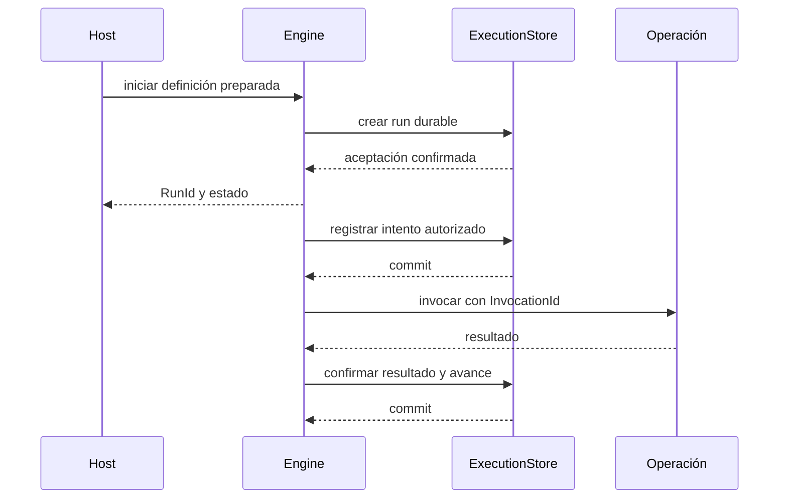

# Workflow Forge — diseño técnico

Fecha: 2026-09-26. *Technical Design Document* de la refactorización. Desarrolla el [PRD](PRD.md) dentro de los límites de [ARCHITECTURE](ARCHITECTURE.md). Los mecanismos, nombres y estados siguientes son **diseño propuesto**, no API implementada. Las decisiones pendientes conservan su autoridad en el PRD.

## 1. Convenciones y mapa técnico

Cada contrato `TDD-*` tiene una responsabilidad y verificaciones asociadas. [CONTRACTS](CONTRACTS.md) concreta la primera entrega con formato, mappings, frontera Rust, errores y presupuestos; es un anexo normativo de este TDD. [ACCEPTANCE](ACCEPTANCE.md) fija fixtures y mediciones. Los schemas/DTOs ejecutables se publicarán al implementar la fase correspondiente. Los fragmentos no constituyen implementación ni DDL.

La [arquitectura ampliada](ARCHITECTURE.md#recorridos) muestra intercambios y fragmentos E-01 a E-10; sus [recetas](ARCHITECTURE.md#recetas) explican dónde conectar operaciones, proveedores y transportes, y el [bootstrap](ARCHITECTURE.md#instancia-y-arranque) cómo crear y conservar la instancia. Son ejemplos parciales del presente diseño, no firmas normativas adicionales. La matriz de ejemplos al final de su sección 7 los vincula con estos contratos y verificaciones.

| Contrato | Responsabilidad |
|---|---|
| TDD-01 | Identidad, revisiones y plan preparado. |
| TDD-02 | Descriptores, catálogo, extensiones y composición. |
| TDD-03 | Documento, datos y autoría gráfica. |
| TDD-04 | Validación y compilación. |
| TDD-05 | Control de flujo y coordinación. |
| TDD-06 | Invocación, intentos y efectos externos. |
| TDD-07 | Estado, persistencia y recuperación. |
| TDD-08 | Esperas, timers y señales. |
| TDD-09 | Secretos, artefactos y contexto. |
| TDD-10 | Superficies de librería y servicio. |
| TDD-11 | Errores y observación. |
| TDD-12 | Capacidad, eficiencia y ciclo de vida. |

## 2. TDD-01 — identidad y revisión

Separar `WorkflowId` y revisión de definición; `OperationId`, versión del contrato y revisión de implementación; `RunId`, `InvocationId` y `AttemptId`. Las revisiones identifican contenido inmutable mediante strings opacos y rechazo de reutilización con contenido distinto, según CONTRACTS; no se exige un hash indefinido. IDs de ejecución son opacos, únicos dentro del ámbito del store y generados por el engine; no se derivan solamente del payload.

`PreparedWorkflow` conserva definición normalizada, revisión de catálogo, operaciones resueltas, schemas compilados, índices, mappings preparados, políticas y referencias exactas a subworkflows/perfiles. Registrar una implementación nueva no modifica planes ya preparados. Conflictos de ID/revisión se rechazan; reemplazar exige una revisión nueva.

Una invocación incluye ámbito de run, nodo, ruta de subworkflow e iteración. Los reintentos conservan `InvocationId` y cambian `AttemptId`. Dos elementos con el mismo JSON siguen siendo invocaciones distintas. La clave de negocio de deduplicación puede ser independiente y aportada por el host.

Una reanudación carga las revisiones fijadas. Si falta una implementación, un schema o un formato compatible de checkpoint, queda bloqueada con diagnóstico; nunca toma silenciosamente la última versión. Versionar la representación de checkpoints independientemente del crate y del documento de workflow. Migrar requiere un mecanismo explícito por versión, aún por concretar antes de F-3.

## 3. TDD-02 — descriptor, catálogo y composición

El descriptor de una operación debe expresar:

| Campo conceptual | Regla |
|---|---|
| Identidad/versiones | Nombre con namespace y referencias exactas de contrato/implementación. |
| Configuración | JSON Schema para configuración reusable; distinguirla de input por invocación. |
| Entrada/salida | Schemas explícitos. Si se admite cualquier JSON, declararlo como contrato abierto. |
| Documentación | Descripción y ejemplos; metadatos opcionales de presentación. |
| Efectos | Declaración de comportamiento ante repetición y, si aplica, soporte de clave/reconciliación. |
| Requisitos | Recursos/capacidades necesarios para preparar y ejecutar. |

P-06 adopta JSON Schema 2020-12 y resolución exclusiva de recursos registrados, con límites y comportamiento de `format` definidos en CONTRACTS. No descargar referencias arbitrarias durante compilación o invocación. El descriptor no contiene secretos ni clientes concretos.

Contratos lógicos iniciales: `Operation`, `OperationCatalog`, `ExecutionStore`, `ArtifactStore`, `SecretProvider`, `ExecutionObserver` y entrada de señales. Los nombres no obligan a un trait monolítico; separar lectura, mutación y capacidades si sus garantías difieren.

El builder registra módulos/proveedores, comprueba conflictos y compatibilidad, y entrega una composición preparada. El registro no ejecuta acciones de negocio. El host construye pools/clientes e inyecta dependencias; configura límites antes de aceptar runs. La experiencia predeterminada conecta módulos oficiales, y cada sustitución es explícita.

Diseño adoptado: catálogo abierto de operaciones y enum cerrado de instrucciones de control. La conformidad de extensiones verifica descriptor, serialización, validación, errores, recursos y política de efectos. Operaciones sin efectos pueden usar closures tipadas como ergonomía sobre el mismo protocolo. P-03 adopta crates compilados y registro explícito; no se promete ABI Rust estable ni sandbox por implementar un trait.

### Contribuciones de módulos y conformidad

Un módulo propone contribuciones explícitas; el host conserva autoridad sobre composición y proveedores. Su descriptor identifica módulo, compatibilidad de protocolo, exports y requisitos de capacidades. Cada operación mantiene su propio descriptor de datos/efectos; la versión del módulo no sustituye las revisiones de operaciones ni de implementación.

El builder valida un paquete completo en preparación antes de incorporarlo: conflictos de IDs/revisiones, requisitos, schemas y coherencia de descriptores rechazan el paquete sin publicación parcial. El catálogo activo y los planes preparados son inmutables respecto a ese registro. Una dependencia se satisface mediante un puerto/configuración inyectados; no habilita localizar arbitrariamente servicios del engine.

Una operación compartida entre runs no almacena input o credenciales por invocación en campos globales mutables. Un decorador conserva descriptor, resultado, error e identidad; si altera semántica pública requiere otro contrato/revisión. Un proveedor solo es sustituible bajo las garantías que declara y demuestra en conformidad.

Las reglas de retiro conservan revisiones necesarias para planes/checkpoints o bloquean su recuperación explícitamente. No se autoriza hot reload ni unloading con esta definición. [PATTERNS](PATTERNS.md) explica los patrones, ejemplos y casos de conformidad V-17 aplicables a este contrato.

## 4. TDD-03 — documento y datos

Modelo lógico del documento: identidad/revisión y versión de formato; contrato global de entrada/salida; nodos con identidad estable e instrucción; referencias a operaciones/perfiles/subworkflows; relaciones de control; mappings de datos; políticas; metadatos opcionales de presentación.

El documento serializable y su layout visual se conservan en un round-trip, pero solo el contenido semántico participa en la revisión ejecutable. Los schemas de configuración y datos permiten construir formularios; widgets/disposición son sugerencias opcionales, nunca instrucciones del engine.

Las relaciones de control determinan cuándo puede ejecutarse un nodo. Un mapping determina qué valor recibe. Leer el output de otro nodo no crea implícitamente una dependencia: el compilador verifica su disponibilidad bajo el control declarado o emite diagnóstico. Referencias a ramas opcionales necesitan fallback o control que garantice el dato.

Propuesta: outputs confirmados inmutables por invocación y vistas de lectura por ámbito. Los conectores reciben input resuelto y un contexto acotado de recursos; no mutan el documento global de estado ni el resultado de otros nodos. Configuración de perfiles se fija por revisión y los secretos permanecen como referencias hasta su resolución autorizada.

El formato `forge.workflow/2` usa bindings literal/select/object/array y JSON Pointer según CONTRACTS. Distingue ausente de `null`, no interpreta strings como expresiones y conserva cardinalidad: seleccionar un array no itera. Conversiones/cálculos complejos son operaciones explícitas; el validador no modifica datos para hacerlos pasar. Se sustituye el DSL implícito del prototipo sin promesa de migración automática.

## 5. TDD-04 — validación y compilación

El compilador acumula diagnósticos independientes y evita errores derivados cuando una etapa previa invalida sus premisas.

| Etapa | Comprueba |
|---|---|
| Documento | Versión soportada, forma, IDs únicos y campos requeridos. |
| Grafo | Referencias válidas, entradas/salidas, alcanzabilidad y ciclos según las instrucciones permitidas. |
| Resolución | Operaciones, schemas, subworkflows y perfiles disponibles por revisión exacta. |
| Datos | Sintaxis de mappings, ámbito, dependencia de control y compatibilidad comprobable. |
| Capacidades | El backend y los recursos soportan las garantías solicitadas. |
| Preparación | Índices y validadores reutilizables; referencias fijadas. |

Propuesta: DAG de control con iteración explícita y acotada, evitando ciclos arbitrarios. El análisis de schemas/mappings comunica tres situaciones: compatible dentro del análisis soportado, incompatible demostrado y desconocido. El desconocimiento no elimina validación en runtime ni autoriza anunciar compatibilidad total.

Validar/preparar no invoca conectores de negocio. Puede resolver recursos de catálogo/schema autorizados según configuración. En runtime se valida input antes de invocar y output antes de publicarlo. Un output inválido después de un efecto no convierte la operación en segura para reintento.

Diagnóstico lógico: código estable, severidad, ubicación de nodo/arista/campo y detalle saneado. La API y el editor consumen el mismo resultado. El esquema completo de diagnóstico se cierra con P-05/P-06.

## 6. TDD-05 — coordinación y control de flujo

Separar una transición que decide trabajo listo de la ejecución asíncrona de ese trabajo. El coordinador administra estados, intenta persistir la decisión según perfil y despacha operaciones. El scheduler aplica límites; no decide reglas de negocio.

Semántica propuesta, sujeta a revisión P-09:

| Instrucción | Comportamiento |
|---|---|
| Secuencia | El sucesor se habilita después del resultado requerido del predecesor. |
| Decisión exclusiva | Evaluación con orden declarado; una ruta elegida o fallback; ausencia de ambos es error explícito. |
| Paralelo | Genera un conjunto identificado de ramas bajo un ámbito de fork. |
| Join | Espera las ramas activadas del fork asociado; resultados se identifican por rama, no por orden de llegada. |
| Foreach | Una invocación por índice/elemento, concurrencia limitada y resultados correlacionados con el input. |
| Loop | Estado de iteración explícito, condición y límite; alcanzar el límite tiene política declarada. |
| Subworkflow | Invoca una revisión fijada con ámbito/identidad propios; el resultado satisface el contrato del padre. |

Para joins, distinguir rama no activada, completada, fallida y cancelada. La propuesta es estructurar fork/join y rechazar topologías ambiguas; sustituye contar indiscriminadamente aristas entrantes del prototipo. Una rama activada que se desvía por una ruta de error debe concluir con un estado interpretable por su ámbito. No declarar éxito por quedar sin trabajo listo si aún hay ramas requeridas pendientes.

Definir políticas de abortar o recolectar errores por grupo/iteración. La primera versión propuesta no incluye joins `any`/quorum: ampliarlos exige definir cancelación y resultados tardíos. En subworkflows, un retry del padre no repite silenciosamente todos los efectos confirmados del hijo.

## 7. TDD-06 — invocaciones y efectos

Secuencia lógica: resolver datos → validar input → registrar intención/intento → invocar → validar resultado → confirmar output y transición. El perfil durable registra intención antes de despachar. Persistir esa intención no demuestra que el destino haya recibido la solicitud.

Declarar por separado pureza/lectura, capacidad de repetición idempotente y posibilidad de reconciliar por una identidad externa. Una lectura puede ser segura de repetir y devolver datos diferentes; no se considera pura por ser de lectura.

La decisión de reintentar considera clase de error, garantía de repetición, intentos restantes, deadline y política. La clave de idempotencia de una invocación se conserva entre intentos; el destino debe implementarla para deduplicar efectos. Una clave derivada exclusivamente del payload no distingue dos operaciones legítimas idénticas.

Timeout, pérdida de conexión, panic o cancelación tras despacho pueden dejar resultado incierto. Cuando no pueda probarse que el efecto no ocurrió ni repetirse con seguridad, conservar `Unknown` y bloquear su continuación dependiente para reconciliación. La política puede consultar al destino, aceptar evidencia de resultado o autorizar una acción explícita auditable. El catálogo no promete deshacer efectos.

Un intento que responde tarde conserva su identidad. Solo el intento autorizado puede confirmar la transición; respuestas obsoletas se registran sin sobrescribir resultados. Rechazar una confirmación tardía protege el estado local, no deshace un efecto remoto.

### Resolver un resultado incierto sin editar el estado a mano

El motor ofrece dos comandos diferentes: `inspect_effect` solicita evidencia de solo lectura al reconciliador del módulo; `reconcile` presenta una resolución al coordinador. El reconciliador es una capacidad opcional y separada de `Operation`, asociada a su revisión. Recibe identidad/input y contexto autorizado; devuelve `Applied(output, evidence)`, `NotApplied(evidence)` o `Inconclusive(reason)`. Consultar no crea un nuevo efecto de negocio ni escribe estados. Una consulta «no encontrado» solo prueba no aplicación si el destino garantiza que el intento original ya no puede completarse.

`ReconcileCommand` incluye `command_id`, run/invocación, revisión esperada del estado, intento observado, decisión y referencia de evidencia. La identidad del actor viene del contexto autenticado del host, nunca de un campo confiado del payload. Evidencias grandes o sensibles se guardan como artefactos autorizados; el registro de auditoría conserva referencia, actor, motivo, decisión y fecha, sin secretos.

| Decisión | Precondición | Transición y respuesta |
|---|---|---|
| `ConfirmApplied` | Evidencia autoritativa y output válido bajo la revisión fijada. | `Unknown → Succeeded`; confirmar output, auditoría y sucesores de forma atómica. |
| `ConfirmNotApplied` | Evidencia de no aplicación y garantía de que el intento anterior ya no producirá efecto. | `Unknown → Ready` si existe presupuesto y se solicita retry permitido; de otro modo `Failed`. Conservar InvocationId y clave de efecto. |
| `RecordInconclusive` | Evidencia insuficiente o destino sin capacidad. | Mantener `Unknown` y run bloqueado; registrar la investigación. |
| `StopTracking` | Actor con permiso explícito acepta cerrar seguimiento con efecto sin resolver. | Detener/cancelar trabajo dependiente; tras clasificar trabajo activo, finalizar `Failed` o `Cancelled` con `unresolved_effects` persistidos. Nunca afirmar que el efecto no ocurrió. |

`ConfirmApplied` con output inválido no libera sucesores: registra evidencia y mantiene bloqueo para obtener un resultado conforme. Repetir a pesar de un efecto desconocido no se ofrece como botón de retry genérico. El host puede iniciar una nueva acción de negocio bajo su propia autorización, sin borrar el historial ni presentarla como recuperación segura.

El coordinador aplica la misma revisión/propiedad que cualquier transición. Un segundo comando sobre una revisión obsoleta recibe `state.conflict`; un `command_id` repetido con el mismo contenido devuelve el acuse persistido y con contenido diferente produce conflicto. Si se pierde el acuse, se consulta por ID antes de inferir que no ocurrió. Evidencia y decisión aceptada se conservan transaccionalmente; el observador no sustituye esa auditoría.

Una respuesta tardía puede aportar evidencia a investigar, pero no completar otra vez una invocación resuelta. `reconcile` no reabre runs terminales. La semántica aplica en memoria desde F-2 y con persistencia desde F-3; V-18 y C-04 verifican ambas fronteras. Se aplican Command y State sobre el coordinador existente; el proveedor de evidencia es un Adapter, no otro engine.

## 8. TDD-07 — estados y persistencia

Estados conceptuales propuestos:

| Entidad | Estados y significado |
|---|---|
| Run | `Accepted`, `Running`, `Waiting`, `Blocked`, `Cancelling`, `Succeeded`, `Failed`, `Cancelled`. |
| Invocación | `Pending`, `Ready`, `Running`, `RetryScheduled`, `Waiting`, `Succeeded`, `Failed`, `Skipped`, `Cancelled`, `Unknown`. |
| Intento | Identidad, inicio, vencimiento, propietario y resultado conocido/indeterminado. |

`Waiting` significa que el run no tiene trabajo activo/listo y espera una causa conocida; una rama esperando no impide que otras mantengan el run en `Running`. `Blocked` requiere resolución o recurso/revisión faltante. Estados terminales no vuelven a activos: repetir crea otro run; reanudar aplica solo a estados no terminales habilitados.

Transiciones de referencia: `Accepted → Running`; `Running → Waiting/Blocked/Cancelling/terminal`; `Waiting → Running/Blocked/Cancelling`; `Blocked → Running/Cancelling` tras resolución; `Cancelling → Cancelled` una vez resueltos los intentos relevantes. No afirmar cancelación limpia con efectos inciertos sin representar esa incertidumbre; el resultado de reconciliación puede dejar el run en `Blocked`. La excepción explícita `StopTracking` de TDD-06 permite finalizar tras detener trabajo, conservando `unresolved_effects` en estado, resultado y auditoría; nunca produce `Succeeded`.

El puerto de estado necesita las siguientes garantías, no solo operaciones CRUD:

- Crear un run y aplicar deduplicación de recepción cuando se solicite, bajo una clave con ámbito definido.
- Confirmar transiciones con revisión esperada (comparación y actualización atómica) e identidad del propietario/intento autorizado.
- Confirmar resultado, datos de salida o referencias durables, avance y trabajo siguiente de forma atómica, o mediante protocolo recuperable equivalente.
- Registrar esperas, timers, señales recibidas y su consumo con unicidades y transiciones compatibles.
- Consultar y recuperar runs no terminales, manteniendo versiones e información suficiente para reconstruir trabajo listo.

Checkpoint lógico: revisión de formato y run, definición/catálogo fijados, estado de nodos/invocaciones/iteraciones, outputs confirmados, referencias a artefactos, pendientes, esperas y deadlines. No serializa futures, conexiones o trait objects. Tablas, índices y migraciones dependen de P-04; escoger un backend no modifica estas obligaciones.

El perfil efímero ofrece el mismo significado de control de flujo mientras vive el proceso, sin garantía de reinicio. El durable confirma aceptación después de persistirla. Si se aceptan varios propietarios, el adaptador debe demostrar reclamo exclusivo y protección contra propietarios vencidos; usar una lease no impide por sí solo duplicados remotos.

| Frontera de fallo | Recuperación exigida |
|---|---|
| Antes de aceptar durablemente | No acreditar aceptación; reenvío bajo clave de recepción si aplica. |
| Aceptación guardada, sin despacho | Recuperar trabajo pendiente. |
| Intención guardada, despacho no acreditado | Tratar como potencialmente despachado; repetir solo si es seguro. |
| Efecto producido, resultado no guardado | Reconciliar o repetir idempotentemente; no inferir fracaso del efecto. |
| Resultado guardado, sucesor no ejecutado | Recuperar siguiente trabajo sin repetir el paso confirmado. |
| Artefacto escrito, transición no confirmada | Conservar/stagear hasta resolver; recolección posterior de huérfanos. |
| Cancelación o vencimiento durante I/O | Preservar la incertidumbre y excluir confirmaciones obsoletas. |

## 9. TDD-08 — esperas y señales

Una espera registra identidad, run/invocación, correlación, condición de activación, vencimiento y contrato de payload. Un timer durable conserva una fecha de vencimiento persistible; los relojes monotónicos del proceso sirven para medir duración, no para reconstruir esperas tras reinicio.

Decisión base P-09: `signal` se dirige a una espera identificada y tiene ID de mensaje. Una señal desconocida o temprana se rechaza explícitamente; no se confirma como aceptada si no se conserva. El host usa pre-registro de espera antes del efecto que enviará callback o reentrega comprobada. Un inbox anticipado sería una ampliación con retención y límites propios.

Para hacer viable el pre-registro, F-3 define el recorrido de control **reservar espera → iniciar trabajo → esperar resultado**. El coordinador reserva identidad/correlación y deadline antes del despacho, y entrega al adaptador de inicio esa referencia como dato de input. Una señal para esa reserva ya conocida puede conservarse antes de que el control llegue a esperar; su consumo requiere además que se haya confirmado el paso de inicio. La reserva admite un único resultado bajo su schema y deduplicación, con tamaño/retención acotados; no es un buzón abierto de señales sin destinatario. «Temprana» rechazada significa que aún no existe reserva.

El vencimiento se cuenta desde la reserva. Si el inicio falla de manera conocida, se cierra la reserva sin continuar; si queda incierto, se preservan la reserva y evidencia mientras se resuelve TDD-06. Recibir un callback no autoriza saltarse esa resolución. Una reserva, un intento de inicio y un consumo son identidades distintas dentro del mismo run. El formato de esta instrucción se concreta en F-3; implementarlo como control del engine evita permisos de escritura de estado dentro de los conectores.

Validar acceso, correlación, estado y payload antes de consumir. Repetir la misma señal devuelve la recepción previa sin continuar otra vez. Consumo y transición deben ser atómicos. La carrera entre señal y expiración se resuelve por transición condicional: solo una gana; la otra recibe un resultado definido. Señales tardías no reabren estados terminales.

Un callback de un trabajo externo es una señal, no un hilo bloqueado. Una aprobación humana es un caso del anfitrión que entrega una señal autorizada; el motor no inventa identidades humanas ni incluye una UI de aprobación.

## 10. TDD-09 — recursos y contexto

`ExecutionContext` lógico expone identidad de run/invocación/intento, deadline/cancelación, acceso a artefactos y referencias autorizadas a recursos. Evitar un localizador global que permita obtener cualquier servicio. Las implementaciones pueden recibir clientes concretos al construirse.

`SecretProvider` resuelve referencias bajo el contexto del host. Configuración exportable, eventos y errores no contienen valores secretos. La política de rotación/versionado se documenta para cada proveedor; fijar un workflow no significa persistir credenciales en su checkpoint.

`ArtifactStore` ofrece referencias con identidad, metadatos y operaciones de lectura/escritura adecuadas para streaming. En modo durable, publicar una referencia exige que sus bytes estén disponibles para recuperación. La finalización de un future no dispara limpieza de artefactos aún retenidos por un run, espera o resultado consultable.

Separar artefacto en preparación, publicado/referenciado y elegible para limpieza. Confirmar referencia y propiedad mediante protocolo recuperable cuando bytes y estado vivan en sistemas distintos. Retención, cuotas y disponibilidad tras finalizar se deciden en P-07. La expiración debe ser observable y no confundirse con un resultado vacío.

## 11. TDD-10 — librería y servicio

Superficie lógica propuesta; no son todavía firmas Rust ni rutas HTTP:

| Operación | Resultado y obligación |
|---|---|
| `catalog` | Descriptores/revisiones disponibles y capacidades habilitadas. |
| `validate` / `prepare` | Diagnósticos o plan preparado; sin efectos de negocio. |
| `start` | Run identificado y aceptación bajo el perfil solicitado. |
| `status` / `result` | Estado y resultado confirmado, con error explícito si aún no está listo o expiró. |
| `cancel` | Solicitud de cancelación identificable; no promesa de reversión remota. |
| `signal` | Acuse de recepción/duplicado/rechazo conforme a TDD-08. |
| `inspect_effect` / `reconcile` | Consultar evidencia y solicitar resolución autorizada; comandos, precondiciones y auditoría de TDD-06. |

La librería puede añadir un método de conveniencia que inicia y espera el resultado. El servidor traduce estas capacidades a HTTP/JSON, con DTOs concretos por cerrar en P-05; no interpreta otra spec ni implementa retries adicionales alrededor de `start`. La desconexión del cliente no cancela el run; cancelar requiere comando explícito. El servicio usa durabilidad por defecto y publica cualquier perfil efímero elegido expresamente.

La solicitud puede incluir clave de recepción. Reutilizarla con contenido diferente produce conflicto; con contenido equivalente devuelve el run previo dentro de su ámbito/ventana definida. Esta deduplicación no reemplaza la idempotencia de operaciones externas.

Autenticación, ámbitos de acceso, paginación, límites, códigos de transporte y schemas completos se cierran antes de implementar la API pública. No se inventa multitenencia por incluir un campo genérico de metadata.

## 12. TDD-11 — observación y errores

Errores diferenciados por validación, resolución/capacidad, ejecución de operación, contrato de input/output, timeout/cancelación, persistencia y efecto incierto. Los códigos públicos son estables; el detalle interno se sanea. Clasificación de retry y fase de efecto se conservan como información estructurada cuando se conocen.

Los eventos incluyen run, invocación/intento cuando aplique, secuencia por ámbito, revisión y causalidad. El estado autoritativo proviene del coordinador/store. Un observador lento tiene buffering/límites y política explícita; no debe bloquear inadvertidamente el scheduler ni convertir un log en la confirmación de persistencia.

No se promete entrega durable de telemetría por defecto. Si un consumidor exige auditoría sin pérdida, requiere registro transaccional/outbox y consulta/reentrega con garantías documentadas. Las consultas de estado no dependen de haber recibido todos los eventos de observación.

Registrar por defecto metadatos y diagnósticos, no payloads completos ni secretos. El host define políticas de detalle y acceso. El reporte conserva distinción entre nodo omitido, error manejado, fallo del run y resultado incierto.

## 13. TDD-12 — capacidad y eficiencia

Límites configurables por run/composición: concurrencia, intentos, profundidad, iteraciones, tamaño de input/contexto/artefactos, duración y pendientes. El host puede imponer restricciones adicionales, nunca ampliar capacidades que el proveedor no soporta. CONTRACTS fija defaults F-1; ACCEPTANCE fija cargas y mediciones desde esa fase. P-07 conserva cuotas de capacidades posteriores y metas reales del despliegue.

Distinguir admisión de recepción: si se confirma aceptación durable, el run queda persistido aunque espere capacidad; si no puede recibirse, se rechaza antes del acuse. No descartar trabajos aceptados para liberar espacio.

Preparar schemas, expresiones e índices una vez por revisión; reutilizar planes inmutables; medir clonación de JSON y retención de outputs; usar referencias para binarios. Los detalles del scheduler y asignación se eligen con profiling, sin convertir cada extensión en un coste dinámico innecesario.

Durante cierre del host: detener nuevas admisiones, aplicar política de drenado y conservar transiciones/esperas pendientes en modo durable. El plazo de apagado no acredita que un destino haya cancelado su trabajo. Al reiniciar, recuperar antes de ofrecer garantías de estado consistente.

### Construcción, inicio y propiedad del motor

`WorkflowBuilder::build()` produce una `EngineAssembly` inactiva. `EngineRuntime::boot(assembly, options)` comprueba acceso/propiedad/codecs, prepara las definiciones iniciales, reconstruye pendientes e inicia tareas supervisadas. Devuelve un runtime listo o un error con limpieza de recursos parciales. No inicia automáticamente una ejecución por cada definición cargada.

El host conserva `EngineRuntime`; distribuye clones de `WorkflowApplication` a sus consumidores. Los clones comparten catálogo/servicios de la misma instancia y crean runs separados. Los pools y el runtime se crean durante bootstrap, no dentro de cada handler. No hay admisión antes de boot ni después de cerrar el gate de admisión. Consultas y señales durante drenado se rigen por una política que no confirma trabajo que el perfil no pueda conservar.

Estados propuestos de lifecycle del motor, distintos de estados de run: `Built → Starting → Ready → Draining → Stopped`; un fallo crítico produce `Failed` y obliga a retirar readiness y limpiar recursos. Readiness combina estado del engine y disponibilidad del transporte del host. Una inicialización fallida no cae automáticamente a modo efímero ni elige revisiones más recientes para continuar.

`shutdown()` se espera explícitamente, con plazo y reporte de trabajo drenado/pendiente/incierto. `Drop` no acredita flush async. Al terminar, los handles supervivientes reportan indisponibilidad y no recrean tareas. El supervisor debe detectar fallos de tareas esenciales, además de señales del sistema operativo y del transporte. La [sección de arranque de arquitectura](ARCHITECTURE.md#instancia-y-arranque) muestra orden y escenarios de fallo.

## 14. Matriz de trazabilidad y verificación

Son verificaciones por implementar, no resultados ejecutados. Cada caso debe observar comportamiento, incluyendo fallos inyectados en fronteras relevantes.

| Requisito | Contratos | Verificación de aceptación |
|---|---|---|
| PRD-DEF-001 | TDD-01, TDD-03 | V-01: round-trip semántico; mover layout no altera plan. |
| PRD-CAT-001 | TDD-02 | V-02: descubrir/configurar operación usando solo descriptor. |
| PRD-VAL-001 | TDD-03, TDD-04 | V-03: rechazar referencias/input inválidos sin invocar; diagnosticar compatibilidad desconocida. V-19: mappings explícitos, refs sin red, límites y acceso por ámbito desde F-1. |
| PRD-EXT-001 | TDD-02 | V-04: módulo externo compila contra contratos públicos y cumple conformidad. V-17: registro íntegro de paquetes, compatibilidad, concurrencia entre runs, decoradores transparentes y retiro/versionado de extensiones. |
| PRD-COMP-001 | TDD-02, TDD-09 | V-05: composición predeterminada y reemplazo de proveedor; rechazo de combinación incompatible. |
| PRD-EXEC-001 | TDD-05 | V-06: órdenes distintos de finalización, ramas omitidas, errores, límites y subworkflows. |
| PRD-EFFECT-001 | TDD-06 | V-07: efecto remoto confirmado con respuesta perdida; deduplicación/reconciliación y respuesta tardía. V-18: evidencia insuficiente, no aplicación definitiva, output inválido, acceso, resolución duplicada/concurrente y cierre con incertidumbre registrada. |
| PRD-DUR-001 | TDD-07 | V-08: reinicios en cada frontera de la tabla; conflictos de revisión y propietario vencido cuando aplique. |
| PRD-WAIT-001 | TDD-08 | V-09: reinicio durante espera; señal duplicada, desconocida, inválida, tardía y carrera con timer. |
| PRD-API-001 | TDD-10 | V-10: mismos casos por librería/API; recepción duplicada y desconexión. |
| PRD-VIS-001 | TDD-02, TDD-03, TDD-04 | V-11: consumidor de catálogo construye flujo y ubica errores sin acceso al engine interno. |
| PRD-RES-001 | TDD-09 | V-12: exportación sin secretos, streaming y recuperación de referencia después de reinicio. |
| PRD-OBS-001 | TDD-11 | V-13: estado correcto con observador lento/fallido y diagnósticos saneados. |
| PRD-OPS-001 | TDD-12 | V-14: saturación sin pérdida de aceptación y medición reproducible de cargas acordadas. V-16: construcción sin admisión, boot con recuperación, handles compartidos, readiness, fallos parciales y apagado supervisado. |
| PRD-EVOL-001 | TDD-01, TDD-07 | V-15: cambio de catálogo no altera run; revisión ausente bloquea recuperación explícitamente. |

Casos mínimos adicionales de V-19, desde F-1:

| Entrada o acción | Resultado verificable |
|---|---|
| Literal con `$`, selección inexistente y selección que devuelve `null` | Literal intacto; falta produce diagnóstico/fallback declarado; `null` no activa fallback. |
| Mapping que lee un nodo posterior o inexistente | Error al preparar, sin ejecutar operaciones. |
| `$ref` no registrado que parece una URL | Error al preparar y cero solicitudes de red del resolver. |
| Profundidad/tamaño/capacidad excedidos | Rechazo en su frontera antes del siguiente efecto; no truncamiento silencioso. |
| Comando desde otro ámbito o recurso no autorizado | `access.denied`, sin publicar datos ni despachar. |
| Cola llena o recibos de deduplicación sin capacidad | Rechazo previo al acuse; los runs ya aceptados siguen consultables según su retención. |

V-18 añade en F-2/F-3 el caso donde una consulta remota devuelve «no encontrado» pero el intento original sigue vivo: la resolución mantiene incertidumbre. La aceptación de `ConfirmNotApplied` exige evidencia más fuerte y nunca se basa únicamente en ausencia temporal de un registro.

## 15. Detalles que deben cerrarse antes de codificar cada contrato

El diseño no afirma que los DTOs, schemas, DDL y estados anteriores estén ya implementados. CONTRACTS cierra las decisiones de F-1; sus formas se convierten a tipos y schemas comprobables como parte de esa fase. Para fases posteriores faltan codec/DDL/migraciones del checkpoint, matriz completa de instrucciones avanzadas, DTOs HTTP y cuotas durables según [P-01 a P-09](PRD.md#7-registro-canónico-de-decisiones-pendientes). La referencia SQLite y el transporte HTTP ya están seleccionados; sus adaptadores aún deben demostrar conformidad.

La [hoja de ruta](ROADMAP.md) exige cerrar los detalles de la fase antes de programarlos. Decidir persistencia no equivale a elegir automáticamente event sourcing, Redis, SQL o workers remotos. Las [referencias de arquitectura](ARCHITECTURE.md#9-referencias-de-diseño) orientan este diseño sin imponer infraestructura.
