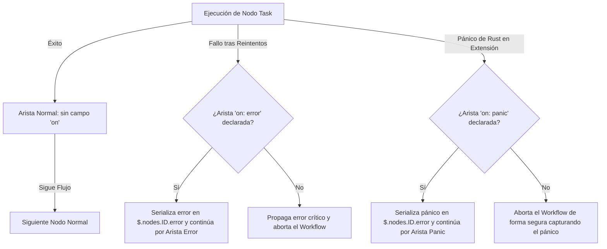

# Manual de Referencia Absoluta y Guía de Uso de Workflow-Forge (v1.0)

Este documento constituye la especificación técnica definitiva y el manual de ingeniería de `workflow-forge-core`. Ha sido redactado para servir como la biblia de referencia para desarrolladores de flujos, arquitectos de software e ingenieros de plataforma que diseñan, integran y operan orquestaciones declarativas complejas.

---

## 1. Arquitectura y Filosofía del Sistema

`workflow-forge` es un motor de orquestación de workflows declarativos e híbridos basado en un Grafo Dirigido Acíclico (DAG) y ejecutado de manera asíncrona sobre el runtime de Tokio en Rust. Su diseño se rige por tres principios inquebrantables:

1. **Aislamiento Estricto de Datos:** El flujo de datos no se manipula mediante código imperativo arbitrario; en su lugar, se gestiona a través de mappings JSONPath inmutables aplicados sobre un documento de estado compartido de forma concurrente (`WorkflowContext`).
2. **Desacoplamiento de Carga Útil (Mecánica de Blobs):** Los payloads binarios pesados (archivos CSV, audios, imágenes) nunca viajan "inline" en el JSON de contexto. En su lugar, viajan por referencia mediante identificadores hash estables basados en la especificación `$blob`. El ciclo de vida de estos archivos está atado a la ejecución (`BlobStore`) y se recolecta automáticamente al terminar el flujo.
3. **Resiliencia Defensiva Multi-Frontera:** El motor encapsula fallas de red mediante políticas de reintento con exponencial backoff y jitter, y aísla pánicos de software de extensiones mediante mecanismos `catch_unwind`, reconduciendo la ejecución por aristas alternativas de error sin colapsar la infraestructura principal.

```mermaid
graph TD
    subgraph WorkflowContext (Estado Compartido Concurrentemente)
        Trigger[$.trigger]
        Nodes[$.nodes.*.output]
        Errors[$.nodes.*.error]
        Metadata[$.workflow]
    end

    subgraph WorkflowExecutor (Motor de Ejecución)
        Start[Start Node] -->|BFS Reachability / Kahn's Cycle Check| Run{run_inner}
        Run -->|execute_from| Task[Task Node]
        Run -->|run_foreach| Foreach[Foreach Node]
        Run -->|run_gateway| Gateway[Gateway Node]

        Task -->|mapping::resolve| Input[Input Payload]
        Task -->|execute_with_policy| Invocation[Task Execution]
        Invocation -->|Success| Complete[NodeCompleted Event]
        Invocation -->|Fail / Timeout| ErrorBoundary{on: error / panic}
    end

    subgraph BlobStore (Almacenamiento Temporal File-Backed)
        TempDir[Temp Directory]
        BlobRef[Blob Reference: $blob]
    end

    WorkflowContext -->|Lectura JSONPath| Input
    BlobStore -->|Streaming por Referencia| Invocation
```

---

## 2. El Documento de Estado (`WorkflowContext`)

El `WorkflowContext` mantiene en memoria el estado completo del workflow mediante un cerrojo de lectura/escritura (`RwLock<serde_json::Value>`). Esto permite que múltiples ramas paralelas se ejecuten de forma concurrente sin condiciones de carrera.

Al iniciar el flujo, el documento de estado se inicializa con la siguiente topología de datos:

```json
{
  "trigger": {
    "origen": "carga_manual",
    "archivo_id": "01J0A1B2C3...UUIDv7"
  },
  "workflow": {
    "id": "wf_procesar_ventas",
    "name": "Pipeline de Ventas Diarias",
    "version": "1.0.0",
    "execution_id": "01H9Y2K3...UUIDv7",
    "parent_execution_id": null
  },
  "nodes": {}
}
```

### 2.1. El DSL de Enrutamiento de Datos (JSONPath)

Para mapear variables dinámicas, se utiliza el motor de JSONPath con las siguientes reglas sintácticas estrictas:

- **`$.trigger`**: Accede a los datos proporcionados durante el arranque del workflow.
- **`$.nodes.<node_id>.output`**: Accede al resultado exitoso producido por un nodo específico que ya ha finalizado. Ejemplo: `$.nodes.obtener_tasas.output.body.rates.MXN`.
- **`$.nodes.<node_id>.error`**: Accede al objeto de error estructurado generado por un nodo fallido, si y solo si la ejecución continuó a través de una arista `on: error`.
- **`$$.` (Mecanismo de Escape):** Permite introducir cadenas literales que inician con `$.`. Por ejemplo, la cadena `"$$.propiedad"` se resolverá en memoria exactamente como el string estático `"$.propiedad"` sin ser interpretado como JSONPath.

---

## 3. Especificación Detallada de los Nodos del Grafo

El motor soporta seis tipos especializados de nodos. Cada nodo en el array `"nodes"` de la definición raíz exige un identificador único `"id"` y un atributo discriminador `"kind"`.

### 3.1. Nodo `start` (Frontera de Entrada)

Define la puerta de enlace inicial del flujo. Exige exactamente un nodo de este tipo en todo el grafo.

- **`schema`** (Objeto, opcional): Objeto JSON Schema oficial. El motor precompila este validador en la fase de construcción. Si el trigger de entrada no cumple el esquema, el flujo no arranca, previniendo inyecciones de datos corruptos.
- **`defaults`** (Objeto, opcional): Diccionario de valores por defecto que se fusionan con el trigger. Si el trigger no es un objeto, el trigger original se encapsula dentro del campo `_input` y se combinan los valores por defecto.

```json
{
  "id": "start",
  "kind": "start",
  "schema": {
    "type": "object",
    "required": ["ruta_csv"],
    "properties": {
      "ruta_csv": { "type": "string" },
      "notificar_al_finalizar": { "type": "boolean" }
    }
  },
  "defaults": {
    "notificar_al_finalizar": true,
    "ambiente": "produccion"
  }
}
```

### 3.2. Nodo `end` (Frontera de Salida)

Representa la terminación de una ruta de ejecución. Puede haber múltiples nodos `end` en el grafo (por ejemplo, para rutas exitosas, rutas con fallas controladas, o cancelaciones).

- **`status`** (String u Objeto, opcional): Determina la clasificación de la salida. Valores válidos: `"success"`, `"error"`, `"cancelled"`, o un estatus personalizado estructurado: `{"custom": "api_down"}`.
- **`output`** (Objeto o String, opcional): Plantilla de mapeo para construir el JSON final retornado por el nodo. Si se omite, se propaga el payload acarreado del nodo predecesor de manera íntegra.
- **`schema`** (Objeto, opcional): JSON Schema para validar la estructura del output final del workflow.

```json
{
  "id": "fin_exitoso",
  "kind": "end",
  "status": "success",
  "output": {
    "registros_procesados": "$.nodes.procesar_lote.output.ok",
    "errores_de_validacion": "$.nodes.procesar_lote.output.failed",
    "duracion_total_ms": "$.workflow.execution_id"
  },
  "schema": {
    "type": "object",
    "required": ["registros_procesados"]
  }
}
```

### 3.3. Nodo `task` (Invocación Unitaria)

Invoca una extensión física registrada o un perfil de configuración local.

- **`task`** (String, obligatorio): ID único namespaced de la tarea a invocar (ej. `"http.request"`).
- **`input`** (Cualquier valor JSON, opcional): Estructura de mapeo que construye la entrada de la tarea. Si se omite, se le pasa de forma directa el payload que viene recorriendo el grafo.
- **`timeout_ms`** (Entero, opcional): Tiempo de gracia máximo para la ejecución de la tarea. Si el futuro asíncrono no finaliza dentro de este umbral, se cancela y se genera un error `TASK_TIMEOUT`.
- **`retry`** (Objeto, opcional): Política de reintentos asíncronos:
  - `max` (Entero, obligatorio): Cantidad de reintentos adicionales tras el fallo inicial.
  - `initial_ms` (Entero, opcional, por defecto `500`): Tiempo base de espera inicial en milisegundos.
  - `backoff` (String, opcional, por defecto `"exponential"`): Algoritmo de incremento. Opciones: `"exponential"`, `"linear"`, `"fixed"`.

```json
{
  "id": "descargar_archivo",
  "kind": "task",
  "task": "http.request",
  "input": {
    "url": "$.trigger.ruta_csv",
    "method": "GET",
    "response_body": "blob"
  },
  "timeout_ms": 30000,
  "retry": {
    "max": 3,
    "backoff": "exponential",
    "initial_ms": 1000
  }
}
```

### 3.4. Nodo `foreach` (Iterador de Colecciones)

Procesa de manera concurrente o secuencial una lista de elementos aplicando una tarea o perfil específico por elemento.

- **`items`** (String, obligatorio): JSONPath que debe apuntar estrictamente a un Array en el contexto de estado actual.
- **`task`** (String, obligatorio): ID de la tarea o perfil a aplicar.
- **`concurrency`** (Entero, opcional, por defecto `1`): Nivel de paralelismo de elementos en vuelo simultáneos. Si es `1`, el bucle se comporta de forma estrictamente secuencial.
- **`throttle_ms`** (Entero, opcional, por defecto `0`): Pausa obligatoria garantizada entre el arranque de cada iteración de elemento, permitiendo configurar rate-limits robustos hacia APIs externas.
- **`on_item_error`** (String, opcional, por defecto `"fail"`):
  - `"fail"`: Detiene inmediatamente la iteración completa del nodo al primer error de cualquier elemento, descartando y cancelando de forma segura (mediante _drop_ asíncrono) los elementos que sigan en vuelo.
  - `"collect"`: Ejecuta la lista completa hasta el final. No genera un fallo del nodo por errores individuales de elementos; en su lugar, agrupa los resultados en una estructura consolidada de éxito y fallos:
    ```json
    {
      "ok": [{ "resultado": 1 }, { "resultado": 2 }],
      "failed": [
        {
          "index": 2,
          "item": { "id": "malo" },
          "error": { "code": "FAIL", "message": "..." }
        }
      ]
    }
    ```
- **`retry`** y **`timeout_ms`** (Opcional): Aplican políticas individuales para cada iteración de elemento de manera independiente.

```json
{
  "id": "enviar_notificaciones",
  "kind": "foreach",
  "task": "http.request",
  "items": "$.nodes.obtener_usuarios.output.usuarios",
  "concurrency": 5,
  "throttle_ms": 200,
  "on_item_error": "collect",
  "input": {
    "url": "https://api.sms.com/send",
    "method": "POST",
    "body": {
      "telefono": "@.telefono",
      "mensaje": "Hola @.nombre, tu reporte está listo."
    }
  },
  "timeout_ms": 3000
}
```

### 3.5. Nodo `gateway` (Enrutamiento Lógico)

Controla la ramificación y unificación del grafo estilo BPMN 2.0. Exige la propiedad `"gateway"`.

**A. `exclusive` (Bifurcación Condicional - Or-Exclusivo)**
Evalúa las condiciones declaradas en `"branches"` de forma secuencial y ordenada. El motor redirige el flujo **únicamente** por la arista saliente cuyo label coincida con el campo `"edge"` de la primera rama que resuelva a verdadero.

- Exige que contenga al menos una rama.
- Admite un máximo de una rama con `"else": true`.
- Todas las ramas no-else deben definir obligatoriamente un bloque condicional `"when"`.

```json
{
  "id": "evaluar_monto",
  "kind": "gateway",
  "gateway": "exclusive",
  "branches": [
    {
      "when": { "path": "$.nodes.obtener_datos.output.monto", "gte": 10000 },
      "edge": "ruta_alto_valor"
    },
    { "else": true, "edge": "ruta_estandar" }
  ]
}
```

**B. `parallel` (Bifurcación Incondicional - And-Split)**
Divide la ejecución actual en múltiples ramas asíncronas concurrentes. No admite definir la llave `"branches"`. El motor lanza en paralelo todas las aristas normales de salida que parten de este nodo.

**C. `join` (Barrera de Sincronización - And-Join)**
Sincroniza múltiples hilos de ejecución paralelos. El motor detiene el flujo asíncrono y acumula en memoria las llegadas de cada rama. Una vez que se han completado **todas** las aristas normales entrantes calculadas estáticamente por el indexador, el nodo se desbloquea.

- No admite definir la llave `"branches"`.
- Exige que el grafo tenga al menos dos aristas normales de entrada que apunten a este nodo.
- **Output consolidado:** Al completarse, su salida es un objeto JSON cuyas llaves corresponden a los identificadores de los nodos de origen de cada rama paralela:
  ```json
  {
    "nodo_rama_a": { "status": "completado_a" },
    "nodo_rama_b": { "status": "completado_b" }
  }
  ```

### 3.6. Nodo `subworkflow` (Composición Jerárquica)

Ejecuta otra definición de workflow de manera aislada e independiente en memoria.

- **`workflow`** (String, obligatorio): El nombre del workflow a invocar. Se busca secuencialmente en la sección `"workflows"` inline del documento, y posteriormente en el `WorkflowRegistry` compartido.
- **`input`** (Objeto, opcional): Mapping de entrada que se inyecta como trigger para el workflow hijo. Si se omite, el subworkflow recibe de forma íntegra el payload acarreado del nodo predecesor.

```json
{
  "id": "ejecutar_limpieza",
  "kind": "subworkflow",
  "workflow": "limpieza_temporales_s3",
  "input": {
    "directorio_raiz": "$.trigger.ambiente"
  }
}
```

---

## 4. Estructuración de Aristas y Ruteo de Resiliencia (`edges`)

Las aristas (`edges`) representan las conexiones dirigidas entre los nodos, uniendo `"from"` y `"to"`. Sin embargo, `workflow-forge` introduce un esquema de control de flujos secundarios para interceptar desastres y errores de negocio de forma nativa.

```json
{
  "from": "id_origen",
  "to": "id_destino",
  "label": "etiqueta_opcional_para_gateway_exclusive",
  "on": "error_u_panic_opcional"
}
```

### 4.1. Tipos de Aristas según su Activador (`on`)



1. **Arista de Flujo Estándar (Sin campo `"on"`):**
   - Es la arista por defecto. Sigue el curso feliz de la ejecución si el nodo de origen finaliza exitosamente (`Ok`).
   - En gateways condicionales (`exclusive`), el motor filtra y activa únicamente la arista estándar de salida cuyo atributo `"label"` coincida exactamente con la rama condicional seleccionada en runtime.

2. **Arista de Recuperación de Negocio (`"on": "error"`):**
   - Se activa cuando la tarea del nodo de origen (o un subworkflow) devuelve un error estructurado (`Err`) y este agota por completo todas las políticas de reintentos configuradas.
   - **Mecánica interna del motor:** Si existe esta arista, el motor **no detiene el workflow**; en su lugar, captura el `WorkflowError`, lo serializa a JSON, lo escribe en la base de datos de contexto bajo la ruta `$.nodes.<node_id>.error` y continúa la ejecución de manera normal hacia el nodo destino de esta arista, transmitiendo el JSON del error como payload. Esto permite implementar **Circuit Breakers** y flujos alternativos automáticos.
   - Si el nodo falla pero **no** se declara una arista de este tipo, el error se propaga de forma crítica, deteniendo el workflow por completo.

3. **Arista de Control de Fallas de Código (`"on": "panic"`):**
   - Se activa ante pánicos de software severos en Rust (`panic!`) dentro de una extensión de terceros.
   - **Importante:** El motor principal está diseñado de forma defensiva y nunca reintenta un pánico (pues representa un bug físico de lógica en la extensión y no una falla transitoria de red). Si se declara esta arista, el motor captura el pánico de forma segura mediante un aislador `catch_unwind`, escribe la traza formateada del error en `$.nodes.<node_id>.error` y reconduce el control por esta ruta de emergencia.
   - Si ocurre un pánico y no se define una arista `"on": "panic"`, el motor aborta el workflow de manera controlada para resguardar la consistencia de los datos en memoria sin tumbar el proceso del host.

---

## 5. El Mini-DSL de Condiciones (`Condition`)

Las bifurcaciones en gateways de exclusión (`exclusive`) evalúan un AST de condiciones estructurado en JSON. Esto garantiza que no se ejecute código arbitrario, aislando el runtime y facilitando la validación del esquema del workflow.

### 5.1. Operadores Lógicos (Anidación)

- **`and`** (Array de Condiciones): Todas las condiciones del array deben evaluarse como verdaderas para que el bloque sea verdadero (conjunción lógica).
- **`or`** (Array de Condiciones): Al menos una condición del array debe evaluarse como verdadera (disyunción lógica).
- **`not`** (Objeto Condición): Invierte el resultado de la condición interna (negación lógica).

### 5.2. Operadores Relacionales (Comparaciones)

Cada objeto de comparación evalúa el resultado de un JSONPath dinámico declarado en `"path"` contra un operando de valor estático:

| Operador          | Tipo de Operando     | Descripción de la Evaluación                                                                                                                     |
| :---------------- | :------------------- | :----------------------------------------------------------------------------------------------------------------------------------------------- |
| **`eq`**          | Cualquier JSON Value | Comprueba igualdad exacta de tipos y valores.                                                                                                    |
| **`ne`**          | Cualquier JSON Value | Comprueba desigualdad estricta.                                                                                                                  |
| **`gt`**          | Número o String      | Mayor que (numérico de punto flotante o lexicográfico).                                                                                          |
| **`gte`**         | Número o String      | Mayor o igual que.                                                                                                                               |
| **`lt`**          | Número o String      | Menor que.                                                                                                                                       |
| **`lte`**         | Número o String      | Menor o igual que.                                                                                                                               |
| **`in`**          | Array de JSON Values | Comprueba si el valor resuelto por el `path` se encuentra dentro del array.                                                                      |
| **`contains`**    | Cualquier JSON Value | Si el valor del `path` es un array, evalúa si contiene al operando. Si es un string, comprueba si contiene al operando como subcadena.           |
| **`exists`**      | Booleano             | Comprueba si el JSONPath de `"path"` resuelve algún valor real en el contexto (`true`) o no (`false`).                                           |
| **`is_null`**     | Booleano             | Comprueba si el valor del `path` es explícitamente el tipo `null`.                                                                               |
| **`starts_with`** | String               | Comprueba si la cadena del `path` inicia con el string dado.                                                                                     |
| **`ends_with`**   | String               | Comprueba si la cadena del `path` finaliza con el string dado.                                                                                   |
| **`matches`**     | String               | Comprueba si la cadena del `path` cumple con la Expresión Regular dada. El motor precompila y almacena las regex en un caché global thread-safe. |

**Ejemplo de una Regla Condicional Compleja:**

```json
{
  "or": [
    {
      "and": [
        {
          "path": "$.nodes.obtener_perfil.output.usuario.rol",
          "eq": "premium"
        },
        { "path": "$.nodes.facturacion.output.pendiente_pago", "ne": true }
      ]
    },
    {
      "and": [
        { "path": "$.trigger.prioridad_forzada", "eq": "urgente" },
        {
          "path": "$.nodes.obtener_perfil.output.usuario.email",
          "matches": "^[a-zA-Z0-9._%+-]+@acme\\.com$"
        }
      ]
    }
  ]
}
```

---

## 6. Perfiles de Tarea y Secretos Computados (`TaskProfiles`)

Un perfil de tarea (`TaskProfile`) es una abstracción que permite pre-configurar una tarea física del catálogo. Esto crea una **tarea virtual** local o global, simplificando la declaración de los nodos del grafo al encapsular la complejidad de configuración (cabeceras HTTP, tokens, parámetros fijos).

### 6.1. La Llave `"bind"` y Resolución de Secretos

- El campo `"bind"` es una plantilla dinámica (un `shape`) que construye el input que la tarea base espera recibir. El valor `"@"` representa el input de entrada provisto por el nodo que invoca al perfil, mientras que `"@.propiedad"` accede a sus subpaths de forma local.
- **Mecánica del resolvedor `$secret`:** Cualquier objeto dentro de `"bind"` con la estructura `{"$secret": "NOMBRE_DEL_SECRETO"}` se intercepta al registrar el perfil. El sistema acude al `SecretProvider` inyectado para reemplazar el objeto por la credencial real en memoria de forma segura. Las credenciales sensibles jamás se guardan en los archivos JSON de workflows ni se exponen en la telemetría dinámica de los eventos.

```json
{
  "tasks": [
    {
      "id": "sendgrid.enviar_correo",
      "extends": "http.request",
      "description": "Perfil local de integración segura con SendGrid",
      "input_schema": {
        "type": "object",
        "required": ["destinatario", "asunto", "mensaje"]
      },
      "bind": {
        "url": "https://api.sendgrid.com/v3/mail/send",
        "method": "POST",
        "auth": {
          "type": "bearer",
          "token": { "$secret": "SENDGRID_API_KEY" }
        },
        "body": {
          "personalizations": [{ "to": [{ "email": "@.destinatario" }] }],
          "subject": "@.asunto",
          "content": [{ "type": "text/plain", "value": "@.mensaje" }]
        }
      },
      "output": "@.body"
    }
  ]
}
```

---

## 7. Extensiones Nativas Incluidas (Especificaciones Técnicas)

### 7.1. Extensión de Manipulación de Datos (`data.*`)

#### `data.transform`

Toma el payload actual y aplica un `shape` recursivo usando JSONPaths locales (prefijo `@`) relativos al input para reestructurar objetos de manera flexible.

- **Input Schema:** Cualquier JSON Value.
- **Output:** JSON transformado según el `shape` provisto.

#### `data.map`

Aplica recursivamente un `shape` de transformación a cada uno de los elementos de un array en memoria.

- **Input Schema:** Un array JSON.
- **Output:** Array con cada elemento transformado.

#### `data.merge`

Combina múltiples objetos JSON en uno solo de forma recursiva profunda (_deep merge_). Es ideal para unificar payloads tras un nodo de sincronización `join`.

- **Input Schema:** Array de objetos JSON: `[ { "a": 1 }, { "b": 2, "a": 3 } ]`.
- **Output:** Un solo objeto combinado (los elementos posteriores sobrescriben claves colisionadas): `{ "a": 3, "b": 2 }`.

#### `data.template`

Motor de renderizado de cadenas de texto estáticas interpolando variables dinámicas del contexto con el formato `${$.jsonpath}`.

- **Input Schema:** Objeto con `"template"` (string de la plantilla) e `"input"` (datos opcionales de mapeo).
- **Output:** String con las variables dinámicamente sustituidas de forma segura.

#### `data.cast`

Sanea, formatea y normaliza tipos de datos provenientes de fuentes no estructuradas (ej. CSVs o APIs sucias).

- **Campos del Input:**
  - `source` (Array de Objetos o Objeto Único, obligatorio): Los datos a procesar.
  - `on_invalid` (String, opcional, por defecto `"fail"`): Política ante conversiones fallidas: `"fail"`, `"null"` (coloca nulo al campo), `"collect"` (continúa y documenta fallas).
  - `fields` (Objeto, obligatorio): Declaración de reglas por campo a transformar utilizando operaciones de casteo (`CastOp`):
    - `int`: Convierte a entero de forma segura.
    - `bool`: Convierte a booleano.
    - `string`: Convierte a cadena.
    - `trim`: Elimina espacios en blanco al inicio y final del string.
    - `upper`: Convierte a mayúsculas.
    - `lower`: Convierte a minúsculas.
    - `default`: `{"value": X}`: Inyecta el valor estático `X` si el campo de origen es nulo o no existe.
    - `replace`: `{"from": "a", "to": "b"}`: Reemplaza subcadenas.
    - `date`: Convierte strings de fecha a formato estándar ISO utilizando patrones de formateo opcionales.

---

### 7.2. Extensión de Red HTTP (`http.*`)

#### `http.request`

Cliente HTTP asíncrono e industrial basado en la crate `reqwest`. Incorpora soporte nativo para transmisiones de archivos grandes por streaming y multipart/form-data.

- **Campos de Entrada de Solicitud (`RequestInput`):**
  - `url` (String, obligatorio): Dirección URI válida de la petición.
  - `method` (String, opcional, por defecto `"GET"`): Método HTTP (`GET`, `POST`, `PUT`, `DELETE`, etc.).
  - `headers` (Objeto, opcional): Mapa de cabeceras HTTP.
  - `query` (Objeto, opcional): Parámetros dinámicos agregados a la URL.
  - `body` (Cualquier JSON Value, opcional): Cuerpo de la petición en formato JSON.
  - `text` (String, opcional): Cuerpo de la petición enviado como texto plano crudo.
  - `form` (Objeto, opcional): Envía los parámetros como cuerpo codificado para formularios (`application/x-www-form-urlencoded`).
  - `body_blob` (BlobRef, opcional): Recibe la referencia de un archivo del `BlobStore` (ej: un archivo ZIP de 1 GB) y lo transmite de forma nativa por la red mediante **Streaming Asíncrono**, impidiendo sobrecargar la memoria RAM del servidor.
  - `response_body` (String, opcional, por defecto `"auto"`):
    - `"auto"`: Parsea el cuerpo automáticamente como JSON.
    - `"text"`: Devuelve el cuerpo como cadena de texto plano.
    - `"blob"`: **Streaming de Descarga.** Descarga los bytes de respuesta de la red y los escribe directamente al disco del `BlobStore` local bound a la ejecución, retornando una referencia `BlobRef` ligera. Ideal para APIs de descarga de reportes masivos.
  - `multipart` (Objeto de Partes, opcional): Permite construir cuerpos multiparte complejos (`multipart/form-data`) donde cada campo puede ser:
    - Un texto plano (`plain`).
    - Un objeto JSON (`json`).
    - Un archivo físico referenciado por su ID de blob del store (`blob`), indicando de forma opcional un `"filename"` sugerido y un `"content_type"`.

---

## 8. Guía de Integración Programática en Rust

Para inicializar y ejecutar el motor dentro de tu host de Rust, debes seguir la siguiente arquitectura de llamada:

```rust
use std::sync::Arc;
use serde_json::json;
use workflow_forge_core::workflow::WorkflowDefinition;
use workflow_forge_core::executor::WorkflowExecutor;
use workflow_forge_core::registry::{TaskRegistry, WorkflowRegistry};
use workflow_forge_core::secret::EnvSecrets;
use workflow_forge_core::task::WorkflowData;
use workflow_forge_core::observe::InMemoryHistory;

#[tokio::main]
async fn main() -> Result<(), Box<dyn std::error::Error>> {
    // 1. Cargar la definición declarativa (JSON o YAML)
    let workflow_json = json!({
        "spec": "1.0",
        "name": "flujo_produccion",
        "version": "1.0.0",
        "nodes": [
            { "id": "start", "kind": "start" },
            { "id": "end", "kind": "end" }
        ],
        "edges": [
            { "from": "start", "to": "end" }
        ]
    });

    let definition: WorkflowDefinition = serde_json::from_value(workflow_json)?;

    // 2. Instanciar y registrar las extensiones físicas deseadas
    let registry = Arc::new(TaskRegistry::new());
    // Registrar tareas físicas...

    // 3. Crear el resolvedor de secretos de la infraestructura
    let secrets = EnvSecrets::default();

    // 4. Construir y validar estáticamente el Executor
    let executor = WorkflowExecutor::builder(definition)
        .registry(registry)
        .secrets(&secrets)
        .build() // Valida topología del grafo, ciclos, y compila esquemas preventivamente
        .map_err(|errors| {
            eprintln!("Fallas de validación al construir el workflow:");
            for err in &errors {
                eprintln!("- [Código: {}] {}", err.code, err.message);
            }
            errors.into_iter().next().unwrap()
        })?;

    // 5. Opcional: Registrar un sumidero de observabilidad (Telemetría)
    let history = Arc::new(InMemoryHistory::new());
    let executor = executor.with_observer(Arc::clone(&history) as Arc<dyn workflow_forge_core::observe::ExecutionObserver>);

    // 6. Lanzar la ejecución asíncrona
    let trigger_input = WorkflowData(json!({ "tenant_id": "usr_99" }));

    match executor.run(trigger_input).await {
        Ok(result) => {
            println!("Workflow completado exitosamente!");
            println!("Output obtenido: {}", serde_json::to_string_pretty(&result.0)?);
        }
        Err(err) => {
            eprintln!("La ejecución del Workflow falló catastróficamente:");
            eprintln!("Error en el nodo [{}]: (Código: {}) {}", err.source_task.unwrap_or_default(), err.code, err.message);
        }
    }

    // 7. Extraer reporte detallado de telemetría de ejecución
    let report = history.report();
    println!("Resumen de la ejecución: {:?}", report.status);
    for node in report.nodes {
        println!("- Nodo [{} ({})]: Estado {:?}", node.node_id, node.kind, node.status);
    }

    Ok(())
}
```

---

## 9. Resolución de Problemas y Catálogo de Códigos de Error

El motor cuenta con un catálogo de errores estructurados de modo que puedas diagnosticar problemas de configuración del grafo o errores dinámicos de ejecución de forma fidedigna.

### 9.1. Errores de Validación (Fase de Construcción)

Estos errores ocurren al compilar el documento JSON/YAML llamando a `.build()` en el constructor del executor. **Ningún workflow inválido iniciará ejecución.**

- **`UNSUPPORTED_SPEC`**:
  - _Causa:_ La llave `"spec"` de la raíz del JSON tiene un valor no soportado por este motor (por ejemplo, `"2.0"`).
  - _Solución:_ Asegura que el valor sea exactamente `"1.0"`.
- **`DUPLICATE_NODE_ID`**:
  - _Causa:_ Existen dos o más nodos en el array `"nodes"` con el mismo `"id"`.
  - _Solución:_ Modifica los identificadores para asegurar unicidad lógica.
- **`UNKNOWN_NODE_REF`**:
  - _Causa:_ Una arista de conexión (`edge`) apunta a un `"from"` o `"to"` con un ID de nodo que no existe en el array de `"nodes"`.
  - _Solución:_ Comprueba la ortografía y la existencia física de los nodos que estás intentando enlazar.
- **`NO_START_NODE` / `MULTIPLE_START_NODES`**:
  - _Causa:_ El grafo no define ningún nodo de inicio o define más de uno. La especificación exige exactamente un nodo con `"kind": "start"`.
  - _Solución:_ Ajusta la lista de nodos para consolidar un único nodo de arranque.
- **`NO_END_NODE`**:
  - _Causa:_ El grafo carece de nodos terminales `"kind": "end"`. No hay dónde concluir la ejecución de los datos.
  - _Solución:_ Añade al menos un nodo `"end"` para cerrar las rutas lógicas del grafo.
- **`START_HAS_INCOMING` / `END_HAS_OUTGOING`**:
  - _Causa:_ Violación de la topología BPMN: un nodo `start` tiene una arista entrante, o un nodo `end` tiene una arista saliente.
  - _Solución:_ Re-estructura las conexiones del grafo; los eventos de inicio no reciben flujos y los de salida concluyen el flujo.
- **`GATEWAY_NO_BRANCHES` / `GATEWAY_MULTIPLE_ELSE` / `GATEWAY_BRANCH_WITHOUT_WHEN`**:
  - _Causa:_ Errores en la declaración de las ramas de un gateway exclusivo: no declara branches, declara múltiples elses, o tiene una branch sin condición ni marca de else.
  - _Solución:_ Revisa la sección `"branches"` del gateway exclusivo analizado. Asegura que solo una sea `"else": true` y que el resto declaren sus bloques `"when"`.
- **`GATEWAY_BRANCH_WITHOUT_EDGE` / `GATEWAY_EDGE_WITHOUT_BRANCH`**:
  - _Causa:_ Desconexión estructural: una arista normal del grafo que parte de un gateway exclusivo tiene un `"label"` que no corresponde a ninguna rama, o viceversa (la rama declara un `"edge"` sin su arista correspondiente).
  - _Solución:_ Asegura que el label de la arista coincida exactamente con el string de la propiedad `"edge"` de su rama condicional.
- **`PARALLEL_TOO_FEW_OUTPUTS` / `JOIN_TOO_FEW_INPUTS`**:
  - _Causa:_ Un gateway paralelo tiene menos de 2 aristas salientes de bifurcación, o un gateway join tiene menos de 2 entradas del flujo normal.
  - _Solución:_ Comprueba las conexiones; la sincronización y división lógicas exigen al menos dos flujos paralelos para tener validez.
- **`SUBWORKFLOW_MISSING_NAME` / `SUBWORKFLOW_NOT_FOUND`**:
  - _Causa:_ El nodo subworkflow no declara el nombre del workflow hijo o el nombre referenciado no existe localmente ni en el registro global.
  - _Solución:_ Asegura que declares el atributo `"workflow"` con el nombre del workflow que registraste en el host.
- **`SUBWORKFLOW_CYCLE` / `SUBWORKFLOW_DEPTH_EXCEEDED`**:
  - _Causa:_ Se detectó un ciclo infinito de llamadas recursivas de subworkflows (ej: A llama a B y B llama a A), o se superó el límite de anidación profunda física de cinco (`5`) niveles.
  - _Solución:_ Re-diseña la jerarquía de tus subworkflows para asegurar una estructura lineal de control de llamadas.
- **`UNREACHABLE_NODE`**:
  - _Causa:_ Análisis BFS: existe un nodo en tu array `"nodes"` que no puede ser alcanzado mediante ningún camino que parta del nodo `start` (nodo huérfano).
  - _Solución:_ Añade las aristas necesarias para incorporar el nodo al control del flujo de ejecución del workflow.
- **`CYCLE_DETECTED`**:
  - _Causa:_ El algoritmo de Kahn determinó que el grafo contiene ciclos o bucles de conexiones. La especificación v1.0 prohíbe flujos cíclicos estáticos.
  - _Solución:_ Re-estructura las conexiones utilizando flujos lineales o nodos `foreach` para procesamientos de bucle.

---

### 9.2. Errores de Ejecución (Fase de Runtime)

Estos errores ocurren dinámicamente durante la ejecución del workflow.

- **`MAPPING_PATH_NOT_FOUND`**:
  - _Causa:_ Un mapping de entrada (`input`) o salida de fin de workflow tiene un JSONPath que no resolvió ningún valor real en el documento de estado actual.
  - _Solución:_ Asegura que el JSONPath esté bien escrito y que el nodo anterior referenciado realmente haya completado y publicado datos exitosamente.
- **`INVALID_JSONPATH`**:
  - _Causa:_ Error sintáctico en la formulación de tu cadena JSONPath (ej: usar caracteres inválidos).
  - _Solución:_ Comprueba la validez de la sintaxis JSONPath declarada.
- **`SCHEMA_VALIDATION_FAILED` / `OUTPUT_SCHEMA_VALIDATION_FAILED`**:
  - _Causa:_ El trigger inicial no cumple con el esquema del nodo `start`, o el resultado final del workflow no cumple con el esquema del nodo `end`.
  - _Solución:_ Comprueba la estructura de datos enviada o generada contra la declaración del JSON Schema.
- **`TASK_INPUT_INVALID` / `TASK_OUTPUT_INVALID`**:
  - _Causa:_ El input mapeado para una tarea o el output retornado por esta violan los esquemas preventivos de su manifiesto oficial.
  - _Solución:_ Verifica los parámetros que estás mapeando hacia la tarea para asegurar que cumplan con la especificación de tipos.
- **`TASK_TIMEOUT`**:
  - _Causa:_ La ejecución de la tarea del nodo superó de manera absoluta el tiempo máximo de gracia configurado en `timeout_ms`.
  - _Solución:_ Incrementa el valor del timeout o audita el rendimiento y latencia del servicio externo invocado.
- **`TASK_PANIC`**:
  - _Causa:_ La extensión de Rust invocada por el nodo sufrió un desmoronamiento de pila severo (`panic!`). El motor capturó el desastre.
  - _Solución:_ Comunícate con el desarrollador de la extensión para corregir el bug físico en el código de Rust.
- **`JOIN_INCOMPLETE`**:
  - _Causa:_ El workflow finalizó su procesamiento asíncrono pero quedaron nodos de tipo `join` esperando ramas asíncronas paralelas que nunca llegaron debido a que un gateway exclusive desvió el flujo lejos de dicha barrera.
  - _Solución:_ **Patrón de Diseño:** Asegura que si un gateway exclusivo desvía la ruta, todas las bifurcaciones paralelas que conducen al `join` sean consistentes y no queden a medio camino.
- **`SECRET_NOT_FOUND`**:
  - _Causa:_ Al registrar un perfil de tarea, el motor de secretos no pudo localizar el valor real para el secreto dinámico inyectado en el `bind`.
  - _Solución:_ Asegura que la variable de entorno o la bóveda de credenciales de la infraestructura cuente con la clave buscada.
- **`PROFILE_BIND_INVALID`**:
  - _Causa:_ El mapping estático de un perfil de tarea (`bind`) genera una estructura JSON que la tarea base de origen de la extensión rechaza categóricamente de acuerdo con sus restricciones.
  - _Solución:_ Audita el diseño del profile; los campos producidos tras resolver el bind deben alinearse al esquema de entrada de la tarea base.
- **`FOREACH_ITEMS_NOT_ARRAY`**:
  - _Causa:_ El JSONPath declarado en el atributo `"items"` de un nodo `foreach` resolvió a un valor que no es un Array JSON (ej: un número, string o nulo).
  - _Solución:_ Ajusta el path para apuntar exactamente al array de la colección que deseas iterar.
